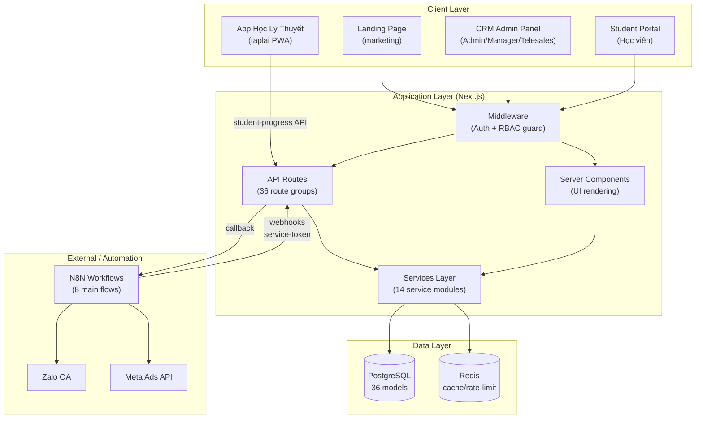
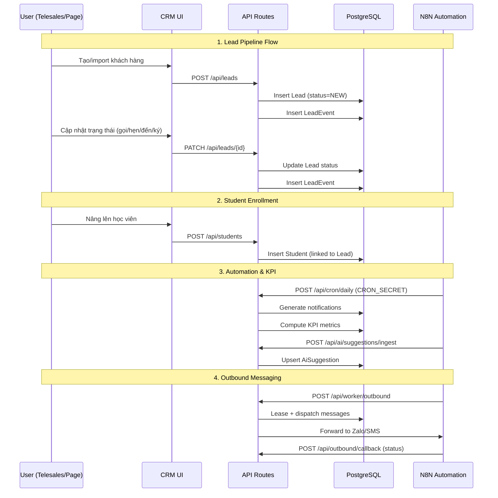

# 00 – Tổng quan hệ thống Thầy Duy CRM

## Mục tiêu sản phẩm

**Thầy Duy CRM** là hệ thống quản lý đào tạo lái xe toàn diện, phục vụ trung tâm đào tạo lái xe "Thầy Duy". Sản phẩm bao gồm:

- **CRM nội bộ**: quản lý khách hàng (lead), học viên, lịch học, thu tiền, KPI, lương, tự động hoá quy trình.
- **Cổng học viên (Student Portal)**: học viên tự đăng nhập xem lịch học, tiến độ, tài liệu hướng dẫn.
- **Landing page**: trang giới thiệu dịch vụ, đăng ký.
- **N8N Automation**: luồng tự động hoá (nhắc lịch, KPI coach, gửi tin, báo cáo marketing).

## Đối tượng sử dụng

| Role | Mô tả |
|------|--------|
| **Admin** | Quản trị viên toàn quyền: cấu hình hệ thống, phân quyền, quản lý chi nhánh, chạy cron, giám sát N8N |
| **Manager** | Quản lý chi nhánh: xem/quản lý lead, học viên, KPI, phiếu thu, phân bổ khách, xem báo cáo HR |
| **Telesales** | Nhân viên tư vấn: quản lý lead được phân, gọi/hẹn/chăm sóc, xem KPI cá nhân, tạo phiếu thu |
| **Direct Page** | Nhân viên page/kênh trực tiếp: tương tự telesales, ít quyền messaging |
| **Viewer** | Người xem: chỉ xem tổng quan, KPI, gợi ý AI |
| **Student** | Học viên: truy cập cổng học viên, xem lịch/tài chính/tài liệu |

## Kiến trúc hệ thống

| Layer | Công nghệ |
|-------|-----------|
| Frontend | Next.js 16 (App Router) + React 19 + Tailwind CSS 4 |
| Backend | Next.js API Routes (serverless functions) |
| ORM | Prisma 7 (PostgreSQL adapter) |
| Database | PostgreSQL |
| Cache/Queue | Redis |
| Auth | JWT (access token cookie + refresh) |
| Automation | N8N webhooks + service tokens |
| Infra | Docker + Docker Compose + Nginx reverse proxy + Certbot SSL |
| Testing | Playwright (E2E) + Vitest (Unit) |

## Architecture Diagram



## Data Flow chính



## Cấu trúc thư mục chính

```
thayduy-crm/
├── src/
│   ├── app/
│   │   ├── (app)/          # CRM admin pages (18 modules)
│   │   ├── (landing)/      # Landing page
│   │   ├── api/            # 36 API route groups
│   │   ├── login/          # CRM login
│   │   └── student/        # Student portal (5 pages)
│   ├── components/         # Shared UI components
│   ├── hooks/              # Custom React hooks
│   └── lib/                # Core libraries
│       ├── services/       # 14 business logic services
│       ├── providers/      # Auth/context providers
│       └── utils/          # Utility functions
├── prisma/
│   ├── schema.prisma       # 36 models, 33+ enums
│   ├── migrations/         # 38 migration folders
│   └── seed.ts             # Seed data
├── scripts/                # 23 operational scripts
├── n8n/                    # N8N workflow configs
│   ├── workflows/          # 12 workflow JSON files
│   └── deploy/             # Deploy scripts
├── nginx/                  # Nginx reverse proxy config
├── tests/                  # E2E + unit tests
├── docs/                   # Documentation (this folder)
├── docker-compose.yml      # Development stack
├── docker-compose.prod.yml # Production stack
└── middleware.ts            # Auth + RBAC middleware
```
