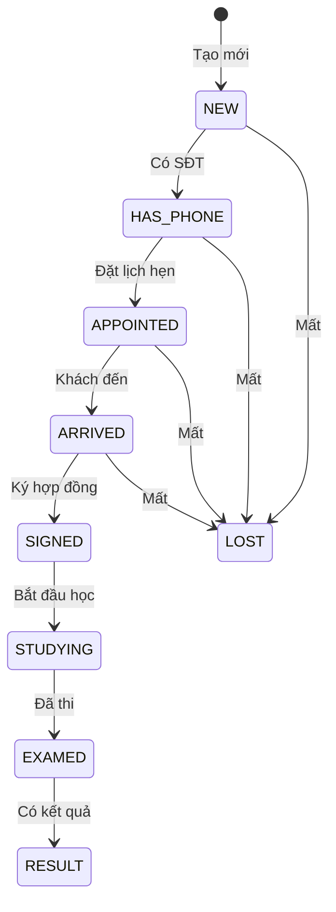
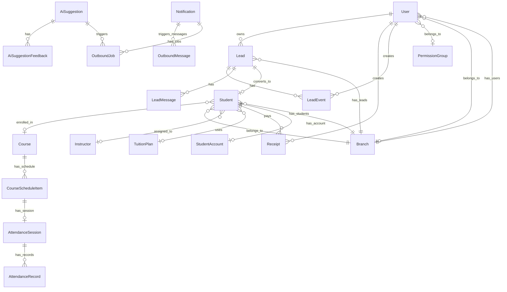

# 03 – Database Schema

> **Mục đích**: Liệt kê 100% models/tables, enums, fields quan trọng, indexes, quan hệ, và ràng buộc nghiệp vụ trong Prisma schema.

## Tổng quan

- **Database**: PostgreSQL
- **ORM**: Prisma 7 (PostgreSQL adapter)
- **Schema file**: [`prisma/schema.prisma`](file:///Volumes/Data%20-%203/thayduy-crm/prisma/schema.prisma)
- **Tổng models**: 36
- **Tổng enums**: 33
- **Migrations**: 38 folders

---

## Models

### User (Người dùng hệ thống)

| Field | Type | Mô tả |
|-------|------|-------|
| id | String (cuid) | PK |
| username | String @unique | Tên đăng nhập |
| email | String @unique | Email |
| name | String? | Họ tên |
| password | String | Bcrypt hash |
| role | Role | admin/manager/telesales/direct_page/viewer |
| isActive | Boolean | Trạng thái tài khoản |
| branchId | String? | FK → Branch |
| groupId | String? | FK → PermissionGroup |

**Indexes**: `[branchId]`, `[groupId]`
**Relations**: → Branch, PermissionGroup, Lead[], Receipt[], LeadEvent[], Notification[], etc.

---

### PermissionGroup (Nhóm quyền)

| Field | Type | Mô tả |
|-------|------|-------|
| id | String (cuid) | PK |
| name | String @unique | Tên nhóm |
| description | String? | Mô tả |
| isSystem | Boolean | Nhóm hệ thống (không xoá) |

**Relations**: → PermissionRule[], User[]

---

### PermissionRule (Quy tắc quyền)

| Field | Type | Mô tả |
|-------|------|-------|
| groupId | String | FK → PermissionGroup |
| module | PermissionModule | Module được phân quyền |
| action | PermissionAction | Hành động (VIEW/CREATE/UPDATE/DELETE/...) |
| allowed | Boolean | Cho phép hay từ chối |

**Unique**: `[groupId, module, action]`

---

### UserPermissionOverride (Override quyền cá nhân)

| Field | Type | Mô tả |
|-------|------|-------|
| userId | String | FK → User |
| module | PermissionModule | Module |
| action | PermissionAction | Hành động |
| allowed | Boolean | Override |

**Unique**: `[userId, module, action]`

---

### Lead (Khách hàng)

| Field | Type | Mô tả |
|-------|------|-------|
| id | String (cuid) | PK |
| fullName | String? | Họ tên |
| phone | String? @unique | SĐT (unique) |
| province | String? | Tỉnh/thành |
| licenseType | String? | Hạng bằng (B1/B2/C/...) |
| source | String? | Nguồn (facebook/zalo/website/...) |
| channel | String? | Kênh (page/telesales) |
| status | LeadStatus | NEW → HAS_PHONE → APPOINTED → ARRIVED → SIGNED → STUDYING → EXAMED → RESULT / LOST |
| branchId | String | FK → Branch |
| ownerId | String? | FK → User (nhân viên phụ trách) |
| callOutcome | CallOutcome? | Kết quả gọi |
| apptOutcome | AppointmentOutcome? | Kết quả hẹn |
| arrivalOutcome | ArrivalOutcome? | Kết quả đến |
| note | String? | Ghi chú |
| tags | String[] | Tags tìm kiếm |
| lastContactAt | DateTime? | Lần liên hệ cuối |

**Indexes**: `[ownerId, createdAt]`, `[branchId, createdAt]`
**Relations**: → User (owner), Branch, LeadMessage[], LeadEvent[], Student?, AutomationLog[], Notification[], OutboundMessage[]

---

### LeadMessage (Tin nhắn khách)

| Field | Type | Mô tả |
|-------|------|-------|
| leadId | String | FK → Lead |
| channel | String | Kênh (zalo/fb/sms) |
| direction | MessageDirection | inbound/outbound |
| content | String | Nội dung |
| externalMessageId | String? | ID từ hệ thống ngoài |

**Index**: `[leadId, createdAt]`

---

### LeadEvent (Nhật ký sự kiện khách)

| Field | Type | Mô tả |
|-------|------|-------|
| leadId | String | FK → Lead |
| type | LeadEventType | Loại sự kiện |
| payload | Json? | Data bổ sung |
| createdById | String? | FK → User (người tạo) |

**Indexes**: `[leadId, createdAt]`, `[type, createdAt]`

---

### TuitionPlan (Bảng học phí)

| Field | Type | Mô tả |
|-------|------|-------|
| province | String | Tỉnh |
| licenseType | String | Hạng bằng |
| tuition | Int | Số tiền (VND) |
| isActive | Boolean | Đang áp dụng |

**Unique**: `[province, licenseType]`

---

### Course (Khoá học)

| Field | Type | Mô tả |
|-------|------|-------|
| code | String @unique | Mã khoá (B2-2026-01) |
| province | String? | Tỉnh |
| licenseType | String? | Hạng bằng |
| startDate | DateTime? | Ngày khai giảng |
| examDate | DateTime? | Ngày thi |
| isActive | Boolean | Đang hoạt động |

---

### CourseScheduleItem (Lịch học)

| Field | Type | Mô tả |
|-------|------|-------|
| courseId | String | FK → Course |
| branchId | String | FK → Branch |
| type | ScheduleType | study/exam/reminder |
| title | String | Tiêu đề |
| startAt | DateTime | Bắt đầu |
| endAt | DateTime? | Kết thúc |
| source | ScheduleSource | AUTO/MANUAL |
| status | ScheduleManualStatus | PLANNED/DONE/CANCELLED |
| location | String? | Địa điểm |
| note | String? | Ghi chú |
| rule | Json? | Cấu hình tự động |

**Indexes**: `[courseId, startAt]`, `[branchId, startAt]`

---

### Student (Học viên)

| Field | Type | Mô tả |
|-------|------|-------|
| leadId | String @unique | FK → Lead (1:1) |
| courseId | String? | FK → Course |
| branchId | String | FK → Branch |
| tuitionPlanId | String? | FK → TuitionPlan |
| tuitionSnapshot | Int? | Số tiền học phí lúc đăng ký |
| signedAt | DateTime? | Ngày ký |
| arrivedAt | DateTime? | Ngày đến |
| instructorId | String? | FK → Instructor |
| studyStatus | StudyStatus | studying/paused/done |
| examDate | DateTime? | Ngày thi |
| examResult | ExamResult? | pass/fail |

**Indexes**: `[courseId]`, `[branchId]`, `[instructorId]`
**Relations**: → Lead, Course, Branch, Instructor, Receipt[], PracticalLesson[], StudentExamPlan?, AppDailySnapshot[], etc.

---

### StudentAccount (Tài khoản cổng học viên)

| Field | Type | Mô tả |
|-------|------|-------|
| phone | String @unique | SĐT đăng nhập |
| passwordHash | String | Bcrypt hash |
| studentId | String @unique | FK → Student (1:1) |

---

### StudentContent (Nội dung cho học viên)

| Field | Type | Mô tả |
|-------|------|-------|
| category | StudentContentCategory | HUONG_DAN/MEO_HOC/HO_SO/THI |
| title | String | Tiêu đề |
| body | String | Nội dung markdown |
| isPublished | Boolean | Đã xuất bản |

---

### AttendanceSession, AttendanceRecord, AttendanceAudit (Điểm danh)

- **AttendanceSession**: 1 phiên điểm danh = 1 CourseScheduleItem
- **AttendanceRecord**: `[studentId, scheduleItemId]` unique, status = PRESENT/ABSENT/LATE
- **AttendanceAudit**: Ghi lại ai sửa gì (action, diff JSON)

---

### Receipt (Phiếu thu)

| Field | Type | Mô tả |
|-------|------|-------|
| studentId | String | FK → Student |
| branchId | String | FK → Branch |
| amount | Int | Số tiền (VND) |
| method | ReceiptMethod | cash/bank_transfer/card/other |
| note | String? | Ghi chú |
| receivedAt | DateTime | Ngày nhận |
| createdById | String? | FK → User |

**Indexes**: `[studentId, receivedAt]`, `[branchId, receivedAt]`

---

### AutomationLog (Log tự động hoá)

| Field | Type | Mô tả |
|-------|------|-------|
| leadId | String? | FK → Lead |
| studentId | String? | FK → Student |
| branchId | String | FK → Branch |
| channel | String | Kênh |
| templateKey | String? | Template dùng |
| milestone | String? | Cột mốc (outbound-job-status, ...) |
| status | AutomationStatus | sent/failed/skipped |
| payload | Json? | Data bổ sung |

---

### Notification (Thông báo / Task)

| Field | Type | Mô tả |
|-------|------|-------|
| scope | NotificationScope | FINANCE/FOLLOWUP/SCHEDULE/SYSTEM |
| status | NotificationStatus | NEW/DOING/DONE/SKIPPED |
| priority | NotificationPriority | HIGH/MEDIUM/LOW |
| title | String | Tiêu đề |
| message | String | Nội dung |
| payload | Json? | Data bổ sung |
| leadId, studentId, courseId, ownerId | FK? | Liên kết |
| dueAt | DateTime? | Hạn xử lý |

**Indexes**: `[scope, status, dueAt]`, `[ownerId, createdAt]`, `[studentId, scope, status]`

---

### NotificationRule (Quy tắc sinh thông báo)

| Field | Type | Mô tả |
|-------|------|-------|
| scope | NotificationScope | Phạm vi |
| name | String @unique | Tên rule |
| isActive | Boolean | Đang bật |
| config | Json | JSON cấu hình |

---

### MessageTemplate (Template tin nhắn)

| Field | Type | Mô tả |
|-------|------|-------|
| key | String @unique | Khoá template (remind_study, etc.) |
| title | String | Tiêu đề |
| channel | OutboundChannel | ZALO/FB/SMS/CALL_NOTE |
| body | String | Nội dung (có biến) |

---

### OutboundMessage (Tin nhắn gửi ra)

| Field | Type | Mô tả |
|-------|------|-------|
| channel | OutboundChannel | ZALO/FB/SMS/CALL_NOTE |
| templateKey | String | Template dùng |
| renderedText | String | Nội dung đã render |
| status | OutboundStatus | QUEUED/SENT/FAILED/SKIPPED |
| priority | OutboundPriority | HIGH/MEDIUM/LOW |
| retryCount | Int | Số lần retry |
| leaseId, leaseExpiresAt | String?, DateTime? | Worker lease fields |

**Indexes**: `[status, nextAttemptAt]`, `[status, createdAt]`, `[leaseExpiresAt]`

---

### OutboundJob (Job gọi nhắc)

| Field | Type | Mô tả |
|-------|------|-------|
| title | String | Tiêu đề |
| status | OutboundJobStatus | NEW/DISPATCHED/DONE/FAILED |
| runId | String? | ID lần chạy |
| idempotencyKey | String? @unique | Chống trùng |
| suggestionId | String? | FK → AiSuggestion |
| taskId | String? | FK → Notification |

---

### Branch (Chi nhánh)

| Field | Type | Mô tả |
|-------|------|-------|
| name | String | Tên |
| code | String? @unique | Mã chi nhánh |
| isActive | Boolean | Đang hoạt động |
| commissionPerPaid50 | Int? | Hoa hồng khi đóng 50% |

---

### KpiTarget (Mục tiêu KPI)

| Field | Type | Mô tả |
|-------|------|-------|
| branchId | String | FK → Branch |
| role | Role | Vai trò áp dụng |
| ownerId | String? | FK → User (KPI cá nhân) |
| metricKey | String | Khoá chỉ số (catalog) |
| targetValue | Int | Giá trị mục tiêu |
| dayOfWeek | Int | -1 = mặc định, 0-6 = theo ngày |

**Unique**: `[branchId, role, metricKey, dayOfWeek, ownerId]`

---

### GoalSetting (Mục tiêu doanh thu/hồ sơ)

| Field | Type | Mô tả |
|-------|------|-------|
| branchId | String? | FK → Branch |
| branchScopeKey | String | "" = toàn hệ thống |
| periodType | GoalPeriodType | DAILY/MONTHLY |
| dateKey | String | "YYYY-MM-DD" |
| monthKey | String | "YYYY-MM" |
| revenueTarget, dossierTarget, costTarget | Int | Mục tiêu VND |

**Unique**: `[branchScopeKey, periodType, dateKey, monthKey]`

---

### AiSuggestion (Gợi ý AI)

| Field | Type | Mô tả |
|-------|------|-------|
| dateKey | String | Ngày áp dụng |
| role | Role | Vai trò target |
| branchId, ownerId | FK? | Phạm vi |
| title, content | String | Nội dung gợi ý |
| scoreColor | AiScoreColor | RED/YELLOW/GREEN |
| actionsJson | Json? | Actions thực hiện |
| source | String | Nguồn (n8n/manual) |
| payloadHash | String? | Chống trùng content |

---

### AiSuggestionFeedback, AiLearningHistory

- **AiSuggestionFeedback**: `@@unique([suggestionId, userId])` – mỗi user chỉ phản hồi 1 lần
- **AiLearningHistory**: Log quá trình AI học

---

### ExpenseCategory, BranchExpenseDaily, BranchBaseSalary, ExpenseInsight

- **ExpenseCategory**: Danh mục chi phí theo branch, `@@unique([branchId, name])`
- **BranchExpenseDaily**: Chi phí ngày, `@@unique([branchId, dateKey, categoryId])`
- **BranchBaseSalary**: Lương cơ bản tháng, `@@unique([userId, monthKey, branchId])`
- **ExpenseInsight**: AI insight chi phí

---

### HR Models

- **SalaryProfile**: Hồ sơ lương [userId, branchId, effectiveFrom]
- **CommissionScheme**: Công thức hoa hồng (rulesJson)
- **Attendance**: Chấm công `@@unique([userId, date])`, status = PRESENT/HALF/OFF/...
- **CommissionLedger**: Sổ hoa hồng `@@unique([sourceType, studentId])`
- **PayrollRun**: Kỳ lương `@@unique([month, branchId])`, status = DRAFT/FINAL/PAID
- **PayrollItem**: Chi tiết lương `@@unique([payrollRunId, userId])`
- **EmployeeKpiSetting**: Thiết lập KPI nhân sự
- **OpsPulse**: Snapshot vận hành realtime `@@unique([role, dateKey, windowMinutes, bucketStart, ...])`
- **MarketingReport**: Báo cáo Meta Ads `@@unique([dateKey, branchId, source])`

---

### Other Models

- **Instructor**: Giáo viên, `phone @unique`
- **PracticalLesson**: Bài thực hành (sa hình/đường trường/cabin)
- **StudentExamPlan**: Lịch thi dự kiến
- **IdempotencyRequest**: Chống trùng request `@@unique([key, route, actorType, actorId])`
- **TrackingCode**: Mã tracking (GA4/Pixel/...) `@@unique([site, key])`
- **PushSubscription**: Web push subscription `endpoint @unique`

---

### App Learning Progress (từ PWA)

- **AppDailySnapshot**: Tiến trình học ngày `@@unique([studentId, dateKey])`
- **AppAttemptSummary**: Kết quả bài thi `attemptId @unique`
- **AppAiSummary**: AI tổng kết `studentId @unique`
- **AppEventLog**: Event log `eventId @unique` (client ULID)

---

## Enums

| Enum | Giá trị | Mô tả |
|------|---------|-------|
| Role | admin, manager, telesales, direct_page, viewer | Vai trò CRM |
| LeadStatus | NEW → HAS_PHONE → APPOINTED → ARRIVED → SIGNED → STUDYING → EXAMED → RESULT \| LOST | Pipeline khách hàng |
| LeadEventType | NEW, HAS_PHONE, APPOINTED, ARRIVED, SIGNED, STUDYING, EXAMED, RESULT, LOST, CALLED, OWNER_CHANGED, ASSIGNED_OWNER, INSTRUCTOR_CHANGED, OTHER | Loại event |
| CallOutcome | no_answer, interested, not_interested, wrong_number, call_back | Kết quả gọi |
| AppointmentOutcome | confirmed, rescheduled, cancelled, no_show | Kết quả hẹn |
| ArrivalOutcome | arrived_ok, arrived_waiting, arrived_refused | Kết quả đến |
| ExamResult | pass, fail | Kết quả thi |
| StudyStatus | studying, paused, done | Trạng thái học |
| ReceiptMethod | cash, bank_transfer, card, other | Phương thức thu |
| MessageDirection | inbound, outbound | Hướng tin nhắn |
| ScheduleType | study, exam, reminder | Loại lịch |
| ScheduleSource | AUTO, MANUAL | Nguồn lịch |
| ScheduleManualStatus | PLANNED, DONE, CANCELLED | Trạng thái lịch |
| AttendanceStatus | PRESENT, ABSENT, LATE | Điểm danh |
| StudentContentCategory | HUONG_DAN, MEO_HOC, HO_SO, THI | Danh mục nội dung |
| AutomationStatus | sent, failed, skipped | Trạng thái tự động |
| NotificationScope | FINANCE, FOLLOWUP, SCHEDULE, SYSTEM | Phạm vi thông báo |
| NotificationStatus | NEW, DOING, DONE, SKIPPED | Trạng thái task |
| NotificationPriority | HIGH, MEDIUM, LOW | Độ ưu tiên |
| OutboundChannel | ZALO, FB, SMS, CALL_NOTE | Kênh outbound |
| OutboundStatus | QUEUED, SENT, FAILED, SKIPPED | Trạng thái gửi |
| OutboundPriority | HIGH, MEDIUM, LOW | Ưu tiên gửi |
| OpsPulseRole | PAGE, TELESALES | Role ops |
| EmployeeKpiRole | PAGE, TELESALES, BRANCH | Role KPI |
| InstructorStatus | ACTIVE, INACTIVE | Trạng thái GV |
| LessonType | SA_HINH, DUONG_TRUONG, DAT, CABIN, OTHER | Loại bài thực hành |
| LessonStatus | SCHEDULED, DONE, CANCELED, NO_SHOW | Trạng thái bài |
| HrAttendanceStatus | PRESENT, HALF, OFF, LEAVE_PAID, LEAVE_UNPAID, LATE, ABSENT | Chấm công |
| HrAttendanceSource | MANUAL, IMPORT, DEVICE | Nguồn chấm công |
| CommissionSourceType | RECEIPT, LEAD, STUDENT, MANUAL_ADJUST, PAID50 | Nguồn hoa hồng |
| PayrollStatus | DRAFT, FINAL, PAID | Trạng thái kỳ lương |
| PermissionModule | 37 modules (overview, leads, leads_board, ..., admin_tracking) | Module phân quyền |
| PermissionAction | VIEW, CREATE, UPDATE, FEEDBACK, EDIT, DELETE, EXPORT, ASSIGN, RUN, INGEST | Hành động phân quyền |
| GoalPeriodType | DAILY, MONTHLY | Kỳ mục tiêu |
| OutboundJobStatus | NEW, DISPATCHED, DONE, FAILED | Trạng thái job |
| AiSuggestionStatus | ACTIVE, ARCHIVED | Trạng thái gợi ý |
| AiScoreColor | RED, YELLOW, GREEN | Mức độ gợi ý |
| AiSuggestionFeedbackType | HELPFUL, NOT_HELPFUL, DONE | Phản hồi |
| TrackingCodePlacement | HEAD, BODY_TOP, BODY_BOTTOM | Vị trí tracking |
| TrackingSite | GLOBAL, LANDING, CRM, STUDENT, TAPLAI | Site áp dụng |

---

## Status Pipeline – Lead Journey

---

## ER Diagram (Core Relations)

