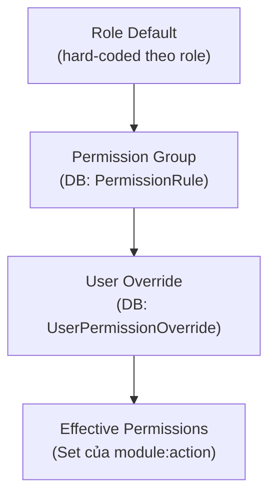
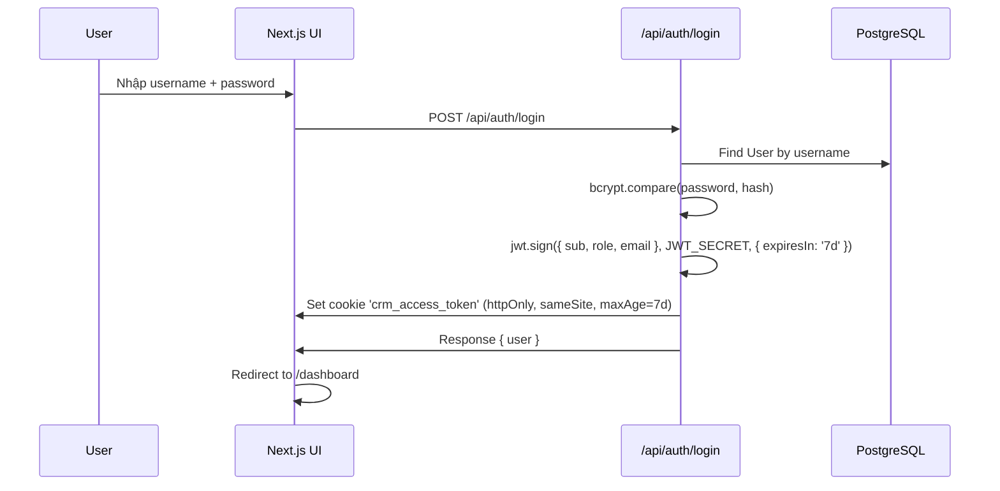
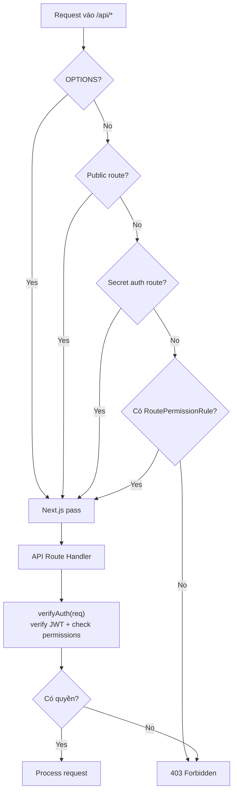

# 04 – RBAC & Security

> **Mục đích**: Mô tả hệ thống phân quyền, auth flows, security configuration.

---

## Roles

| Role | Mô tả | Phạm vi mặc định |
|------|--------|------------------|
| **admin** | Quản trị toàn quyền | Full access tất cả 37 modules × 10 actions |
| **manager** | Quản lý chi nhánh | Gần full, ngoại trừ: admin only modules hạn chế |
| **telesales** | Tư vấn viên | Lead CRUD, student CRUD, schedule, receipts, KPI (xem), expenses (xem) |
| **direct_page** | Nhân viên page | Tương tự telesales, messaging hạn chế (VIEW+CREATE), receipts (VIEW+CREATE) |
| **viewer** | Người xem | Chỉ VIEW: overview, kpi, goals, ai, notifications, expenses, insights |

---

## Permission System

### Cấu trúc 3 lớp



1. **Layer 1 – Role Default**: Hard-coded trong `src/lib/permissions.ts`. Mỗi role có một `PermissionMatrix` định sẵn.
2. **Layer 2 – Permission Group**: User được gán vào `PermissionGroup` (qua `groupId`). Group có các `PermissionRule` (allowed/denied) apply lên default.
3. **Layer 3 – User Override**: `UserPermissionOverride` cho phép override cá nhân (bật/tắt permission cụ thể).

### Permission Key format

```
module:action
```

Ví dụ: `leads:VIEW`, `receipts:CREATE`, `admin_users:DELETE`

### 37 Permission Modules

```
overview, leads, leads_board, kpi_daily, kpi_targets, goals,
ai_kpi_coach, ai_suggestions, students, courses, schedule,
receipts, notifications, outbound_jobs, messaging, my_payroll,
ops_ai_hr, ops_n8n, automation_logs, automation_run,
marketing_meta_ads, admin_branches, admin_users, admin_segments,
admin_tuition, admin_notification_admin, admin_automation_admin,
admin_send_progress, admin_plans, admin_student_content,
admin_instructors, hr_kpi, hr_payroll_profiles, hr_attendance,
hr_total_payroll, api_hub, expenses, salary, insights, admin_tracking
```

### 10 Permission Actions

```
VIEW, CREATE, UPDATE, FEEDBACK, EDIT, DELETE, EXPORT, ASSIGN, RUN, INGEST
```

---

## Auth Flows

### CRM Login



### Token Storage

| Cookie | Mô tả | httpOnly | SameSite | MaxAge |
|--------|--------|---------|----------|--------|
| `crm_access_token` | JWT access token CRM | ✅ | Lax | 7 ngày |
| `student_access_token` | JWT access token Student Portal | ✅ | Lax | 7 ngày |

### JWT Payload

```json
{
  "sub": "user-cuid",
  "role": "admin",
  "email": "user@example.com",
  "iat": 1234567890,
  "exp": 1235172690
}
```

### Student Portal Auth

- Student đăng nhập bằng SĐT + password (`/api/student/auth/login`)
- Tạo tài khoản bằng SĐT + mật khẩu (`/api/student/auth/register`)
- JWT riêng biệt (`student_access_token` cookie)
- Middleware cho phép admin/CRM staff truy cập student portal bằng `crm_access_token`

---

## Middleware Guard

**File**: `middleware.ts` – Next.js Edge Middleware

### Protected Routes (CRM)

```
/dashboard, /leads, /kpi, /goals, /ai, /students, /schedule,
/courses, /receipts, /expenses, /notifications, /outbound,
/automation, /admin, /api-hub, /hr, /me, /marketing
```

→ Yêu cầu `crm_access_token` cookie hợp lệ (chưa expired)

### Admin-Only Routes

- `/admin/*` → chỉ cho role=`admin` (middleware redirect)
- `/automation/run` → chỉ cho role=`admin`

### Student Protected Routes

- `/student` (không phải `/students`) → yêu cầu `student_access_token` hoặc `crm_access_token`
- Ngoại trừ: `/student/login`, `/student/register`

---

## API Auth Layers

### 3 loại xác thực API

| Layer | Header/Cookie | Mô tả | Routes |
|-------|--------------|-------|--------|
| **Public** | Không cần | Health, auth, public endpoints | `/api/health`, `/api/auth/*`, `/api/public/*` |
| **Bearer JWT** | Cookie `crm_access_token` | Xác thực user, check permission | Hầu hết API endpoints |
| **Secret Token** | Header `x-service-token` / `x-worker-secret` / `x-cron-secret` / `x-callback-secret` | N8N, cron, worker, ingest | `/api/cron/daily`, `/api/worker/outbound`, `/api/ops/pulse`, `/api/marketing/ingest`, etc. |

### Route Permission Check Flow



---

## Rate Limiting

**File**: `src/lib/rate-limit.ts`

- Sử dụng Redis hoặc in-memory Map (fallback)
- Window-based rate limiting
- Config qua ENV: `WORKER_RATE_LIMIT_PER_MIN`, `WORKER_RATE_LIMIT_PER_OWNER_PER_MIN`

---

## CORS

- Next.js config trong `next.config.ts`
- Cross-origin: giữa landing/CRM/student dùng cùng domain
- Service token endpoints: N8N → CRM

---

## Idempotency

**File**: `src/lib/idempotency.ts`

- Header `Idempotency-Key` cho các endpoints mutation quan trọng
- Model `IdempotencyRequest` lưu trữ response cache
- Unique: `[key, route, actorType, actorId]`
- Endpoints bắt buộc: tạo phiếu thu, tạo lịch, dispatch outbound, tạo outbound job

---

## Audit Logs

- **LeadEvent**: Ghi lại mọi thay đổi trạng thái lead (ai thay đổi, từ trạng thái nào)
- **AttendanceAudit**: Ghi lại thay đổi điểm danh (action, diff JSON)
- **AutomationLog**: Log mọi hoạt động tự động hoá
- **AiLearningHistory**: Log AI processing

---

## Security Checklist

| Hạng mục | Trạng thái |
|---------|-----------|
| Password hashing (bcrypt) | ✅ Done |
| JWT token with expiry | ✅ Done |
| httpOnly cookies | ✅ Done |
| RBAC permission check | ✅ Done (3-layer) |
| Middleware route guard | ✅ Done |
| Service token for N8N/worker | ✅ Done |
| Idempotency protection | ✅ Done |
| Rate limiting | ✅ Done |
| Input validation | ✅ Done (API routes) |
| SQL injection prevention | ✅ Done (Prisma ORM) |
