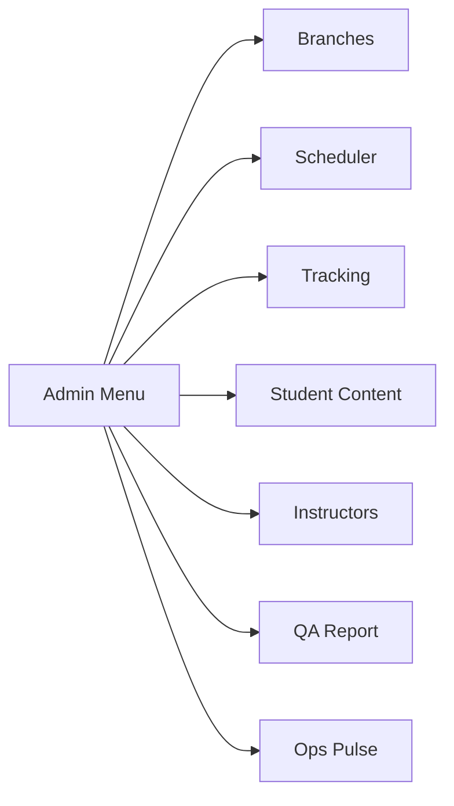

# Admin Ops Tools

## Mục đích / Giá trị
Bộ công cụ vận hành dành cho Admin: quản lý chi nhánh, scheduler, tracking codes, nội dung học viên, giáo viên, QA report.

## User story / Ai dùng
- **Admin**: cấu hình và giám sát hệ thống

## Các module con

### Branches (Chi nhánh)
- **URL**: `/admin/branches`
- **API**: `GET/POST/PATCH/DELETE /api/admin/branches`
- CRUD chi nhánh, mỗi branch có code @unique
- commissionPerPaid50: config hoa hồng khi đóng 50%

### Scheduler / Health Check
- **URL**: `/admin/scheduler`
- **API**: `GET /api/admin/scheduler/health`
- Monitor: queue delays, worker health, lag warnings

### Tracking Codes
- **URL**: `/admin/tracking`
- **API**: `GET/POST/PATCH/DELETE /api/admin/tracking-codes`
- Quản lý mã GA4, Facebook Pixel, TikTok Pixel
- Placement: HEAD / BODY_TOP / BODY_BOTTOM
- Site scope: GLOBAL / LANDING / CRM / STUDENT / TAPLAI

### Student Content
- **URL**: `/admin/student-content`
- **API**: `GET/POST/PATCH /api/admin/student-content`
- Tạo nội dung cho cổng học viên
- Categories: HUONG_DAN, MEO_HOC, HO_SO, THI

### Instructors (Giáo viên)
- **URL**: `/admin/instructors`
- **API**: `GET/POST/PATCH /api/instructors`
- CRUD giáo viên, gắn với Student

### QA Report
- **URL**: `/admin/qa`
- **API**: `GET /api/reports/qa`
- Báo cáo tổng hợp sức khoẻ hệ thống

### Ops Pulse
- **URL**: `/admin/ops`
- **API**: `GET /api/admin/ops/pulse`
- Realtime metrics per role/owner (10-minute buckets)

## Data / DB
- **Branch**, **TrackingCode**, **StudentContent**, **Instructor**, **PushSubscription**, **IdempotencyRequest**

## RBAC / Security
- `admin_branches:VIEW/CREATE/UPDATE/DELETE`
- `admin_tracking:VIEW/CREATE/UPDATE/DELETE`
- `admin_student_content:VIEW/CREATE/UPDATE`
- `admin_plans:VIEW`
- `ops_ai_hr:VIEW`

## Todo / Tech debt
- QA report cần mở rộng thêm metrics
