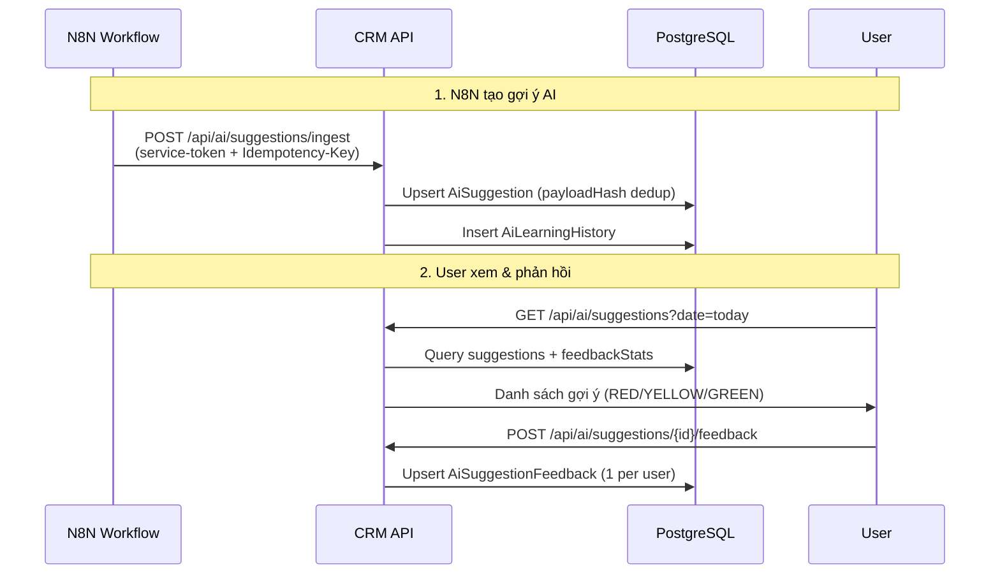

# AI KPI Coach

## Mục đích / Giá trị
Tạo gợi ý công việc dựa trên dữ liệu KPI và pipeline, giúp nhân viên biết cần ưu tiên làm gì.

## User story / Ai dùng
- **Telesales/Page**: xem gợi ý, phản hồi hữu ích / không hữu ích
- **Manager**: tạo gợi ý thủ công, xem analytics
- **Admin**: ingest gợi ý từ N8N, xem trend

## Luồng sử dụng

## UI/UX
- **URL**: `/ai`
- Cards: mỗi gợi ý có scoreColor (RED=khẩn cấp, YELLOW=chú ý, GREEN=tốt), title, content
- Actions: nút "Hữu ích" / "Không hữu ích" / "Đã làm xong"
- Analytics: đồ thị feedback stats, trend

## API liên quan
| Endpoint | Mô tả |
|----------|-------|
| `GET /api/ai/suggestions` | Danh sách gợi ý |
| `POST /api/ai/suggestions` | Tạo gợi ý thủ công |
| `POST /api/ai/suggestions/{id}/feedback` | Phản hồi (1 lần/user) |
| `POST /api/ai/suggestions/ingest` | Ingest từ N8N |
| `GET /api/ai/suggestions/analytics` | Phân tích |
| `GET /api/ai/suggestions/summary` | Tổng kết |
| `GET /api/ai/suggestions/trend` | Xu hướng |

## Business rules
- **scoreColor**: RED (hiệu suất thấp), YELLOW (cần chú ý), GREEN (tốt)
- **Dedup**: `payloadHash` chống trùng nội dung
- **Feedback**: mỗi user chỉ phản hồi 1 lần per suggestion (@@unique)
- **AiLearningHistory**: log quá trình AI học từ feedback
- **Actions**: từ gợi ý có thể tạo OutboundJob hoặc Task

## Data / DB
- **AiSuggestion**: dateKey, role, scoreColor, content, actionsJson, source
- **AiSuggestionFeedback**: @@unique([suggestionId, userId])
- **AiLearningHistory**: moduleKey, useCaseKey, inputJson, outputJson

## RBAC / Security
- `ai_suggestions:VIEW` – xem
- `ai_suggestions:CREATE` – tạo thủ công (manager/admin)
- `ai_suggestions:FEEDBACK` – phản hồi
- Ingest endpoint: `x-service-token` + `Idempotency-Key`

## Service Logic
- File: `src/lib/services/ai-kpi-coach.ts` (37KB – service lớn nhất)

## Todo / Tech debt
- AI hiện được tính toán từ N8N external → xem xét tích hợp LLM trực tiếp
