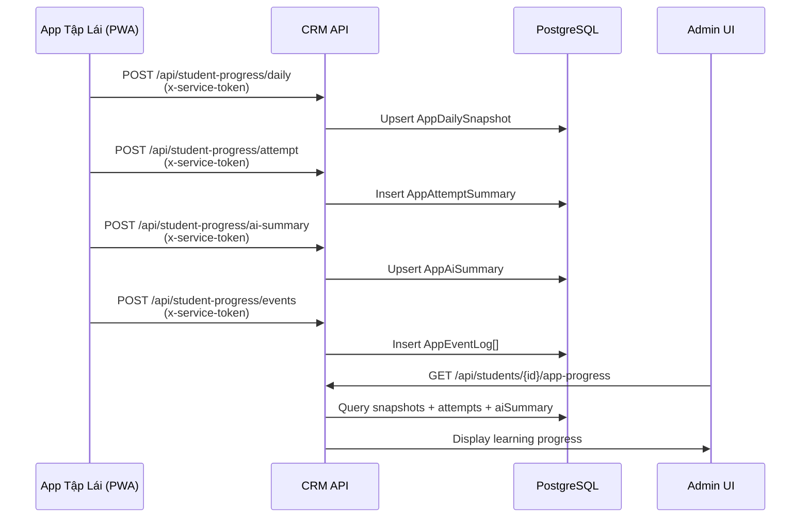

# App Learning Progress

## Mục đích / Giá trị
Đồng bộ tiến trình học lý thuyết từ PWA (app Tập Lái) vào CRM để admin theo dõi tiến độ học viên.

## User story / Ai dùng
- **Service (PWA app)**: push data qua service-token
- **Admin**: xem tiến trình trên trang chi tiết học viên

## Luồng sử dụng

## UI/UX
- **URL**: `/students/{id}` → tab "Tiến trình học app"
- Hiển thị: snapshot ngày (minutes, accuracy, streak), lịch sử bài thi, AI summary

## API liên quan
| Endpoint | Auth | Mô tả |
|----------|------|-------|
| `POST /api/student-progress/daily` | x-service-token | Đẩy snapshot ngày |
| `POST /api/student-progress/attempt` | x-service-token | Đẩy kết quả bài thi |
| `POST /api/student-progress/ai-summary` | x-service-token | Đẩy AI summary |
| `POST /api/student-progress/events` | x-service-token | Đẩy event log |
| `GET /api/students/{id}/app-progress` | Bearer | Xem tiến trình |

## Business rules
- AppDailySnapshot: @@unique([studentId, dateKey]) – 1 snapshot/ngày/student
- AppAttemptSummary: attemptId @unique – client-generated
- AppAiSummary: studentId @unique – 1 AI summary/student
- AppEventLog: eventId @unique – client-generated ULID (idempotent)
- dateKey format: "YYYY-MM-DD" Asia/Ho_Chi_Minh

## Data / DB
- **AppDailySnapshot**: minutes, questionsAnswered, correct, accuracy, streak, topWeakTopics
- **AppAttemptSummary**: mode (MOCK/DAILY), score, total, accuracy, topicBreakdown
- **AppAiSummary**: passProbability, strengths, weaknesses, todayPlan
- **AppEventLog**: type (DAILY_COMPLETED, MOCK_FINISHED, etc.), occurredAt, payload

## RBAC / Security
- Ingest: `x-service-token` (SERVICE_TOKEN) – không dùng JWT user
- View: `students:VIEW`

## Todo / Tech debt
- Chưa có notification khi accuracy thấp
- Chưa có biểu đồ trend tiến trình
