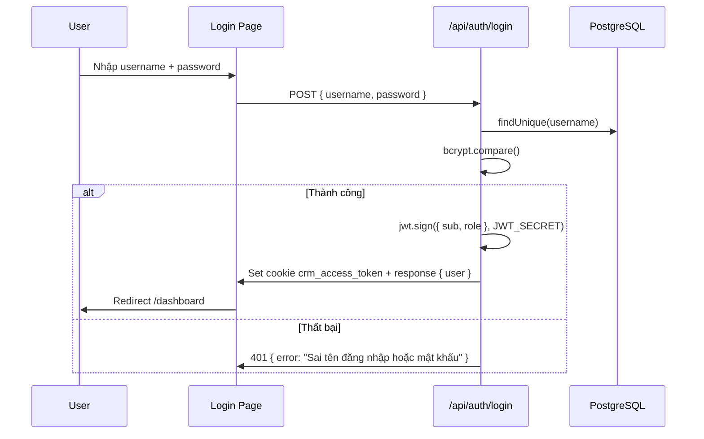

# Auth & Session

## Mục đích / Giá trị
Cung cấp xác thực phiên làm việc cho CRM và Student Portal, phân quyền truy cập theo role.

## User story / Ai dùng
- **Tất cả nhân viên**: đăng nhập CRM bằng username + password
- **Học viên**: đăng nhập Student Portal bằng SĐT + mật khẩu
- **Admin**: quản lý tài khoản, phân quyền

## Luồng sử dụng

## UI/UX
- **URL**: `/login`
- **Màn hình**: Form đăng nhập (username, password, nút "Đăng nhập")
- **States**: Loading (spinner), Error (thông báo đỏ), Success (redirect)
- **Empty**: Không applicable

## API liên quan

| Endpoint | Mô tả |
|----------|-------|
| `POST /api/auth/login` | Đăng nhập, trả JWT cookie |
| `POST /api/auth/refresh` | Refresh token |
| `GET /api/auth/me` | Lấy user info + permissions |
| `POST /api/auth/logout` | Xoá cookie |

## Business rules
- Password lưu trữ dạng **bcrypt hash**
- JWT token có thời hạn **7 ngày**
- Token chứa: `sub` (userId), `role`, `email`
- Cookie: `httpOnly`, `sameSite=Lax`
- Middleware chặn tất cả `/dashboard`, `/leads`, `/admin`, ... nếu không có token hợp lệ
- Admin check: `/admin/*` route yêu cầu `role=admin` (redirect nếu không phải)

## Data / DB
- **Models**: `User` (username, email, password hash, role, isActive)
- **Liên quan**: `PermissionGroup`, `PermissionRule`, `UserPermissionOverride`

## RBAC / Security
- 3-layer RBAC: Role Default → Permission Group → User Override
- JWT verified bằng `JWT_SECRET` env var

## Edge cases
- Token expired → redirect `/login`
- User `isActive=false` → login bị từ chối
- Đổi password không invalidate token cũ (theo thiết kế JWT stateless)
- Student truy cập CRM route → redirect `/login`
- CRM staff truy cập student portal → cho phép (middleware check cả 2 token)

## Test coverage
- Unit test: `tests/unit/` (JWT utilities)
- E2E test: login flow trong Playwright spec

## Config/Env
- `JWT_SECRET` – bắt buộc

## Todo / Tech debt
- Chưa có refresh token rotation (dùng cookie maxAge 7d)
- Chưa có rate limit cho login endpoint
