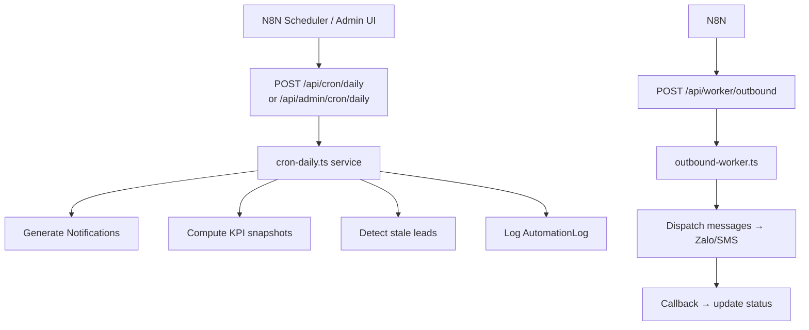

# Automation & N8N

## Mục đích / Giá trị
Tự động hoá quy trình vận hành: chạy cron hằng ngày, tích hợp N8N workflows, ghi log, monitor.

## User story / Ai dùng
- **Admin**: chạy cron thủ công, monitor workflow, xem logs/errors
- **N8N**: tự động chạy theo lịch, callback kết quả

## Luồng sử dụng

## UI/UX
- **`/automation/logs`**: Nhật ký tự động hoá
- **`/automation/run`**: Chạy tay (admin only)
- **`/admin/cron`**: Vận hành tự động (cron)
- **`/admin/n8n`**: Tài liệu + workflow N8N
- **`/admin/automation-monitor`**: Giám sát (overview, jobs, errors, logs)
- **`/admin/scheduler`**: Lập lịch + health check

## API liên quan
| Endpoint | Mô tả |
|----------|-------|
| `GET/POST /api/automation/logs` | Logs |
| `POST /api/automation/logs/ingest` | N8N đẩy logs |
| `POST /api/automation/run` | Chạy tay |
| `POST /api/admin/cron/daily` | Cron hàng ngày |
| `POST /api/admin/worker/outbound` | Worker outbound |
| `GET /api/admin/scheduler/health` | Health check |
| `GET /api/admin/automation/overview` | Tổng quan |
| `GET /api/admin/automation/jobs` | Jobs |
| `GET /api/admin/automation/logs` | Logs chi tiết |
| `GET /api/admin/automation/errors` | Top lỗi |
| `GET /api/admin/n8n/workflows` | Workflow docs |

## N8N Workflows (8 main + sub-workflows)
Workflows nằm trong `n8n/workflows/`:
1. Daily cron (generate notifications, KPI)
2. Outbound worker (dispatch messages)
3. AI KPI coach (generate suggestions)
4. Marketing report ingest
5. Ops pulse (10-minute snapshots)
6. Stale leads detection
7. Commission calculation
8. Expense insights

## Business rules
- Cron secret auth: `CRON_SECRET` / `WORKER_SECRET` / `OPS_SECRET`
- Service token: `SERVICE_TOKEN` cho ingest endpoints
- Idempotency-Key bắt buộc cho ingest endpoints
- Quiet hours: không gửi tin trong khung giờ yên tĩnh

## Service Logic
- `src/lib/services/cron-daily.ts` (18KB)
- `src/lib/services/automation-monitor.ts` (7.3KB)
- `src/lib/services/scheduler-health.ts` (5.6KB)
- `src/lib/services/ops-pulse.ts` (25.9KB)

## Data / DB
- **AutomationLog**, **OutboundJob**, **OutboundMessage**, **OpsPulse**

## RBAC / Security
- `automation_logs:VIEW/CREATE/INGEST`, `automation_run:RUN`
- `admin_automation_admin:RUN`, `admin_send_progress:RUN`
- `ops_n8n:VIEW`, `ops_ai_hr:VIEW`

## Todo / Tech debt
- N8N workflows cần documentation update khi thêm workflow mới
