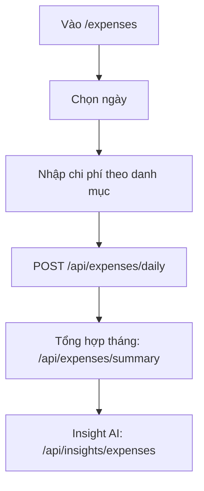

# Expenses & Finance

## Mục đích / Giá trị
Nhập và theo dõi chi phí hàng ngày, tổng hợp chi phí tháng (bao gồm lương cơ bản), phân tích insight AI.

## User story / Ai dùng
- **Admin/Manager**: nhập chi phí ngày, xem tổng hợp tháng, set lương cơ bản
- **Viewer**: xem chi phí (read-only)

## Luồng sử dụng

## UI/UX
- **URL**: `/expenses`
- Form nhập chi phí theo ngày + danh mục, bảng tổng hợp tháng

## API liên quan
| Endpoint | Mô tả |
|----------|-------|
| `GET/POST /api/expenses/daily` | Chi phí ngày |
| `GET /api/expenses/summary` | Tổng hợp tháng |
| `GET/POST /api/expenses/base-salary` | Lương cơ bản |
| `GET /api/insights/expenses` | Insight AI |
| `POST /api/insights/expenses/ingest` | Ingest insight từ N8N |

## Business rules
- BranchExpenseDaily: @@unique([branchId, dateKey, categoryId])
- ExpenseCategory: @@unique([branchId, name])
- BranchBaseSalary: @@unique([userId, monthKey, branchId])
- Summary = tổng expenses + tổng base salary

## Data / DB
- **BranchExpenseDaily**, **ExpenseCategory**, **BranchBaseSalary**, **ExpenseInsight**

## RBAC / Security
- `expenses:VIEW/EDIT`, `salary:VIEW/EDIT`, `insights:VIEW`

## Todo / Tech debt
- Chưa có biểu đồ chi phí theo thời gian
