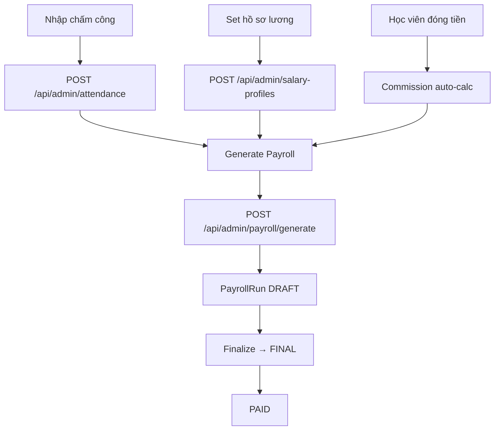

# HR & Payroll

## Mục đích / Giá trị
Chấm công, quản lý hồ sơ lương, tính hoa hồng, tạo kỳ lương, xem lương cá nhân.

## User story / Ai dùng
- **Admin**: quản lý chấm công, hồ sơ lương, generate payroll, tính commission
- **Manager**: xem data HR (read-only hoặc limited)
- **Tất cả**: xem lương cá nhân `/me/payroll`

## Luồng sử dụng

## UI/UX
- **`/hr/kpi`**: KPI nhân sự
- **`/hr/attendance`**: Chấm công (bảng tháng)
- **`/hr/payroll`**: Kỳ lương

## API liên quan
| Endpoint | Mô tả |
|----------|-------|
| `GET/POST /api/admin/attendance` | Chấm công |
| `GET/POST /api/admin/salary-profiles` | Hồ sơ lương |
| `GET/POST /api/admin/employee-kpi` | KPI nhân sự |
| `GET /api/admin/payroll` | Kỳ lương |
| `POST /api/admin/payroll/generate` | Generate payroll |
| `POST /api/admin/payroll/finalize` | Finalize |
| `GET/POST /api/admin/commissions` | Hoa hồng |
| `POST /api/admin/commissions/rebuild` | Rebuild |
| `POST /api/admin/commissions/paid50/rebuild` | Rebuild paid50 |
| `GET /api/me/payroll` | Lương cá nhân |
| `GET /api/admin/ops/pulse` | Ops Pulse |

## Business rules
- Attendance: @@unique([userId, date])
- PayrollRun: @@unique([month, branchId]), status: DRAFT → FINAL → PAID
- PayrollItem: baseSalaryVnd + allowanceVnd + commissionVnd - penaltyVnd + bonusVnd = totalVnd
- Commission: sourceType (RECEIPT/LEAD/STUDENT/MANUAL_ADJUST/PAID50)
- CommissionScheme: rulesJson chứa công thức tính
- commissionPerPaid50: Branch-level config

## Data / DB
- **Attendance**, **SalaryProfile**, **CommissionScheme**, **CommissionLedger**
- **PayrollRun**, **PayrollItem**, **EmployeeKpiSetting**
- **BranchBaseSalary**, **OpsPulse**

## RBAC / Security
- `hr_attendance:VIEW/CREATE/UPDATE`
- `hr_payroll_profiles:VIEW/CREATE/UPDATE`
- `hr_kpi:VIEW/CREATE/UPDATE/EXPORT`
- `hr_total_payroll:VIEW/RUN`
- `my_payroll:VIEW`

## Todo / Tech debt
- Payroll calculation logic phức tạp → cần unit test nhiều hơn
