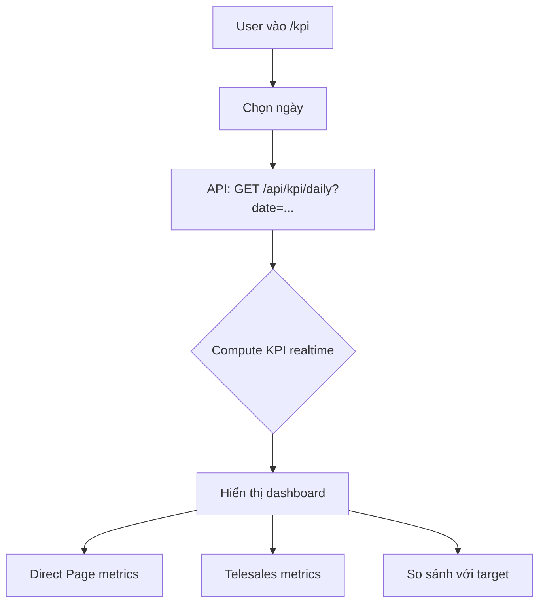

# KPI Daily

## Mục đích / Giá trị
Tổng hợp KPI phần trăm theo ngày (và luỹ kế tháng) cho từng vai trò, giúp quản lý theo dõi hiệu suất nhân viên.

## User story / Ai dùng
- **Tất cả roles**: xem KPI ngày
- **Manager/Admin**: xem KPI team, đặt/sửa mục tiêu

## Luồng sử dụng

## UI/UX
- **URL**: `/kpi`
- Dashboard hiển thị: date picker, 2 panels (Direct Page / Telesales)
- Mỗi metric: tên, giá trị %, target (nếu có), biểu đồ progress
- States: Loading, Empty (ngày chưa có data)

## API liên quan
| Endpoint | Mô tả |
|----------|-------|
| `GET /api/kpi/daily` | KPI theo ngày |
| `GET /api/kpi/targets` | Mục tiêu KPI |
| `POST /api/kpi/targets` | Upsert mục tiêu |

## Business rules
- **Timezone**: `Asia/Ho_Chi_Minh` – tất cả dateKey dùng timezone này
- **dateKey**: format `YYYY-MM-DD`
- KPI tính **realtime** từ data trong DB (Lead status changes, receipts, etc.)
- **Tỷ lệ** tính dạng phần trăm (ví dụ: hasPhoneRate = leads có phone / tổng leads)
- Mục tiêu KPI theo: branchId + role + metricKey + dayOfWeek (-1 = mặc định)
- Catalog metrics: `appointed_rate_pct`, `has_phone_rate_pct`, v.v. (xem `kpi-metrics-catalog.ts`)

## Data / DB
- **KpiTarget**: mục tiêu KPI
- **Tính từ**: Lead, Receipt, Student (aggregate realtime)

## RBAC / Security
- `kpi_daily:VIEW` – xem KPI
- `kpi_targets:VIEW` / `kpi_targets:EDIT` – quản lý target

## Todo / Tech debt
- KPI compute realtime mỗi request → có thể cache nếu load tăng
