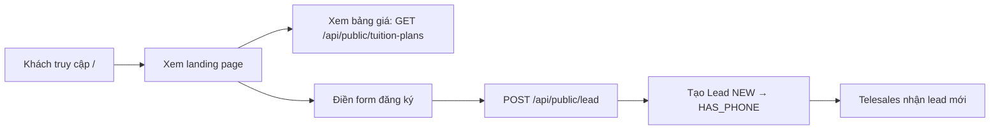

# Landing Page

## Mục đích / Giá trị
Trang giới thiệu dịch vụ đào tạo lái xe, form đăng ký nhanh, bảng học phí công khai.

## User story / Ai dùng
- **Khách vãng lai**: xem thông tin, bảng giá, đăng ký nhanh

## Luồng sử dụng

## UI/UX
- **URL**: `/` (landing page)
- Sections: hero, giới thiệu, bảng giá, form đăng ký, thông tin liên hệ
- Mobile responsive

## API liên quan
| Endpoint | Mô tả |
|----------|-------|
| `GET /api/public/tuition-plans` | Bảng giá công khai |
| `POST /api/public/lead` | Đăng ký từ landing |

## Business rules
- Lead tạo từ landing có source = "website"
- Nếu có phone → status auto set HAS_PHONE
- Trùng phone → trả error (chống spam)

## Data / DB
- **Lead**, **TuitionPlan**

## RBAC / Security
- Public endpoints (không cần auth)

## Config
- TrackingCode: GA4, Facebook Pixel, TikTok Pixel (inject qua API)

## Todo / Tech debt
- Chưa có A/B testing
- Landing page design có thể cải tiến
