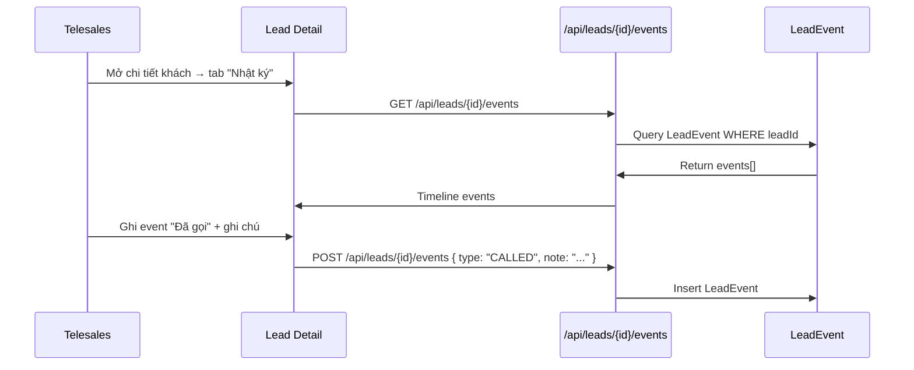

# Lead Events Logging

## Mục đích / Giá trị
Ghi nhật ký toàn bộ sự kiện liên quan đến khách hàng: gọi điện, hẹn, chuyển trạng thái, đổi owner, ghi chú.

## User story / Ai dùng
- **Telesales**: ghi log gọi, kết quả gọi
- **Manager**: xem timeline hoạt động của team
- **Admin**: audit trail toàn bộ

## Luồng sử dụng

## UI/UX
- **URL**: `/leads` → chi tiết lead → tab "Nhật ký"
- Timeline hiển thị: icon + loại event + ghi chú + thời gian + ai tạo

## API liên quan
| Endpoint | Mô tả |
|----------|-------|
| `GET /api/leads/{id}/events` | Lấy timeline |
| `POST /api/leads/{id}/events` | Ghi event mới |

## Business rules
- **LeadEventType**: NEW, HAS_PHONE, APPOINTED, ARRIVED, SIGNED, STUDYING, EXAMED, RESULT, LOST, CALLED, OWNER_CHANGED, ASSIGNED_OWNER, INSTRUCTOR_CHANGED, OTHER
- Khi lead change status → auto insert event tương ứng
- Khi đổi owner → insert `OWNER_CHANGED` + `ASSIGNED_OWNER`
- `payload` (JSON): tuỳ loại event (callOutcome, note, oldStatus, newStatus...)
- `createdById` = user thực hiện

## Data / DB
- **LeadEvent**: leadId, type, payload (JSON), createdById, createdAt
- Indexes: `[leadId, createdAt]`, `[type, createdAt]`

## RBAC / Security
- `leads:VIEW` – xem events
- `leads:UPDATE` – tạo event mới

## Edge cases
- Event không xoá được (append-only audit log)
- Event type CALLED có thêm callOutcome trong payload

## Todo / Tech debt
- Không có ảnh / file đính kèm trong event
