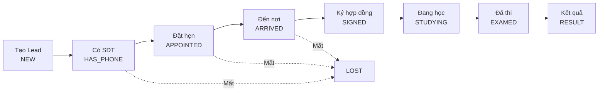

# Leads Pipeline

## Mục đích / Giá trị
Quản lý khách hàng tiềm năng qua pipeline trạng thái từ tiếp nhận đến đăng ký. Là tính năng core của CRM.

## User story / Ai dùng
- **Telesales/Page**: nhận lead từ Facebook/Zalo, gọi tư vấn, hẹn, chăm sóc
- **Manager**: phân bổ khách, giám sát pipeline
- **Admin**: quản lý toàn bộ, phân khách tự động / thủ công

## Luồng sử dụng

## UI/UX
- **`/leads`**: Bảng danh sách + filter (status, owner, search, date range) + phân trang
- **`/leads/board`**: Kanban board theo trạng thái (drag & drop)
- **Detail modal**: Thông tin chi tiết + timeline events + nút cập nhật trạng thái
- **States**: Loading skeleton, Empty "Chưa có khách hàng", Error toast

## API liên quan

| Endpoint | Mô tả |
|----------|-------|
| `GET /api/leads` | Danh sách + filter |
| `POST /api/leads` | Tạo mới |
| `GET /api/leads/{id}` | Chi tiết |
| `PATCH /api/leads/{id}` | Cập nhật |
| `POST /api/leads/assign` | Phân khách thủ công |
| `POST /api/leads/auto-assign` | Phân khách tự động |
| `POST /api/leads/bulk-assign` | Phân hàng loạt |
| `GET /api/leads/stale` | Khách lâu không liên hệ |
| `GET /api/leads/export` | Export Excel |
| `GET /api/leads/unassigned-count` | Đếm chưa phân |

## Business rules
- Phone **@unique** – không tạo trùng SĐT
- Khi tạo lead: nếu có phone → status auto set `HAS_PHONE`, không thì `NEW`
- Mỗi thay đổi status → tự động ghi `LeadEvent`
- Đổi owner → ghi `LeadEvent(OWNER_CHANGED)` + `ASSIGNED_OWNER`
- **Stale lead**: lead không liên hệ > N ngày (cấu hình) → hiện ở `/leads/stale`
- Pipeline chỉ tiến lên (trừ LOST có thể từ bất kỳ status)
- Tags: mảng string, hỗ trợ filter

## Data / DB
- **Lead**: core model, phone @unique, status enum
- **LeadEvent**: audit trail
- **LeadMessage**: tin nhắn in/outbound

## RBAC / Security
- `leads:VIEW` – xem danh sách (scope theo branchId nếu không phải admin)
- `leads:CREATE` – tạo mới
- `leads:UPDATE` – cập nhật thông tin/trạng thái
- `leads:ASSIGN` – phân khách cho owner khác
- `leads:EXPORT` – export Excel

## Edge cases
- Trùng phone → trả error `LEAD_PHONE_EXISTS`
- Phân khách cho owner khác branch → không giới hạn (theo thiết kế)
- Export lượng lớn → pagination server-side

## Test coverage
- E2E: tạo lead, cập nhật status, phân khách

## Todo / Tech debt
- Chưa có webhook import từ Facebook/Zalo API trực tiếp (hiện qua N8N)
