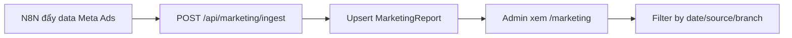

# Marketing Reports

## Mục đích / Giá trị
Theo dõi chi phí quảng cáo Meta Ads, CPL, tin nhắn theo ngày và nguồn.

## User story / Ai dùng
- **Admin/Manager**: xem báo cáo chi phí marketing, so sánh hiệu quả

## Luồng sử dụng

## UI/UX
- **URL**: `/marketing`
- Bảng: ngày, nguồn, chi phí, tin nhắn, CPL, chi nhánh

## API liên quan
| Endpoint | Mô tả |
|----------|-------|
| `GET /api/admin/marketing/reports` | Báo cáo |
| `POST /api/marketing/ingest` | Ingest từ N8N |
| `POST /api/marketing/report` | Report từ N8N |
| `GET /api/marketing/metrics` | Metrics tổng hợp |

## Business rules
- MarketingReport: @@unique([dateKey, branchId, source])
- CPL = spendVnd / messages (nếu messages > 0)

## Data / DB
- **MarketingReport**: date, dateKey, branchId, source, spendVnd, messages, cplVnd, metaJson

## RBAC / Security
- `marketing_meta_ads:VIEW/CREATE/EXPORT`
- Ingest: `MARKETING_SECRET` header

## Todo / Tech debt
- Chưa có biểu đồ trend CPL theo tuần/tháng
