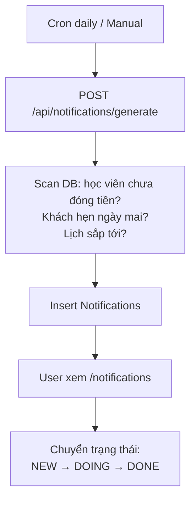

# Notifications & Tasks

## Mục đích / Giá trị
Sinh thông báo nghiệp vụ tự động (nhắc thu tiền, nhắc lịch, follow-up), quản lý danh sách việc cần làm.

## User story / Ai dùng
- **Tất cả**: xem thông báo, đánh dấu hoàn thành
- **Admin**: sinh thông báo tự động, tạo task thủ công

## Luồng sử dụng

## UI/UX
- **URL**: `/notifications`
- Danh sách: filter scope (FINANCE/FOLLOWUP/SCHEDULE/SYSTEM), status
- Badge đếm NEW trên sidebar

## API liên quan
| Endpoint | Mô tả |
|----------|-------|
| `GET /api/notifications` | Danh sách |
| `PATCH /api/notifications/{id}` | Cập nhật status |
| `POST /api/notifications/generate` | Sinh tự động |
| `GET/POST /api/tasks` | Tasks (alias Notification) |
| `PATCH /api/tasks/{id}` | Update task |

## Business rules
- **Scope**: FINANCE (nhắc tiền), FOLLOWUP (chăm sóc), SCHEDULE (lịch), SYSTEM
- **Status pipeline**: NEW → DOING → DONE / SKIPPED
- **Priority**: HIGH / MEDIUM / LOW
- Tasks = Notifications với enriched metadata
- NotificationRule: config JSON cho sinh tự động

## Data / DB
- **Notification**, **NotificationRule**

## RBAC / Security
- `notifications:VIEW/CREATE/UPDATE`

## Todo / Tech debt
- Chưa có push notification (chỉ in-app)
- PushSubscription model sẵn nhưng chưa sử dụng
