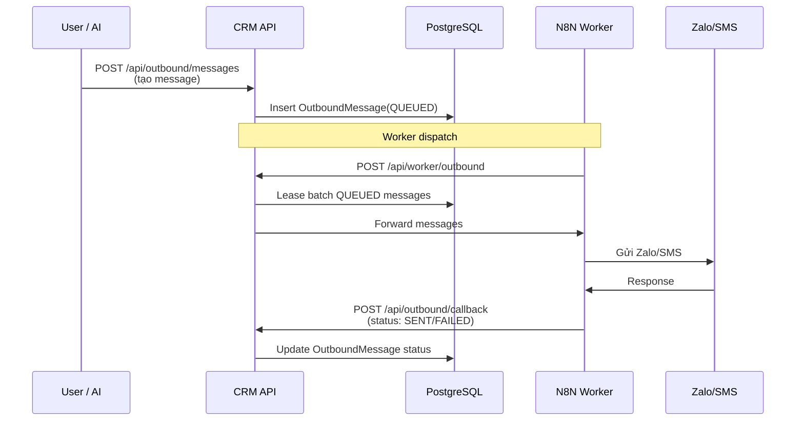

# Outbound Messaging

## Mục đích / Giá trị
Hàng đợi gửi tin nhắn tự động/thủ công qua Zalo, Facebook, SMS, ghi chú gọi. Worker dispatch + N8N callback.

## User story / Ai dùng
- **Telesales**: tạo tin nhắn gửi học viên/khách
- **Admin**: monitor hàng đợi, dispatch batch, xem jobs

## Luồng sử dụng

## UI/UX
- **URL**: `/outbound`
- Bảng hàng đợi: filter status, channel, date

## API liên quan
| Endpoint | Mô tả |
|----------|-------|
| `GET/POST /api/outbound/messages` | Queue |
| `POST /api/outbound/dispatch` | Dispatch batch |
| `GET/POST /api/outbound/jobs` | Jobs (từ AI action) |
| `PATCH /api/outbound/jobs/{id}` | N8N cập nhật status |
| `POST /api/outbound/callback` | N8N callback |

## Business rules
- Messages có lease mechanism: leaseId + leaseExpiresAt (worker claims)
- Retry: retryCount, nextAttemptAt
- Priorities: HIGH > MEDIUM > LOW
- Quiet hours: OPS_QUIET_HOURS (mặc định 21:00-08:00) → không gửi
- Rate limit: WORKER_RATE_LIMIT_PER_MIN, PER_OWNER

## Data / DB
- **OutboundMessage**: channel, template, status, lease fields
- **OutboundJob**: job level tracking, suggestionId link
- **MessageTemplate**: key, body (template biến)

## RBAC / Security
- `messaging:VIEW/CREATE/RUN`, `outbound_jobs:VIEW/CREATE`
- Worker: `WORKER_SECRET` header
- Callback: `N8N_CALLBACK_SECRET` header

## Service Logic
- `src/lib/services/outbound-worker.ts` (14.6KB)

## Todo / Tech debt
- Chưa tích hợp Zalo OA API trực tiếp (qua N8N)
