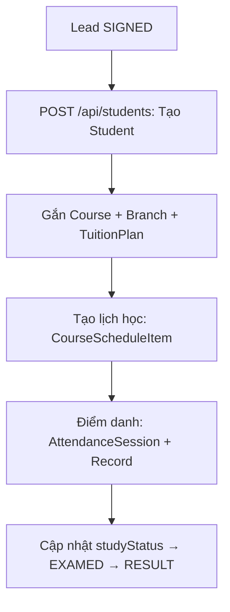

# Student / Course / Schedule

## Mục đích / Giá trị
Quản lý học viên, khoá học, lịch học/thi, điểm danh. Core module học vụ.

## User story / Ai dùng
- **Telesales**: nâng lead thành học viên, gắn khoá
- **Manager**: quản lý khoá học, lịch, điểm danh
- **Admin**: cấu hình toàn bộ

## Luồng sử dụng

## UI/UX
- **`/students`**: Bảng học viên + filter (studyStatus, course, search)
- **`/courses`**: Danh sách khoá học, tạo/sửa khoá
- **`/schedule`**: Calendar/bảng lịch, tạo lịch thủ công, điểm danh

## API liên quan
| Endpoint | Mô tả |
|----------|-------|
| `GET/POST /api/students` | List/create |
| `GET/PATCH /api/students/{id}` | Detail/update |
| `POST /api/students/bulk-status` | Cập nhật status hàng loạt |
| `GET /api/students/{id}/finance` | Tài chính học viên |
| `GET /api/students/{id}/app-progress` | Tiến trình học app |
| `GET/POST /api/courses` | Khoá học |
| `GET/PATCH /api/courses/{id}` | Detail/update khoá |
| `GET/POST /api/courses/{id}/schedule` | Lịch khoá |
| `GET/POST /api/schedule` | Lịch + tạo thủ công |
| `GET/PATCH /api/schedule/{id}` | Detail/update lịch |
| `POST /api/schedule/{id}/attendance` | Điểm danh |
| `GET/POST /api/instructors` | Giáo viên |
| `GET/POST /api/practical-lessons` | Bài thực hành |

## Business rules
- Student.leadId @unique (1 lead → 1 student)
- tuitionSnapshot lưu giá lúc đăng ký (không thay đổi khi sửa TuitionPlan)
- Schedule: check trùng giờ (allowOverlap bypass)
- Điểm danh: upsert @@unique([studentId, scheduleItemId])
- AttendanceAudit: log thay đổi

## Data / DB
- **Student**, **Course**, **CourseScheduleItem**, **AttendanceSession**, **AttendanceRecord**, **AttendanceAudit**
- **Instructor**: giáo viên (phone @unique)
- **PracticalLesson**: bài thực hành (sa hình/đường trường/cabin)
- **StudentExamPlan**: lịch thi dự kiến

## RBAC / Security
- `students:VIEW/CREATE/UPDATE/EXPORT`
- `courses:VIEW/CREATE/UPDATE`
- `schedule:VIEW/CREATE/UPDATE`

## Todo / Tech debt
- Calendar view UI có thể cải thiện (drag & drop)
