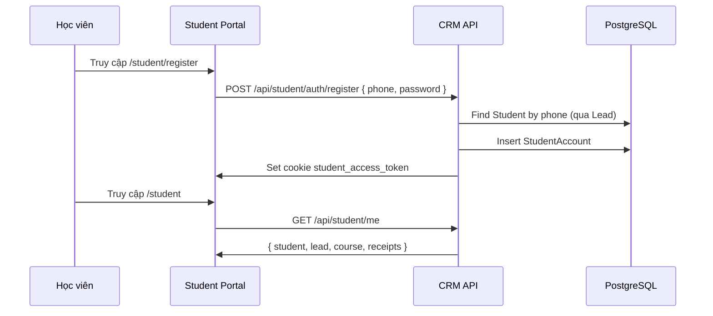

# Student Portal

## Mục đích / Giá trị
Cổng dành cho học viên: tự xem lịch học, tiến độ tài chính, nội dung hướng dẫn, điểm thi.

## User story / Ai dùng
- **Học viên**: đăng ký tài khoản bằng SĐT, đăng nhập, xem thông tin cá nhân

## Luồng sử dụng

## UI/UX
- **`/student`**: Dashboard học viên (thông tin, lịch, tiến độ)
- **`/student/login`**: Đăng nhập
- **`/student/register`**: Đăng ký
- **`/student/schedule`**: Lịch học
- **`/student/finance`**: Phiếu thu, công nợ
- **`/student/content`**: Tài liệu hướng dẫn (HUONG_DAN, MEO_HOC, HO_SO, THI)

## API liên quan
| Endpoint | Mô tả |
|----------|-------|
| `POST /api/student/auth/login` | Đăng nhập |
| `POST /api/student/auth/register` | Đăng ký |
| `POST /api/student/auth/logout` | Đăng xuất |
| `GET /api/student/me` | Thông tin phiên |
| `GET /api/student/content` | Nội dung hướng dẫn |

## Business rules
- StudentAccount.phone @unique (match với Lead.phone)
- Mỗi Student chỉ có 1 StudentAccount (studentId @unique)
- CRM staff có thể xem student portal bằng crm_access_token

## Data / DB
- **Student**, **StudentAccount**, **StudentContent**, **Receipt**

## RBAC / Security
- Student token riêng biệt (student_access_token cookie)
- Middleware guard: `/student/*` yêu cầu student hoặc CRM token

## Todo / Tech debt
- Chưa có push notification cho học viên
