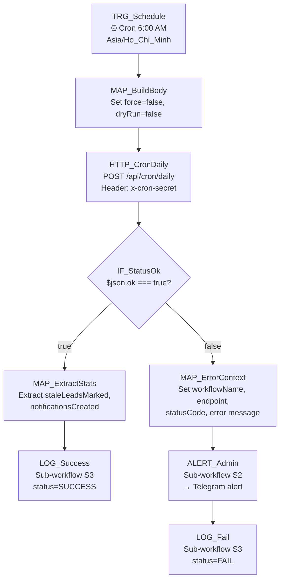

# 01 — Daily Cron Master

## 1. Mục đích + KPI

Workflow trung tâm chạy mỗi sáng sớm. Kích hoạt tất cả logic hàng ngày của CRM: đánh dấu lead nguội, tạo notification follow-up, cập nhật KPI, dọn dữ liệu tạm.

**KPI**: Cron chạy thành công 100% các ngày làm việc. Response time < 30s.

---

## 2. Trigger + Timezone + Tần suất

| Thuộc tính | Giá trị |
|-----------|---------|
| Trigger | Schedule Trigger (Cron) |
| Cron expression | `0 6 * * *` |
| Timezone | `Asia/Ho_Chi_Minh` |
| Tần suất | Mỗi ngày lúc 06:00 AM |
| Chạy cuối tuần | Có (lead không nghỉ) |

---

## 3. Input / Output

### Input (body gửi đến CRM)
| Field | Type | Required | Mô tả |
|-------|------|----------|--------|
| `force` | boolean | No | `true` = bỏ qua guard "đã chạy hôm nay" |
| `dryRun` | boolean | No | `true` = chạy thử, không thay đổi DB |

### Output (response từ CRM)
| Field | Type | Mô tả |
|-------|------|--------|
| `ok` | boolean | `true` nếu thành công |
| `staleLeadsMarked` | number | Số lead bị đánh dấu nguội |
| `notificationsCreated` | number | Số notification tạo mới |
| `kpiUpdated` | boolean | KPI đã được cập nhật |
| `executedAt` | ISO datetime | Thời điểm chạy |

---

## 4. Sơ đồ Node chi tiết



---

## 5. Bảng Node-by-Node

| # | Node Name | Node Type | Config quan trọng | Input mapping | Output | Error handling |
|---|-----------|-----------|-------------------|---------------|--------|----------------|
| 1 | `TRG_Schedule` | Schedule Trigger | Cron: `0 6 * * *`, TZ: `Asia/Ho_Chi_Minh` | — | Trigger signal | — |
| 2 | `MAP_BuildBody` | Set | `force`: `false`, `dryRun`: `false` | — | `{force, dryRun}` | — |
| 3 | `HTTP_CronDaily` | HTTP Request | Method: `POST`, URL: `{{ $env.CRM_BASE_URL }}/api/cron/daily`, Header: `x-cron-secret: {{ $env.CRON_SECRET }}`, Body: `{{ $json }}`, Retry on fail: `true`, Max tries: `3`, Wait between: `5000ms` | `$json.force`, `$json.dryRun` | Full CRM response | On error: continue (route to IF) |
| 4 | `IF_StatusOk` | IF | Condition: `{{ $json.ok }}` equals `true` | `$json` from HTTP | Route true/false | — |
| 5 | `MAP_ExtractStats` | Set | `staleLeads`: `{{ $json.staleLeadsMarked }}`, `notifications`: `{{ $json.notificationsCreated }}` | `$json` | Extracted stats | — |
| 6 | `LOG_Success` | Execute Sub-workflow | Workflow: `[CRM] S3 Standard Logger`, Pass: `{workflowName: "01-daily-cron", endpoint: "/api/cron/daily", statusCode: 200, dateKey: today}` | Stats from MAP | Log entry | — |
| 7 | `MAP_ErrorContext` | Set | `workflowName`: `"01 Daily Cron"`, `endpoint`: `"/api/cron/daily"`, `error`: `{{ $json.error \|\| $json.message \|\| "Unknown" }}` | Error response | Error context | — |
| 8 | `ALERT_Admin` | Execute Sub-workflow | Workflow: `[CRM] S2 Alert Admin` | Error context | `{sent: boolean}` | Silent fail (log only) |
| 9 | `LOG_Fail` | Execute Sub-workflow | Workflow: `[CRM] S3 Standard Logger`, status=FAIL | Error context | Log entry | — |

---

## 6. Request mẫu (curl)

### Chạy thật
```bash
curl -s -X POST "${CRM_BASE_URL}/api/cron/daily" \
  -H "Content-Type: application/json" \
  -H "x-cron-secret: ${CRON_SECRET}" \
  -d '{"force": false, "dryRun": false}'
```

### Dry run (test)
```bash
curl -s -X POST "${CRM_BASE_URL}/api/cron/daily" \
  -H "Content-Type: application/json" \
  -H "x-cron-secret: ${CRON_SECRET}" \
  -d '{"force": true, "dryRun": true}'
```

### Response mẫu
```json
{
  "ok": true,
  "staleLeadsMarked": 12,
  "notificationsCreated": 8,
  "kpiUpdated": true,
  "executedAt": "2026-02-18T06:00:01.234Z"
}
```

---

## 7. Idempotency & Anti-duplicate

| Aspect | Strategy |
|--------|----------|
| Guard nội bộ | CRM kiểm tra đã chạy cron hôm nay chưa (trừ khi `force: true`) |
| Gọi trùng | An toàn — nếu đã chạy sẽ trả `{ ok: true, skipped: true }` |
| Idempotency key | Không cần — do CRM tự quản lý bằng date-based guard |

---

## 8. Retry / Backoff / Rate-limit

| Cấu hình | Giá trị |
|----------|---------|
| Retry on fail (N8N node) | `true` |
| Max tries | `3` |
| Wait between retries | `5000ms` (exponential: 5s → 10s → 20s) |
| HTTP timeout | `30000ms` |
| Xử lý 429 | Không áp dụng (endpoint không rate-limited) |
| Xử lý 5xx | Retry → nếu vẫn fail → route sang ALERT_Admin |
| Xử lý 403 | Không retry (sai secret) → route sang ALERT_Admin ngay |

---

## 9. Observability

### Log fields bắt buộc
```json
{
  "correlationId": "01-daily-cron-{executionId}-{dateKey}",
  "workflowName": "01-daily-cron-master",
  "endpoint": "/api/cron/daily",
  "statusCode": 200,
  "durationMs": 1234,
  "dateKey": "2026-02-18",
  "result": {
    "staleLeadsMarked": 12,
    "notificationsCreated": 8,
    "kpiUpdated": true
  }
}
```

### Alert channels
| Khi nào | Gửi tới |
|---------|---------|
| Cron fail (status != 200) | Telegram group admin |
| Cron fail sau 3 retry | Telegram + Email admin |
| Cron skip (đã chạy) | Chỉ log, không alert |

---

## 10. Runbook vận hành

### Test nhanh (1 lệnh)
```bash
# Dry run test
curl -s -X POST "http://localhost:3000/api/cron/daily" \
  -H "Content-Type: application/json" \
  -H "x-cron-secret: test-cron-secret-local" \
  -d '{"force": true, "dryRun": true}' | python3 -m json.tool
```

### Bật/tắt workflow
- N8N UI → Workflows → `[CRM] 01 Daily Cron Master` → Toggle Active/Inactive

### Debug khi fail
1. Kiểm tra N8N execution history: Executions → Lọc workflow 01
2. Kiểm tra CRM logs: `docker logs crm-app --tail 50 | grep cron`
3. Kiểm tra secret: so sánh `CRON_SECRET` giữa N8N env và CRM `.env`
4. Test manual: chạy curl dry-run ở trên

### Checklist secrets
- [ ] `CRM_BASE_URL` — đặt đúng URL production
- [ ] `CRON_SECRET` — khớp với CRM server `.env`
