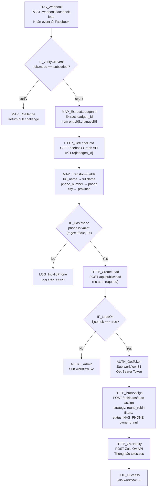

# 02 — Facebook Lead Capture

## 1. Mục đích + KPI

Tự động nhận lead từ Facebook Lead Ads webhook, tạo lead trong CRM, gán owner round-robin cho telesales, gửi thông báo Zalo cho nhân viên được gán.

**KPI**: 100% lead từ Facebook được nhập CRM trong < 30 giây. 0% lead bị miss.

---

## 2. Trigger + Timezone + Tần suất

| Thuộc tính | Giá trị |
|-----------|---------|
| Trigger | Webhook (POST) |
| Path | `/webhook/facebook-lead` |
| Timezone | `Asia/Ho_Chi_Minh` |
| Tần suất | Real-time (mỗi khi có lead mới trên Facebook) |
| Auth | Facebook Verify Token |

---

## 3. Input / Output

### Input (Facebook Leadgen Webhook Payload)
| Field | Type | Mapping → CRM |
|-------|------|---------------|
| `entry[0].changes[0].value.leadgen_id` | string | Dùng để query Graph API |
| `entry[0].changes[0].value.page_id` | string | Xác định page |
| `entry[0].changes[0].value.form_id` | string | Xác định form |

### Lead data (từ Graph API)
| Facebook Field | CRM Field | Transform |
|----------------|-----------|-----------|
| `full_name` | `fullName` | Trim |
| `phone_number` | `phone` | Remove spaces, format 0xx |
| `city` | `province` | Map city → province |
| — | `licenseType` | Mặc định `"B2"` hoặc từ custom field |
| — | `source` | Set `"facebook"` |
| — | `channel` | Set `"fb_lead_ads"` |

### Output
| Field | Type | Mô tả |
|-------|------|--------|
| `ok` | boolean | Lead tạo thành công |
| `assigned` | object | Owner được gán `{leadId, ownerId}` |

---

## 4. Sơ đồ Node chi tiết



---

## 5. Bảng Node-by-Node

| # | Node Name | Node Type | Config quan trọng | Input mapping | Output | Error handling |
|---|-----------|-----------|-------------------|---------------|--------|----------------|
| 1 | `TRG_Webhook` | Webhook | Method: POST, Path: `/webhook/facebook-lead`, Response mode: `When last node finishes` | Facebook POST body | Raw event | — |
| 2 | `IF_VerifyOrEvent` | IF | Condition: `{{ $json.query['hub.mode'] === 'subscribe' }}` | Query params | Route | — |
| 3 | `MAP_Challenge` | Set | Return `hub.challenge` as plain text | Query params | Challenge string | — |
| 4 | `MAP_ExtractLeadgenId` | Set | `leadgenId`: `{{ $json.body.entry[0].changes[0].value.leadgen_id }}` | Event body | leadgenId | Skip if entry empty |
| 5 | `HTTP_GetLeadData` | HTTP Request | GET `https://graph.facebook.com/v21.0/{{ $json.leadgenId }}?access_token={{ $env.FB_PAGE_TOKEN }}` | leadgenId | Lead fields | Retry 2x |
| 6 | `MAP_TransformFields` | Code | Map `full_name` → `fullName`, `phone_number` → `phone` (strip spaces, normalize 0xx), `city` → `province` | Graph API data | CRM payload | — |
| 7 | `IF_HasPhone` | IF | Regex: `{{ /^0\d{8,10}$/.test($json.phone) }}` | phone | Route | — |
| 8 | `HTTP_CreateLead` | HTTP Request | POST `{{ $env.CRM_BASE_URL }}/api/public/lead`, Body: `{fullName, phone, province, licenseType: "B2"}` | Transformed fields | `{ok, message}` | On error: route ALERT |
| 9 | `AUTH_GetToken` | Execute Sub-workflow | `[CRM] S1 Get Bearer Token` | — | `{bearerToken}` | — |
| 10 | `HTTP_AutoAssign` | HTTP Request | POST `/api/leads/auto-assign`, Auth: Bearer `{{ $json.bearerToken }}`, Body: `{strategy: "round_robin", filters: {status: "HAS_PHONE"}}` | Token from S1 | `{updated, assigned[]}` | Log if fail, don't block |
| 11 | `HTTP_ZaloNotify` | HTTP Request | POST Zalo OA API, Template: "Lead mới: {fullName} - {phone}" | Lead data + assigned owner | Zalo response | Silent fail |
| 12 | `LOG_Success` | Execute Sub-workflow | `[CRM] S3 Standard Logger` | All context | Log entry | — |

---

## 6. Request mẫu (curl)

### Tạo lead (Public API)
```bash
curl -s -X POST "${CRM_BASE_URL}/api/public/lead" \
  -H "Content-Type: application/json" \
  -d '{
    "fullName": "Nguyễn Văn A",
    "phone": "0901234567",
    "province": "TP.HCM",
    "licenseType": "B2"
  }'
```

### Response
```json
{
  "ok": true,
  "message": "Đã ghi nhận thông tin. Chúng tôi sẽ liên hệ bạn sớm!"
}
```

### Auto-assign (Bearer required)
```bash
curl -s -X POST "${CRM_BASE_URL}/api/leads/auto-assign" \
  -H "Content-Type: application/json" \
  -H "Authorization: Bearer ${TOKEN}" \
  -d '{
    "strategy": "round_robin",
    "filters": { "status": "HAS_PHONE" }
  }'
```

### Response
```json
{
  "updated": 3,
  "assigned": [
    {"leadId": "clxyz1", "ownerId": "user-ts1"},
    {"leadId": "clxyz2", "ownerId": "user-ts2"},
    {"leadId": "clxyz3", "ownerId": "user-ts1"}
  ]
}
```

---

## 7. Idempotency & Anti-duplicate

| Aspect | Strategy |
|--------|----------|
| Phone trùng | CRM tự xử lý: nếu phone đã tồn tại → update `updatedAt` + bổ sung fields thiếu |
| Webhook trùng | Facebook có thể gửi cùng event 2-3 lần → CRM idempotent theo phone unique constraint |
| Leadgen ID | Lưu `leadgenId` vào log để trace duplicate |
| Anti-spam | CRM có honeypot field `_hp`: nếu có → silent ignore |
| Rate-limit | CRM giới hạn 10 req/phút cho public endpoint |

---

## 8. Retry / Backoff / Rate-limit

| Cấu hình | Giá trị |
|----------|---------|
| HTTP_GetLeadData retry | `2` lần, mỗi 3000ms |
| HTTP_CreateLead retry | `3` lần, mỗi 2000ms |
| HTTP_AutoAssign retry | `1` lần (không block nếu fail) |
| HTTP_ZaloNotify retry | `2` lần, mỗi 5000ms |
| 429 từ CRM | Wait 60s rồi retry |
| 429 từ Facebook | Wait 300s (5 phút) rồi retry |
| Timeout | HTTP nodes: `15000ms` |

---

## 9. Observability

### Log fields
```json
{
  "correlationId": "02-fb-lead-{executionId}",
  "workflowName": "02-facebook-lead-capture",
  "leadgenId": "12345678",
  "phone": "090***567",
  "leadCreated": true,
  "autoAssigned": true,
  "assignedOwner": "user-ts1",
  "zaloNotified": true,
  "durationMs": 2340
}
```

### Alert channels
| Khi nào | Gửi tới |
|---------|---------|
| Lead create fail | Telegram admin |
| Facebook API fail (liên tục > 3 lần) | Telegram + Email |
| Rate-limit CRM | LOG only (auto-retry) |

---

## 10. Runbook vận hành

### Test nhanh
```bash
# Giả lập tạo lead từ landing
curl -s -X POST "http://localhost:3000/api/public/lead" \
  -H "Content-Type: application/json" \
  -d '{"fullName":"Test N8N","phone":"0999888777","province":"HCM","licenseType":"B2"}' \
  | python3 -m json.tool
```

### Cấu hình Facebook Webhook
1. Facebook Developer Console → App → Webhooks
2. Callback URL: `https://n8n.your-domain.com/webhook/facebook-lead`
3. Verify Token: (đặt trong N8N webhook node)
4. Subscribe: `leadgen` field

### Debug
1. Kiểm tra N8N webhooks: Settings → Webhook URLs
2. Check Facebook webhook delivery status
3. Check CRM leads: `/leads?source=facebook`

### Checklist
- [ ] `FB_PAGE_TOKEN` — Facebook Page access token (long-lived)
- [ ] `CRM_BASE_URL` — URL production CRM
- [ ] `CRM_EMAIL` / `CRM_PASSWORD` — cho auto-assign step
- [ ] Zalo OA credentials (cho notification step)
