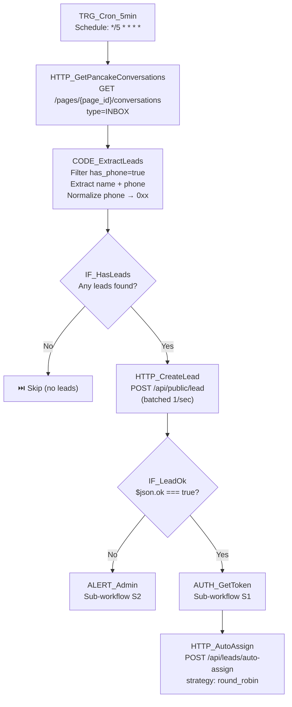

# 02 — Pancake Lead Capture

## 1. Mục đích + KPI

Tự động lấy lead (khách hàng có SĐT) từ **Pancake conversations API**, tạo lead trong CRM, gán owner round-robin cho telesales.

**KPI**: 100% lead có SĐT từ Pancake inbox được nhập CRM trong < 5 phút. 0% lead bị miss.

---

## 2. Trigger + Timezone + Tần suất

| Thuộc tính | Giá trị |
|-----------|---------|
| Trigger | Schedule (Cron) |
| Schedule | Mỗi 5 phút (`*/5 * * * *`) |
| Timezone | `Asia/Ho_Chi_Minh` |
| API Source | Pancake Conversations API |
| Auth | Page Access Token |

---

## 3. Input / Output

### Input (Pancake Conversations API)
| Field | Type | Mapping → CRM |
|-------|------|---------------|
| `page_customer.name` / `from.name` | string | → `fullName` |
| `recent_phone_numbers[0].phone_number` | string | → `phone` (normalize) |
| `page_customer.gender` | string | → `gender` |
| `ad_ids` (presence) | array | → `channel` (fb_ads_inbox / facebook_inbox) |
| — | — | `source` = `"pancake"` |
| — | — | `licenseType` = `"B2"` |

### Output
| Field | Type | Mô tả |
|-------|------|--------|
| `ok` | boolean | Lead tạo thành công |
| `assigned` | object | Owner được gán `{leadId, ownerId}` |

---

## 4. Sơ đồ Node chi tiết



---

## 5. Bảng Node-by-Node

| # | Node Name | Node Type | Config quan trọng | Input → Output | Error handling |
|---|-----------|-----------|-------------------|----------------|----------------|
| 1 | `TRG_Cron_5min` | Schedule Trigger | Every 5 minutes | — → trigger | — |
| 2 | `HTTP_GetPancakeConversations` | HTTP Request | GET `https://pages.fm/api/public_api/v2/pages/{{ $env.PANCAKE_PAGE_ID }}/conversations?page_access_token={{ $env.PANCAKE_PAGE_ACCESS_TOKEN }}&type[]=INBOX` | — → conversations[] | Retry 2x, 5s |
| 3 | `CODE_ExtractLeads` | Code | Filter `has_phone=true`, extract name+phone, normalize phone `0xx`, validate regex | conversations → leads[] | Skip invalid |
| 4 | `IF_HasLeads` | IF | `_noLeads !== true` | leads → route | — |
| 5 | `HTTP_CreateLead` | HTTP Request | POST `{{ $env.CRM_BASE_URL }}/api/public/lead`, batched 1/sec | lead → `{ok}` | Retry 3x, continue on error |
| 6 | `IF_LeadOk` | IF | `$json.ok === true` | response → route | — |
| 7 | `AUTH_GetToken` | Sub-workflow | `[CRM] S1 Get Bearer Token` | — → `{bearerToken}` | — |
| 8 | `HTTP_AutoAssign` | HTTP Request | POST `/api/leads/auto-assign`, Auth: Bearer | token → assigned | Continue on error |
| 9 | `ALERT_Admin` | Sub-workflow | `[CRM] S2 Alert Admin` | error context → alert | — |

---

## 6. Request mẫu (curl)

### Lấy conversations từ Pancake
```bash
curl -s "https://pages.fm/api/public_api/v2/pages/${PANCAKE_PAGE_ID}/conversations?page_access_token=${PANCAKE_PAGE_ACCESS_TOKEN}&type[]=INBOX"
```

### Tạo lead (Public API)
```bash
curl -s -X POST "${CRM_BASE_URL}/api/public/lead" \
  -H "Content-Type: application/json" \
  -d '{
    "fullName": "Nguyễn Văn A",
    "phone": "0901234567",
    "province": "",
    "licenseType": "B2"
  }'
```

### Auto-assign (Bearer required)
```bash
curl -s -X POST "${CRM_BASE_URL}/api/leads/auto-assign" \
  -H "Content-Type: application/json" \
  -H "Authorization: Bearer ${TOKEN}" \
  -d '{"strategy": "round_robin", "filters": {"status": "HAS_PHONE"}}'
```

---

## 7. Idempotency & Anti-duplicate

| Aspect | Strategy |
|--------|----------|
| Phone trùng | CRM tự xử lý: nếu phone đã tồn tại → update `updatedAt` + bổ sung fields thiếu |
| Cron polling trùng | CRM idempotent theo phone unique constraint — cùng phone gọi nhiều lần vẫn safe |
| Rate-limit Pancake | Pancake API không ghi rõ rate-limit; poll mỗi 5 phút là an toàn |
| Rate-limit CRM | CRM giới hạn 10 req/phút cho public endpoint; batch 1 req/giây |

---

## 8. Retry / Backoff

| Cấu hình | Giá trị |
|----------|---------|
| HTTP_GetPancakeConversations retry | `2` lần, mỗi 5000ms |
| HTTP_CreateLead retry | `3` lần, mỗi 2000ms |
| HTTP_AutoAssign retry | `1` lần (không block nếu fail) |
| Timeout | HTTP nodes: `15000ms` (Pancake: `30000ms`) |

---

## 9. Checklist cấu hình

- [ ] `PANCAKE_PAGE_ACCESS_TOKEN` — Token từ Pancake Settings → Tools
- [ ] `PANCAKE_PAGE_ID` — Page ID (hiện tại: `382049544990443`)
- [ ] `CRM_BASE_URL` — URL production CRM
- [ ] `CRM_EMAIL` / `CRM_PASSWORD` — cho auto-assign step
