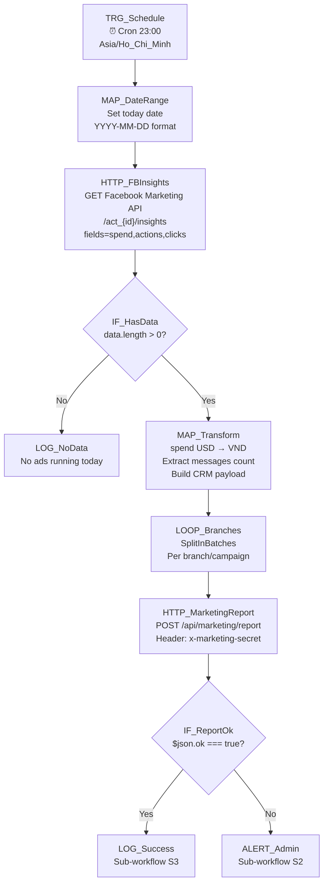

# 03 — Marketing Ads Sync

## 1. Mục đích + KPI

Đồng bộ chi phí quảng cáo Meta Ads hàng ngày vào CRM. Tự động tính CPL (cost per lead), hiển thị trên dashboard marketing, giúp quản lý theo dõi ROI quảng cáo.

**KPI**: 100% ngày có dữ liệu ads được sync. CPL dashboard luôn cập nhật sáng hôm sau.

---

## 2. Trigger + Timezone + Tần suất

| Thuộc tính | Giá trị |
|-----------|---------|
| Trigger | Schedule Trigger (Cron) |
| Cron expression | `0 23 * * *` |
| Timezone | `Asia/Ho_Chi_Minh` |
| Tần suất | Mỗi ngày lúc 23:00 |
| Chạy cuối tuần | Có (ads chạy 24/7) |

---

## 3. Input / Output

### Input → Facebook Marketing API
| Field | Mô tả |
|-------|--------|
| `act_{AD_ACCOUNT_ID}` | Facebook Ad Account ID |
| `date_preset`: `today` | Lấy data hôm nay |
| `fields`: `spend,actions,impressions,clicks` | Metrics cần lấy |

### Transform: Facebook → CRM
| Facebook Field | CRM Field | Transform |
|----------------|-----------|-----------|
| `spend` (USD) | `spendVnd` (VND) | `spend * exchangeRate` |
| `actions[type=onsite_conversion.messaging_conversation_started_7d].value` | `messages` | Extract count |
| Campaign metadata | `meta` | Pass-through JSON |
| — | `date` | `YYYY-MM-DD` format |
| — | `source` | `"meta"` |
| — | `branchCode` | Map từ campaign name hoặc set mặc định |

### Output (CRM response)
| Field | Type | Mô tả |
|-------|------|--------|
| `ok` | boolean | Thành công |
| `item.id` | string | ID record đã upsert |
| `item.cplVnd` | number | CPL tự động tính (spendVnd / messages) |

---

## 4. Sơ đồ Node chi tiết



---

## 5. Bảng Node-by-Node

| # | Node Name | Node Type | Config quan trọng | Input mapping | Output | Error handling |
|---|-----------|-----------|-------------------|---------------|--------|----------------|
| 1 | `TRG_Schedule` | Schedule Trigger | Cron: `0 23 * * *`, TZ: `Asia/Ho_Chi_Minh` | — | Trigger | — |
| 2 | `MAP_DateRange` | Set | `dateKey`: `{{ $now.format('yyyy-MM-dd') }}` | — | `{dateKey}` | — |
| 3 | `HTTP_FBInsights` | HTTP Request | GET `https://graph.facebook.com/v21.0/act_{{ $env.FB_AD_ACCOUNT_ID }}/insights?date_preset=today&fields=spend,actions,impressions,clicks&access_token={{ $env.FB_ACCESS_TOKEN }}` | — | Facebook insights JSON | Retry 3x, backoff 10s |
| 4 | `IF_HasData` | IF | `{{ $json.data.length > 0 }}` | FB response | Route | — |
| 5 | `MAP_Transform` | Code | `spendVnd = Math.round(parseFloat(data.spend) * 25400)`, extract `messages` from actions array | FB insights | CRM payload `{date, source, spendVnd, messages, branchCode, meta}` | — |
| 6 | `LOOP_Branches` | SplitInBatches | Batch size: 1 (per campaign) | Multiple rows | Single row | — |
| 7 | `HTTP_MarketingReport` | HTTP Request | POST `{{ $env.CRM_BASE_URL }}/api/marketing/report`, Header: `x-marketing-secret: {{ $env.MARKETING_SECRET }}`, Body: transformed payload | CRM payload | `{ok, item}` | Retry 3x |
| 8 | `IF_ReportOk` | IF | `{{ $json.ok === true }}` | CRM response | Route | — |
| 9 | `LOG_Success` | Execute Sub-workflow | `[CRM] S3 Standard Logger` | All context | Log | — |
| 10 | `ALERT_Admin` | Execute Sub-workflow | `[CRM] S2 Alert Admin` | Error context | Alert | — |

---

## 6. Request mẫu (curl)

### Gửi marketing report
```bash
curl -s -X POST "${CRM_BASE_URL}/api/marketing/report" \
  -H "Content-Type: application/json" \
  -H "x-marketing-secret: ${MARKETING_SECRET}" \
  -d '{
    "date": "2026-02-18",
    "source": "meta",
    "spendVnd": 2500000,
    "messages": 45,
    "branchCode": "Q1",
    "meta": {
      "campaignName": "B2_HCMC_Feb2026",
      "impressions": 15000,
      "clicks": 320,
      "ctr": 2.13
    }
  }'
```

### Response
```json
{
  "ok": true,
  "item": {
    "id": "clxyz123",
    "dateKey": "2026-02-18",
    "source": "meta",
    "spendVnd": 2500000,
    "messages": 45,
    "cplVnd": 55556,
    "createdAt": "2026-02-18T23:01:00.000Z",
    "updatedAt": "2026-02-18T23:01:00.000Z"
  }
}
```

---

## 7. Idempotency & Anti-duplicate

| Aspect | Strategy |
|--------|----------|
| Upsert | CRM sử dụng upsert theo `date + source + branchCode` → gọi lại cùng ngày sẽ update |
| Gọi trùng | An toàn — upsert không tạo duplicate |
| Multiple campaigns | Mỗi campaign/branch gửi riêng 1 request |

---

## 8. Retry / Backoff / Rate-limit

| Cấu hình | Giá trị |
|----------|---------|
| Facebook API retry | `3` lần, backoff `10000ms` |
| CRM report retry | `3` lần, backoff `5000ms` |
| Facebook rate-limit | Nếu 429 → wait 300s (5 phút) |
| CRM timeout | `15000ms` |

---

## 9. Observability

### Log fields
```json
{
  "correlationId": "03-marketing-{executionId}-{dateKey}",
  "workflowName": "03-marketing-ads-sync",
  "dateKey": "2026-02-18",
  "branchCode": "Q1",
  "spendVnd": 2500000,
  "messages": 45,
  "cplVnd": 55556,
  "statusCode": 200,
  "durationMs": 3200
}
```

### Alert
| Khi nào | Gửi tới |
|---------|---------|
| Facebook API fail | Telegram admin |
| CRM report fail | Telegram admin |
| No ads data (bất thường) | LOG only |

---

## 10. Runbook vận hành

### Test nhanh
```bash
curl -s -X POST "http://localhost:3000/api/marketing/report" \
  -H "Content-Type: application/json" \
  -H "x-marketing-secret: test-marketing-secret-local" \
  -d '{"date":"2026-02-18","source":"meta","spendVnd":1000000,"messages":20,"branchCode":"Q1"}' \
  | python3 -m json.tool
```

### Debug
1. Check Facebook Marketing API response: thử GET insights trực tiếp
2. Check exchange rate: verify USD→VND conversion
3. Check CRM marketing metrics: `/marketing/metrics`

### Checklist
- [ ] `FB_AD_ACCOUNT_ID` — Facebook Ad Account ID
- [ ] `FB_ACCESS_TOKEN` — Long-lived token (renew mỗi 60 ngày)
- [ ] `MARKETING_SECRET` — khớp CRM server
- [ ] `CRM_BASE_URL`
