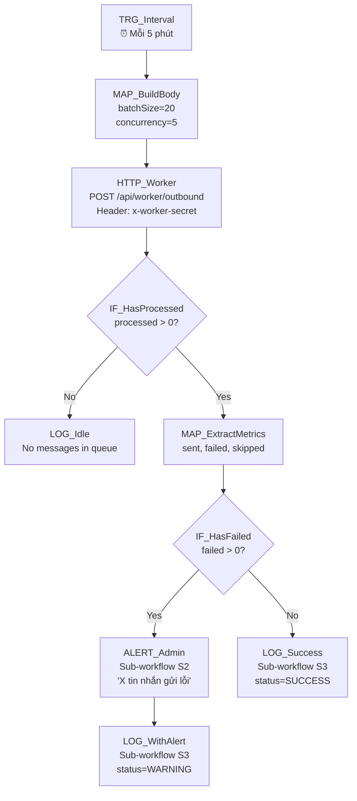

# 05 — Outbound Message Worker

## 1. Mục đích + KPI

Worker liên tục xử lý hàng đợi tin nhắn outbound (Zalo, SMS, Facebook). Lấy batch messages QUEUED, gửi qua channel tương ứng, cập nhật trạng thái. Đảm bảo tin nhắn CRM được gửi đi kịp thời.

**KPI**: Tin nhắn gửi trong < 5 phút kể từ khi tạo. Failed rate < 2%.

---

## 2. Trigger + Timezone + Tần suất

| Thuộc tính | Giá trị |
|-----------|---------|
| Trigger | Schedule Trigger (Interval) |
| Interval | Mỗi `5` phút |
| Timezone | `Asia/Ho_Chi_Minh` |
| Hoạt động | 24/7 |
| Giờ cao điểm | 8:00-12:00, 14:00-17:00 (có thể giảm interval xuống 2 phút) |

---

## 3. Input / Output

### Input (body gửi đến CRM)
| Field | Type | Required | Default | Mô tả |
|-------|------|----------|---------|--------|
| `batchSize` | number | No | `20` | Số tin xử lý/lần (max 100) |
| `concurrency` | number | No | `5` | Luồng song song |
| `dryRun` | boolean | No | `false` | Chạy thử |
| `retryFailedOnly` | boolean | No | `false` | Chỉ retry tin lỗi |
| `force` | boolean | No | `false` | Bỏ qua rate-limit |

### Output (CRM response)
| Field | Type | Mô tả |
|-------|------|--------|
| `processed` | number | Tổng tin đã xử lý |
| `sent` | number | Gửi thành công |
| `failed` | number | Gửi lỗi |
| `skipped` | number | Bỏ qua (template inactive, etc.) |
| `rateLimited` | number | Bị rate-limit |
| `webhookEnabled` | boolean | Webhook channel hoạt động |
| `duration` | number | Thời gian xử lý (ms) |

---

## 4. Sơ đồ Node chi tiết



---

## 5. Bảng Node-by-Node

| # | Node Name | Node Type | Config quan trọng | Input mapping | Output | Error handling |
|---|-----------|-----------|-------------------|---------------|--------|----------------|
| 1 | `TRG_Interval` | Schedule Trigger | Interval: `5` minutes | — | Trigger | — |
| 2 | `MAP_BuildBody` | Set | `batchSize`: `20`, `concurrency`: `5`, `dryRun`: `false`, `retryFailedOnly`: `false` | — | Body payload | — |
| 3 | `HTTP_Worker` | HTTP Request | POST `{{ $env.CRM_BASE_URL }}/api/worker/outbound`, Header: `x-worker-secret: {{ $env.WORKER_SECRET }}`, Body: `{{ $json }}`, Retry: `3`, Backoff: `5000ms` | Body | Worker response | On error → ALERT |
| 4 | `IF_HasProcessed` | IF | `{{ $json.processed > 0 }}` | Response | Route | — |
| 5 | `LOG_Idle` | Set | Log "No messages in queue" | — | Log string | — |
| 6 | `MAP_ExtractMetrics` | Set | `sent`, `failed`, `skipped`, `rateLimited` from response | Response | Metrics | — |
| 7 | `IF_HasFailed` | IF | `{{ $json.failed > 0 }}` | Metrics | Route | — |
| 8 | `ALERT_Admin` | Execute Sub-workflow | `[CRM] S2`, message: `"{{ $json.failed }} tin nhắn gửi lỗi"` | Metrics + error | Alert | Silent fail |
| 9 | `LOG_WithAlert` | Execute Sub-workflow | `[CRM] S3`, status=WARNING | All context | Log | — |
| 10 | `LOG_Success` | Execute Sub-workflow | `[CRM] S3`, status=SUCCESS | All context | Log | — |

---

## 6. Request mẫu (curl)

### Chạy worker
```bash
curl -s -X POST "${CRM_BASE_URL}/api/worker/outbound" \
  -H "Content-Type: application/json" \
  -H "x-worker-secret: ${WORKER_SECRET}" \
  -d '{"batchSize": 20, "concurrency": 5, "dryRun": false}'
```

### Dry run
```bash
curl -s -X POST "${CRM_BASE_URL}/api/worker/outbound" \
  -H "Content-Type: application/json" \
  -H "x-worker-secret: ${WORKER_SECRET}" \
  -d '{"dryRun": true, "batchSize": 10}'
```

### Response mẫu
```json
{
  "processed": 15,
  "sent": 12,
  "failed": 2,
  "skipped": 1,
  "rateLimited": 0,
  "webhookEnabled": true,
  "duration": 3420
}
```

---

## 7. Idempotency & Anti-duplicate

| Aspect | Strategy |
|--------|----------|
| Message dedup | CRM quản lý message queue — mỗi message có unique ID, chỉ xử lý 1 lần |
| Lease mechanism | CRM lock message bằng `leaseExpiresAt` — tránh worker chạy song song xử lý trùng |
| Retry dedup | `retryFailedOnly: true` chỉ pick message `status=FAILED` |

---

## 8. Retry / Backoff / Rate-limit

| Cấu hình | Giá trị |
|----------|---------|
| HTTP retry | `3` lần, backoff `5000ms` |
| Worker internal retry | CRM tự retry message failed (max 3 attempts) |
| Zalo rate-limit | Worker tự quản lý (trả về `rateLimited` count) |
| Alert threshold | Alert nếu `failed > 0` |
| Timeout | `30000ms` |

---

## 9. Observability

### Log fields
```json
{
  "correlationId": "05-worker-{executionId}",
  "workflowName": "05-outbound-message-worker",
  "processed": 15,
  "sent": 12,
  "failed": 2,
  "skipped": 1,
  "rateLimited": 0,
  "duration": 3420,
  "statusCode": 200
}
```

### Alert
| Khi nào | Gửi tới |
|---------|---------|
| `failed > 0` | Telegram admin |
| HTTP 5xx từ CRM | Telegram admin |
| `rateLimited > 5` (liên tục) | Telegram + Email |

---

## 10. Runbook vận hành

### Test nhanh
```bash
curl -s -X POST "http://localhost:3000/api/worker/outbound" \
  -H "Content-Type: application/json" \
  -H "x-worker-secret: test-worker-secret-local" \
  -d '{"dryRun": true, "batchSize": 5}' | python3 -m json.tool
```

### Tăng tốc giờ cao điểm
Thay interval từ 5 phút → 2 phút trong N8N Schedule node (8:00-17:00).

### Debug
1. Check message queue: `SELECT count(*) FROM "OutboundMessage" WHERE status='QUEUED'`
2. Check failed messages: `SELECT * FROM "OutboundMessage" WHERE status='FAILED' ORDER BY "createdAt" DESC LIMIT 10`
3. Check Zalo OA quota

### Checklist
- [ ] `WORKER_SECRET` — khớp CRM server
- [ ] `CRM_BASE_URL`
- [ ] Zalo OA webhook URL configured (nếu gửi Zalo thật)
