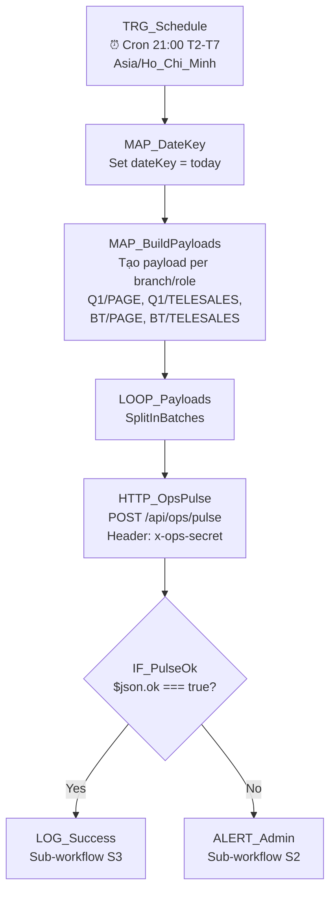

# 06 — Ops Pulse Report

## 1. Mục đích + KPI

Tổng hợp dữ liệu hoạt động cuối ngày: lead mới, cuộc gọi, hẹn lịch, doanh thu — đẩy vào CRM để hiển thị trên dashboard quản lý. Giúp manager nắm overview hiệu suất trước khi kết thúc ngày.

**KPI**: 100% ngày làm việc có pulse report. Dashboard ops luôn cập nhật trước 21:30.

---

## 2. Trigger + Timezone + Tần suất

| Thuộc tính | Giá trị |
|-----------|---------|
| Trigger | Schedule Trigger (Cron) |
| Cron expression | `0 21 * * 1-6` |
| Timezone | `Asia/Ho_Chi_Minh` |
| Tần suất | T2-T7 lúc 21:00 |

---

## 3. Input / Output

### Input (body gửi đến CRM)
| Field | Type | Required | Mô tả |
|-------|------|----------|--------|
| `role` | string | Yes | `PAGE` hoặc `TELESALES` |
| `branchId` | string | Yes | ID chi nhánh |
| `ownerId` | string | No | ID nhân viên (nếu per-user) |
| `dateKey` | string | Yes | `YYYY-MM-DD` |
| `metrics` | object | Yes | Số liệu thống kê |

### Metrics object
| Field | Type | Mô tả |
|-------|------|--------|
| `messagesToday` | number | Số tin nhắn FB hôm nay |
| `dataToday` | number | Số data (lead mới) |
| `calledToday` | number | Số cuộc gọi |
| `appointedToday` | number | Số hẹn lịch |
| `arrivedToday` | number | Số khách đến |
| `signedToday` | number | Số ký hợp đồng |

### Output
| Field | Type | Mô tả |
|-------|------|--------|
| `ok` | boolean | Thành công |
| `id` | string | Pulse record ID |
| `status` | string | Status |
| `computedJson` | object | CRM tự tính thêm (tỷ lệ chuyển đổi) |

---

## 4. Sơ đồ Node chi tiết



---

## 5. Bảng Node-by-Node

| # | Node Name | Node Type | Config quan trọng | Input mapping | Output | Error handling |
|---|-----------|-----------|-------------------|---------------|--------|----------------|
| 1 | `TRG_Schedule` | Schedule Trigger | Cron: `0 21 * * 1-6`, TZ: `Asia/Ho_Chi_Minh` | — | Trigger | — |
| 2 | `MAP_DateKey` | Set | `dateKey`: `{{ $now.format('yyyy-MM-dd') }}` | — | `{dateKey}` | — |
| 3 | `MAP_BuildPayloads` | Code | Build array of `{role, branchId, dateKey, metrics}` for each branch/role combo | dateKey | Array of payloads | — |
| 4 | `LOOP_Payloads` | SplitInBatches | Batch size: 1 | Array | Single payload | — |
| 5 | `HTTP_OpsPulse` | HTTP Request | POST `{{ $env.CRM_BASE_URL }}/api/ops/pulse`, Header: `x-ops-secret: {{ $env.OPS_SECRET }}`, Body: payload, Retry: `3`, Backoff: `5000ms` | Single payload | `{ok, id, status, computedJson}` | On error → ALERT |
| 6 | `IF_PulseOk` | IF | `{{ $json.ok === true }}` | Response | Route | — |
| 7 | `LOG_Success` | Execute Sub-workflow | `[CRM] S3` | All context | Log | — |
| 8 | `ALERT_Admin` | Execute Sub-workflow | `[CRM] S2` | Error context | Alert | — |

---

## 6. Request mẫu (curl)

### Gửi ops pulse — PAGE
```bash
curl -s -X POST "${CRM_BASE_URL}/api/ops/pulse" \
  -H "Content-Type: application/json" \
  -H "x-ops-secret: ${OPS_SECRET}" \
  -d '{
    "role": "PAGE",
    "branchId": "branch-q1-id",
    "ownerId": "user-admin-id",
    "dateKey": "2026-02-18",
    "metrics": {
      "messagesToday": 45,
      "dataToday": 12
    }
  }'
```

### Gửi ops pulse — TELESALES
```bash
curl -s -X POST "${CRM_BASE_URL}/api/ops/pulse" \
  -H "Content-Type: application/json" \
  -H "x-ops-secret: ${OPS_SECRET}" \
  -d '{
    "role": "TELESALES",
    "branchId": "branch-bt-id",
    "ownerId": "user-admin-id",
    "dateKey": "2026-02-18",
    "metrics": {
      "dataToday": 9,
      "calledToday": 25,
      "appointedToday": 6,
      "arrivedToday": 4,
      "signedToday": 2
    }
  }'
```

### Response mẫu
```json
{
  "ok": true,
  "id": "clxyz789",
  "status": "PAGE",
  "computedJson": {
    "appointedRate": 0.5,
    "arrivedRate": 0.67,
    "signedRate": 0.5
  }
}
```

---

## 7. Idempotency & Anti-duplicate

| Aspect | Strategy |
|--------|----------|
| Ngày + role + branch | CRM upsert theo composite key |
| Gọi trùng | An toàn — overwrite với data mới nhất |

---

## 8. Retry / Backoff / Rate-limit

| Cấu hình | Giá trị |
|----------|---------|
| HTTP retry | `3` lần, backoff `5000ms` |
| Timeout | `15000ms` |
| 5xx | Retry rồi alert |

---

## 9. Observability

### Log fields
```json
{
  "correlationId": "06-ops-pulse-{executionId}-{dateKey}",
  "workflowName": "06-ops-pulse-report",
  "dateKey": "2026-02-18",
  "pulsesCreated": 4,
  "roles": ["PAGE", "TELESALES"],
  "branches": ["Q1", "BT"],
  "durationMs": 2100
}
```

### Alert
| Khi nào | Gửi tới |
|---------|---------|
| Pulse fail | Telegram admin |
| Metrics bất thường (data = 0 ngày thường) | LOG warning |

---

## 10. Runbook vận hành

### Test nhanh
```bash
curl -s -X POST "http://localhost:3000/api/ops/pulse" \
  -H "Content-Type: application/json" \
  -H "x-ops-secret: test-ops-secret-local" \
  -d '{"role":"PAGE","branchId":"branch-id","ownerId":"user-id","dateKey":"2026-02-18","metrics":{"messagesToday":10,"dataToday":5}}' \
  | python3 -m json.tool
```

### Checklist
- [ ] `OPS_SECRET` — khớp CRM server
- [ ] `CRM_BASE_URL`
- [ ] Branch IDs chính xác (lấy từ `/api/admin/branches`)

---

## 11. Failure Modes + Debug 3 phút

| Symptom | Check | Fix |
|---------|-------|-----|
| Pulse 401/403 | `OPS_SECRET` sai hoặc thiếu | Kiểm tra `.env` server → `OPS_SECRET` khớp N8N |
| Pulse 500 | DB lỗi / model thiếu | SSH → `docker logs crm --tail 30` → trace SQL error |
| Không có data (metrics = 0) | Branch ID sai | Kiểm tra `/api/admin/branches` lấy ID đúng |
| Không chạy | N8N schedule inactive | N8N UI → workflow → check Active toggle |
| Alert Telegram không gửi | Bot token/Chat ID sai | Kiểm tra S2 sub-workflow env vars |

**Debug nhanh (3 phút):**
1. **30s**: N8N UI → Executions → check lỗi cuối cùng
2. **60s**: `curl` thử endpoint trực tiếp (xem section 6)
3. **90s**: SSH server → `docker logs crm -f --tail 50` → xem API response
