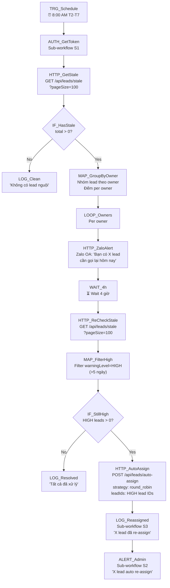

# 07 — Stale Lead Alert & Auto-Assign

## 1. Mục đích + KPI

Tìm lead "nguội" (lâu chưa follow-up), gửi cảnh báo cho telesales, và tự động re-assign nếu owner không xử lý sau 4 giờ. Giảm tỷ lệ lead bị bỏ quên.

**KPI**: 0 lead HIGH (>5 ngày) cuối ngày. Stale lead count giảm 30% sau 1 tuần triển khai.

---

## 2. Trigger + Timezone + Tần suất

| Thuộc tính | Giá trị |
|-----------|---------|
| Trigger | Schedule Trigger (Cron) |
| Cron expression | `0 8 * * 1-6` |
| Timezone | `Asia/Ho_Chi_Minh` |
| Tần suất | T2-T7 lúc 08:00 AM |
| Giai đoạn 2 | WAIT 4h → re-check → re-assign (cùng execution) |

---

## 3. Input / Output

### Input — GET Stale Leads
| Param | Type | Mô tả |
|-------|------|--------|
| `page` | number | Trang (mặc định 1) |
| `pageSize` | number | Số record/trang (max 100) |

### Stale Lead Item
| Field | Type | Mô tả |
|-------|------|--------|
| `id` | string | Lead ID |
| `fullName` | string | Tên khách |
| `phone` | string | SĐT |
| `status` | string | `HAS_PHONE` / `APPOINTED` |
| `daysSinceUpdate` | number | Số ngày từ lần update cuối |
| `warningLevel` | string | `HIGH` (≥5), `MEDIUM` (≥3), `LOW` (<3) |
| `owner` | object | `{id, name, email}` |

### Output — Auto-assign
| Field | Type | Mô tả |
|-------|------|--------|
| `updated` | number | Số lead đã re-assign |
| `assigned` | array | `[{leadId, ownerId}]` |

---

## 4. Sơ đồ Node chi tiết



---

## 5. Bảng Node-by-Node

| # | Node Name | Node Type | Config quan trọng | Input mapping | Output | Error handling |
|---|-----------|-----------|-------------------|---------------|--------|----------------|
| 1 | `TRG_Schedule` | Schedule Trigger | Cron: `0 8 * * 1-6`, TZ: `Asia/Ho_Chi_Minh` | — | Trigger | — |
| 2 | `AUTH_GetToken` | Execute Sub-workflow | `[CRM] S1` | — | `{bearerToken, userId}` | Fail → ALERT |
| 3 | `HTTP_GetStale` | HTTP Request | GET `{{ $env.CRM_BASE_URL }}/api/leads/stale?pageSize=100`, Auth: Bearer | Token | `{items[], total}` | Retry 2x |
| 4 | `IF_HasStale` | IF | `{{ $json.total > 0 }}` | Response | Route | — |
| 5 | `MAP_GroupByOwner` | Code | Group items by `owner.id`, count per owner, format alert message | Items | `[{ownerId, ownerName, count, leads[]}]` | — |
| 6 | `LOOP_Owners` | SplitInBatches | Batch size: 1 | Owner groups | Single owner | — |
| 7 | `HTTP_ZaloAlert` | HTTP Request | POST Zalo OA API, Template: `"[CRM] Bạn có {{ $json.count }} lead cần follow-up"` | Owner data | Zalo response | Silent fail |
| 8 | `WAIT_4h` | Wait | Duration: `4` hours | — | — | — |
| 9 | `HTTP_ReCheckStale` | HTTP Request | GET `/api/leads/stale?pageSize=100`, Auth: Bearer (re-use token or re-auth) | — | Updated stale list | Retry 2x |
| 10 | `MAP_FilterHigh` | Code | `items.filter(i => i.warningLevel === 'HIGH')` | Items | HIGH leads only | — |
| 11 | `IF_StillHigh` | IF | `{{ $json.length > 0 }}` | HIGH leads | Route | — |
| 12 | `HTTP_AutoAssign` | HTTP Request | POST `/api/leads/auto-assign`, Auth: Bearer, Body: `{strategy: "round_robin", leadIds: [...]}` | HIGH lead IDs | `{updated, assigned[]}` | Retry 2x |
| 13 | `LOG_Reassigned` | Execute Sub-workflow | `[CRM] S3` | All context | Log | — |
| 14 | `ALERT_Admin` | Execute Sub-workflow | `[CRM] S2`, message: info (not error) | Reassign stats | Alert | — |

---

## 6. Request mẫu (curl)

### Lấy stale leads
```bash
curl -s "${CRM_BASE_URL}/api/leads/stale?page=1&pageSize=50" \
  -H "Authorization: Bearer ${TOKEN}" | python3 -m json.tool
```

### Response stale leads
```json
{
  "items": [
    {
      "id": "lead-id-1",
      "fullName": "Trần Văn B",
      "phone": "0912345678",
      "status": "HAS_PHONE",
      "daysSinceUpdate": 5,
      "warningLevel": "HIGH",
      "owner": { "id": "user-ts1", "name": "Telesale 1", "email": "ts1@thayduy.local" }
    }
  ],
  "page": 1,
  "pageSize": 50,
  "total": 3
}
```

### Auto-assign specific leads
```bash
curl -s -X POST "${CRM_BASE_URL}/api/leads/auto-assign" \
  -H "Content-Type: application/json" \
  -H "Authorization: Bearer ${TOKEN}" \
  -d '{
    "strategy": "round_robin",
    "leadIds": ["lead-id-1", "lead-id-2"]
  }'
```

---

## 7. Idempotency & Anti-duplicate

| Aspect | Strategy |
|--------|----------|
| Stale check | Idempotent — GET request, no side effects |
| Auto-assign | Re-assign safe — nếu lead đã có owner mới, round-robin vẫn OK |
| Zalo alert | Có thể gửi trùng nếu workflow re-run → acceptable (nhắc nhở thêm) |

---

## 8. Retry / Backoff / Rate-limit

| Cấu hình | Giá trị |
|----------|---------|
| HTTP retry | `2` lần, backoff `3000ms` |
| Zalo alert retry | `1` lần |
| Auto-assign retry | `2` lần, backoff `5000ms` |
| Timeout | `15000ms` (trừ WAIT node) |

---

## 9. Observability

### Log fields
```json
{
  "correlationId": "07-stale-{executionId}-{dateKey}",
  "workflowName": "07-stale-lead-alert",
  "dateKey": "2026-02-18",
  "totalStale": 12,
  "highPriority": 3,
  "alertsSent": 5,
  "reassigned": 3,
  "durationMs": 14400000
}
```

### Alert
| Khi nào | Gửi tới |
|---------|---------|
| Auto-assign kích hoạt | Telegram admin (info) |
| API fail | Telegram admin (error) |

---

## 10. Runbook vận hành

### Test nhanh
```bash
# Chỉ check stale - không reassign
curl -s "http://localhost:3000/api/leads/stale?pageSize=5" \
  -H "Authorization: Bearer ${TOKEN}" | python3 -m json.tool
```

### Tắt auto-reassign (chỉ alert)
Remove hoặc disable các node sau `WAIT_4h` trong N8N canvas.

### Checklist
- [ ] `CRM_BASE_URL`, `CRM_EMAIL`, `CRM_PASSWORD`
- [ ] Zalo OA credentials
- [ ] `warningLevel` thresholds: HIGH=5 days, MEDIUM=3 days (cấu hình trong CRM)

---

## 11. Failure Modes + Debug 3 phút

| Symptom | Check | Fix |
|---------|-------|-----|
| API 401 | Token expired | Kiểm tra S1 sub-workflow, `CRM_EMAIL`/`CRM_PASSWORD` |
| Không tìm thấy stale lead | Threshold quá cao | Giảm `daysSinceContact` param (default: 3 days) |
| Auto-assign fail | Không có user available | Kiểm tra có user active role telesales/direct_page |
| WAIT_4h block | N8N execution timeout | Kiểm tra N8N `EXECUTIONS_TIMEOUT` > 14400 |
| Telegram alert thiếu | S2 sub-workflow off | Activate S2 trong N8N |

**Debug nhanh (3 phút):**
1. **30s**: N8N UI → Executions → check node lỗi đỏ
2. **60s**: Thử `GET /api/leads/stale?pageSize=5` với bearer token
3. **90s**: SSH → `docker logs crm -f --tail 50` → xem stale query
