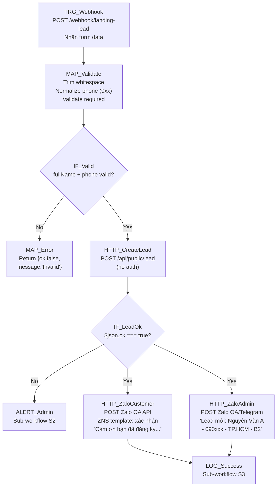

# 08 — Landing Page → CRM → Zalo Notify

## 1. Mục đích + KPI

Khi khách hàng điền form trên landing page, tự động tạo lead trong CRM, gửi Zalo xác nhận cho khách, và thông báo cho admin/telesales có khách mới đăng ký.

**KPI**: 100% form submission → lead trong CRM trong < 10 giây. Zalo xác nhận gửi trong < 30 giây.

---

## 2. Trigger + Timezone + Tần suất

| Thuộc tính | Giá trị |
|-----------|---------|
| Trigger | Webhook (POST) |
| Path | `/webhook/landing-lead` |
| Timezone | `Asia/Ho_Chi_Minh` |
| Tần suất | Real-time |
| Source | Landing page form submit (AJAX) |

---

## 3. Input / Output

### Input (form data từ landing page)
| Field | Type | Required | Mô tả |
|-------|------|----------|--------|
| `fullName` | string | Yes | Họ tên khách |
| `phone` | string | Yes | SĐT (format: 0xxxxxxxxx) |
| `province` | string | No | Tỉnh/thành |
| `licenseType` | string | No | Loại bằng: B1, B2, C |

### Output (trả về landing page)
| Field | Type | Mô tả |
|-------|------|--------|
| `ok` | boolean | Thành công |
| `message` | string | "Đã ghi nhận thông tin..." |

---

## 4. Sơ đồ Node chi tiết



---

## 5. Bảng Node-by-Node

| # | Node Name | Node Type | Config quan trọng | Input mapping | Output | Error handling |
|---|-----------|-----------|-------------------|---------------|--------|----------------|
| 1 | `TRG_Webhook` | Webhook | Method: POST, Path: `/webhook/landing-lead`, Response mode: `When last node finishes`, Return: `{ok, message}` | POST body | Form data | — |
| 2 | `MAP_Validate` | Code | `fullName = body.fullName?.trim()`, `phone = body.phone?.replace(/\s/g,'')`, validate regex `^0\d{8,10}$` | Webhook body | `{fullName, phone, province, licenseType, isValid}` | — |
| 3 | `IF_Valid` | IF | `{{ $json.isValid === true }}` | Validated data | Route | — |
| 4 | `MAP_Error` | Set | `ok: false`, `message: "Dữ liệu không hợp lệ"` | — | Error response | — |
| 5 | `HTTP_CreateLead` | HTTP Request | POST `{{ $env.CRM_BASE_URL }}/api/public/lead`, Body: `{fullName, phone, province, licenseType}`, Retry: `3`, Backoff: `2000ms` | Validated fields | `{ok, message}` | Retry → ALERT |
| 6 | `IF_LeadOk` | IF | `{{ $json.ok === true }}` | CRM response | Route | — |
| 7 | `HTTP_ZaloCustomer` | HTTP Request | POST Zalo OA ZNS API, Template ID: (xác nhận đăng ký), Params: `{name: fullName}`, Phone: `{{ $json.phone }}` | Lead data | Zalo response | Silent fail |
| 8 | `HTTP_ZaloAdmin` | HTTP Request | POST Telegram/Zalo admin group, Message: `"🆕 Lead mới: {{ fullName }} - {{ phone }} - {{ province }} - {{ licenseType }}"` | Lead data | Send response | Silent fail |
| 9 | `LOG_Success` | Execute Sub-workflow | `[CRM] S3` | All context | Log | — |
| 10 | `ALERT_Admin` | Execute Sub-workflow | `[CRM] S2` | Error context | Alert | — |

---

## 6. Request mẫu (curl)

### Tạo lead
```bash
curl -s -X POST "${CRM_BASE_URL}/api/public/lead" \
  -H "Content-Type: application/json" \
  -d '{
    "fullName": "Nguyễn Thị C",
    "phone": "0987654321",
    "province": "Bình Dương",
    "licenseType": "B1"
  }'
```

### Response
```json
{
  "ok": true,
  "message": "Đã ghi nhận thông tin. Chúng tôi sẽ liên hệ bạn sớm!"
}
```

### Giả lập webhook từ landing
```bash
curl -s -X POST "https://n8n.your-domain.com/webhook/landing-lead" \
  -H "Content-Type: application/json" \
  -d '{"fullName":"Test Lead","phone":"0999111222","province":"HCM","licenseType":"B2"}'
```

---

## 7. Idempotency & Anti-duplicate

| Aspect | Strategy |
|--------|----------|
| Phone trùng | CRM xử lý: phone đã tồn tại → update `updatedAt` + bổ sung fields thiếu → trả `ok: true` |
| Form submit trùng | Landing page nên disable button sau submit. CRM vẫn OK nếu trùng |
| Honeypot | Nếu body chứa `_hp` field → CRM silent ignore (anti-bot) |
| Rate-limit | CRM: 10 req/phút cho public endpoint |

---

## 8. Retry / Backoff / Rate-limit

| Cấu hình | Giá trị |
|----------|---------|
| HTTP_CreateLead retry | `3` lần, backoff `2000ms` |
| HTTP_ZaloCustomer retry | `2` lần, backoff `3000ms` |
| HTTP_ZaloAdmin retry | `1` lần |
| 429 từ CRM | Wait 60s → retry |
| Timeout | `10000ms` (fast — landing user đang đợi) |

---

## 9. Observability

### Log fields
```json
{
  "correlationId": "08-landing-{executionId}",
  "workflowName": "08-landing-crm-zalo",
  "phone": "099***222",
  "leadCreated": true,
  "zaloCustomerSent": true,
  "zaloAdminSent": true,
  "durationMs": 1850
}
```

### Alert
| Khi nào | Gửi tới |
|---------|---------|
| Lead create fail | Telegram admin |
| Rate-limit exceeded | LOG + Telegram |

---

## 10. Runbook vận hành

### Test nhanh
```bash
curl -s -X POST "http://localhost:3000/api/public/lead" \
  -H "Content-Type: application/json" \
  -d '{"fullName":"Webhook Test","phone":"0888999111","province":"DN","licenseType":"B2"}' \
  | python3 -m json.tool
```

### Cấu hình landing page
```html
<!-- Landing page form -->
<form id="lead-form">
  <input name="fullName" required>
  <input name="phone" required pattern="0\d{8,10}">
  <input name="province">
  <select name="licenseType">
    <option value="B1">B1</option>
    <option value="B2">B2</option>
    <option value="C">C</option>
  </select>
  <input name="_hp" type="hidden" style="display:none">
  <button type="submit">Đăng ký</button>
</form>

<script>
document.getElementById('lead-form').addEventListener('submit', async (e) => {
  e.preventDefault();
  const data = Object.fromEntries(new FormData(e.target));
  const res = await fetch('https://n8n.domain.com/webhook/landing-lead', {
    method: 'POST',
    headers: {'Content-Type': 'application/json'},
    body: JSON.stringify(data)
  });
  const json = await res.json();
  alert(json.message);
});
</script>
```

### Checklist
- [ ] N8N webhook URL cấu hình trên landing page
- [ ] `CRM_BASE_URL`
- [ ] Zalo OA ZNS template approved (cho customer notification)
- [ ] Telegram Bot token + Chat ID (cho admin notification)
