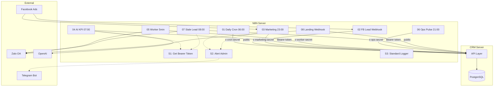
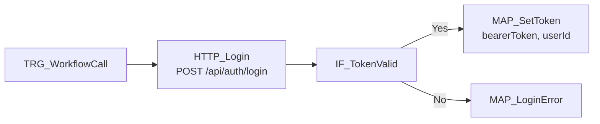
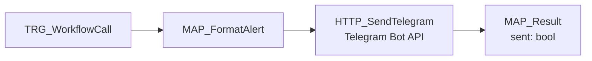
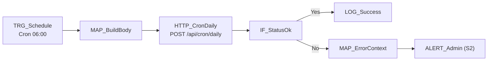
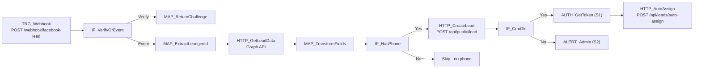
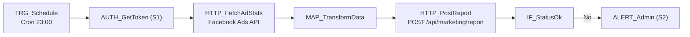
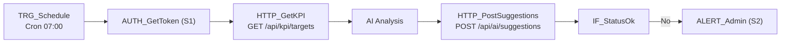
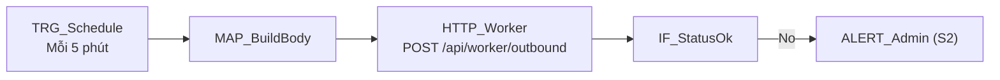
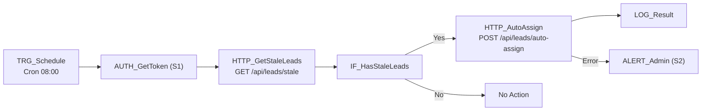

# N8N Production Runbook — CRM Thầy Duy

> **As-built documentation** — Tài liệu vận hành production cho hệ thống N8N automation.
> Cập nhật: 2026-02-19 | Version: v1.0.0

---

## B1. Tổng quan hệ thống

| Thuộc tính | Giá trị |
|------------|---------|
| Domain N8N | `https://n8n.thayduydaotaolaixe.com` |
| N8N Image | `n8nio/n8n:latest` |
| Timezone | `Asia/Ho_Chi_Minh` |
| Webhook Base URL | `https://n8n.thayduydaotaolaixe.com/` |
| CRM Domain | `https://thayduydaotaolaixe.com` |
| Database | PostgreSQL 16 (container `n8n-postgres`) |
| Docker Compose | `/opt/n8n/docker-compose.yml` |
| Docker Network | `thayduy_default` (shared with CRM) |

### Environment Variables (keys only)

| Variable | Mô tả |
|----------|--------|
| `CRM_BASE_URL` | URL CRM server |
| `CRM_EMAIL` | Email admin để lấy Bearer token |
| `CRM_PASSWORD` | Password admin |
| `CRON_SECRET` | Secret cho `/api/cron/daily` |
| `WORKER_SECRET` | Secret cho `/api/worker/outbound` |
| `OPS_SECRET` | Secret cho `/api/ops/pulse` |
| `MARKETING_SECRET` | Secret cho `/api/marketing/report` |
| `SERVICE_TOKEN` | Token cho service-to-service calls |
| `TELEGRAM_BOT_TOKEN` | Token Telegram Bot (alert) |
| `TELEGRAM_CHAT_ID` | Chat ID group admin |
| `FB_PAGE_TOKEN` | Facebook Page access token |
| `ZALO_OA_ACCESS_TOKEN` | Zalo OA access token |
| `N8N_ENCRYPTION_KEY` | N8N encryption key |
| `POSTGRES_PASSWORD` | N8N database password |

> [!CAUTION]
> **Tuyệt đối KHÔNG hardcode giá trị secret trong workflow JSON.** Luôn dùng `{{ $env.VAR_NAME }}`.

### Danh sách workflows đang chạy

| # | Workflow | ID | Trigger | Schedule (VN) | Status |
|---|---------|-----|---------|---------------|--------|
| S1 | Get Bearer Token | `rM8NCtXchLsIhLxG` | Sub-workflow | — | 🟢 Active |
| S2 | Alert Admin | `naX5gYVTYw9cz3dA` | Sub-workflow | — | 🟢 Active |
| S3 | Standard Logger | `e1WhICIEbwErc0ej` | Sub-workflow | — | 🟢 Active |
| 01 | Daily Cron Master | `3dvziGY3AdYINrob` | Cron | 06:00 hàng ngày | 🟢 Active |
| 02 | Facebook Lead Capture | `d4VbLHU3Li2ORnD7` | Webhook | Realtime | 🟢 Active |
| 03 | Marketing Ads Sync | `aT7zN4h6T0ziCOHa` | Cron | 23:00 hàng ngày | 🟢 Active |
| 04 | AI KPI Coach | `mA40Z49COZ01Pm0d` | Cron | 07:00 hàng ngày | 🟢 Active |
| 05 | Outbound Message Worker | `49Aw1IvGmLG611PI` | Cron | Mỗi 5 phút | 🟢 Active |
| 06 | Ops Pulse Report | `ywxhG2irMLrxZf7V` | Cron | 21:00 hàng ngày | 🟢 Active |
| 07 | Stale Lead Alert | `s5QxHfy1AayJngqp` | Cron | 08:00 hàng ngày | 🟢 Active |
| 08 | Landing CRM Zalo | `Bd7LpHje2XQPPLuc` | Webhook | Realtime | 🟢 Active |

### Sơ đồ luồng tổng



---

## B2. Workflow Catalog

| Workflow Name | Trigger | Schedule (VN) | Endpoints CRM | Secrets Required | Idempotency Key | Retry Policy | Alert Channel | Owner |
|--------------|---------|---------------|---------------|-----------------|-----------------|-------------|---------------|-------|
| S1 Get Bearer Token | sub-workflow | — | `POST /api/auth/login` | CRM_EMAIL, CRM_PASSWORD | — | 3 retries, 3s backoff | — | DevOps |
| S2 Alert Admin | sub-workflow | — | Telegram Bot API | TELEGRAM_BOT_TOKEN, TELEGRAM_CHAT_ID | — | 2 retries, 3s backoff | — | DevOps |
| S3 Standard Logger | sub-workflow | — | Console log | — | correlationId | — | — | DevOps |
| 01 Daily Cron Master | cron | 06:00 | `POST /api/cron/daily` | CRON_SECRET | dateKey | 3 retries, 5s backoff | Telegram | Admin |
| 02 Facebook Lead Capture | webhook | realtime | `POST /api/public/lead`, `POST /api/leads/auto-assign` | FB_PAGE_TOKEN, CRM_EMAIL, CRM_PASSWORD | leadgenId / phone | 3 retries, 2s backoff | Telegram | Admin |
| 03 Marketing Ads Sync | cron | 23:00 | `POST /api/marketing/report` | MARKETING_SECRET | date + source | 3 retries, 5s backoff | Telegram | Admin |
| 04 AI KPI Coach | cron | 07:00 | `POST /api/ai/suggestions`, `GET /api/kpi/targets` | CRM_EMAIL, CRM_PASSWORD | dateKey | 3 retries, 5s backoff | Telegram | Admin |
| 05 Outbound Worker | cron | */5 min | `POST /api/worker/outbound` | WORKER_SECRET | — | 3 retries, backoff | Telegram | Admin |
| 06 Ops Pulse Report | cron | 21:00 | `POST /api/ops/pulse` | OPS_SECRET | dateKey + role | 3 retries, 5s backoff | Telegram | Admin |
| 07 Stale Lead Alert | cron | 08:00 | `GET /api/leads/stale`, `POST /api/leads/auto-assign` | CRM_EMAIL, CRM_PASSWORD | — | 3 retries, 5s backoff | Telegram | Admin |
| 08 Landing Webhook | webhook | realtime | `POST /api/public/lead` | ZALO_OA_ACCESS_TOKEN | phone | 3 retries, 2s backoff | Telegram | Admin |

---

## B3. Note chi tiết từng workflow

---

### S1: Get Bearer Token

#### 1) Mục tiêu & Output
- **Mục tiêu**: Lấy JWT Bearer token từ CRM để authenticate các API call cần auth
- **Output**: `{ bearerToken: string, userId: string }`
- **KPI**: Login < 3s, success rate > 99%

#### 2) Trigger & Điều kiện
- **Trigger**: Gọi bởi W04 (AI KPI Coach), W07 (Stale Lead Alert), W02 (Facebook Lead)
- **Điều kiện**: Không có filter — luôn chạy khi được gọi

#### 3) I/O Contract

**Input**: (không có — tự lấy credentials từ env)

**Headers bắt buộc**:
```
Content-Type: application/json
```

**Request body**:
```json
{
  "account": "{{ $env.CRM_EMAIL }}",
  "password": "{{ $env.CRM_PASSWORD }}"
}
```

**Response mẫu (200 OK)**:
```json
{
  "token": "eyJhbGciOiJIUzI1NiIs...",
  "user": { "id": "clxyz...", "role": "admin", "name": "Admin" }
}
```

#### 4) Node Diagram



#### 5) Node-by-Node Table

| NodeName | NodeType | Endpoint | Headers | Body | Output | Retry | Error Branch |
|----------|----------|----------|---------|------|--------|-------|-------------|
| TRG_WorkflowCall | executeWorkflowTrigger | — | — | — | trigger data | — | — |
| HTTP_Login | httpRequest | `POST /api/auth/login` | Content-Type: application/json | account, password | token, user | 3x, 3s | continueRegularOutput |
| IF_TokenValid | if | — | — | — | route | — | → MAP_LoginError |
| MAP_SetToken | set | — | — | — | bearerToken, userId | — | — |
| MAP_LoginError | set | — | — | — | error message | — | — |

#### 6) Idempotency
- Không cần — mỗi lần gọi tạo token mới
- Token chỉ sống trong execution context, không cache cross-execution

#### 7) Failure Modes

| # | Lỗi | Nguyên nhân | Triệu chứng |
|---|------|-------------|-------------|
| 1 | 401 Unauthorized | Password sai | `HTTP_Login` trả 401 |
| 2 | 404 Not Found | Endpoint đổi URL | `HTTP_Login` trả 404 |
| 3 | 500 Server Error | CRM crash | `HTTP_Login` trả 500 |
| 4 | Timeout | CRM quá tải | `HTTP_Login` timeout 15s |
| 5 | Network Error | DNS / connection refused | curl error |

#### 8) Cách debug nhanh
1. N8N: Execution → xem node `HTTP_Login` → response body
2. CRM: Check server logs `docker logs thayduy-app | grep auth`
3. Tái hiện:
```bash
curl -X POST https://thayduydaotaolaixe.com/api/auth/login \
  -H "Content-Type: application/json" \
  -d '{"account":"admin@thayduy.local","password":"Admin@123456"}'
```

#### 9) Rollback
- JSON: `n8n/workflows/s1-get-bearer-token.json`
- Import lại → disable workflow mới → enable workflow cũ

---

### S2: Alert Admin

#### 1) Mục tiêu & Output
- **Mục tiêu**: Gửi cảnh báo lỗi qua Telegram khi workflow fail
- **Output**: `{ sent: boolean }`

#### 2) Trigger & Điều kiện
- **Trigger**: Gọi bởi tất cả main workflows khi gặp lỗi
- **Input**: `{ workflowName, error, endpoint, statusCode }`

#### 3) I/O Contract

**Input payload mẫu**:
```json
{
  "workflowName": "01 Daily Cron Master",
  "endpoint": "/api/cron/daily",
  "statusCode": 500,
  "error": "Internal Server Error"
}
```

**Output message Telegram**:
```
🚨 [CRM N8N] Workflow FAIL
━━━━━━━━━━━━━━━━━━━━
Workflow: 01 Daily Cron Master
Endpoint: /api/cron/daily
Status: 500
Error: Internal Server Error
Time: 06:00 19/02/2026
━━━━━━━━━━━━━━━━━━━━
```

#### 4) Node Diagram



#### 5) Node-by-Node Table

| NodeName | NodeType | Endpoint | Headers | Body | Output | Retry | Error Branch |
|----------|----------|----------|---------|------|--------|-------|-------------|
| MAP_FormatAlert | set | — | — | — | alertMessage | — | — |
| HTTP_SendTelegram | httpRequest | `POST Telegram Bot API` | — | chat_id, text, parse_mode | ok | 2x, 3s | continueRegularOutput |
| MAP_Result | set | — | — | — | sent | — | — |

#### 6) Idempotency
- Không cần — alert có thể gửi nhiều lần (notification)

#### 7) Failure Modes

| # | Lỗi | Nguyên nhân |
|---|------|-------------|
| 1 | 401 | TELEGRAM_BOT_TOKEN sai |
| 2 | 400 | TELEGRAM_CHAT_ID sai hoặc bot chưa join group |
| 3 | 429 | Rate limit Telegram (max 30 msg/s) |
| 4 | Timeout | Telegram API chậm |
| 5 | Network | DNS resolution fail |

#### 8) Cách debug nhanh
```bash
curl -X POST "https://api.telegram.org/bot<TOKEN>/sendMessage" \
  -d '{"chat_id":"<CHAT_ID>","text":"Test alert","parse_mode":"HTML"}'
```

---

### S3: Standard Logger

#### 1) Mục tiêu & Output
- **Mục tiêu**: Format và output structured log cho mỗi workflow execution
- **Output**: JSON log entry với correlationId

#### 2) Correlation ID Format
```
{workflowName}-{executionId}-{dateKey}
```
Ví dụ: `01-daily-cron-master-12345-2026-02-19`

#### 3) Log Entry Schema
```json
{
  "correlationId": "01-daily-cron-master-12345-2026-02-19",
  "timestamp": "2026-02-19T06:00:01.234Z",
  "workflowName": "01-daily-cron-master",
  "executionId": "12345",
  "dateKey": "2026-02-19",
  "branchCode": "Q1",
  "endpoint": "/api/cron/daily",
  "statusCode": 200,
  "status": "SUCCESS",
  "durationMs": 1523,
  "payload": null
}
```

---

### 01: Daily Cron Master

#### 1) Mục tiêu & Output
- **Mục tiêu**: Chạy cron job hàng ngày lúc 6:00 AM — trigger notification, cleanup, stats
- **Output**: `{ ok: true, notifications: N, messages: N, ... }`
- **KPI**: Chạy thành công 100% hàng ngày, duration < 30s

#### 2) Trigger & Điều kiện
- **Trigger**: Schedule Trigger — `0 6 * * *` (06:00 AM Asia/Ho_Chi_Minh)
- **Body**: `{ force: false, dryRun: false }`

#### 3) I/O Contract

**Headers bắt buộc**:
```
Content-Type: application/json
x-cron-secret: {{ $env.CRON_SECRET }}
```

**Request body**:
```json
{ "force": false, "dryRun": false }
```

**Response mẫu (200 OK)**:
```json
{ "ok": true, "notifications": 15, "messages": 8, "date": "2026-02-19" }
```

#### 4) Node Diagram



#### 5) Node-by-Node Table

| NodeName | NodeType | Endpoint | Headers | Body | Output | Retry | Error Branch |
|----------|----------|----------|---------|------|--------|-------|-------------|
| TRG_Schedule | scheduleTrigger | — | — | — | trigger | — | — |
| MAP_BuildBody | set | — | — | — | force, dryRun | — | — |
| HTTP_CronDaily | httpRequest | `POST /api/cron/daily` | x-cron-secret | force, dryRun | ok, stats | 3x, 5s | continueRegularOutput |
| IF_StatusOk | if | — | — | — | route | — | → MAP_ErrorContext |
| LOG_Success | set | — | — | — | log entry | — | — |
| MAP_ErrorContext | set | — | — | — | error context | — | → ALERT_Admin |
| ALERT_Admin | executeWorkflow | S2 | — | — | sent | — | — |

#### 6) Idempotency
- **Key**: dateKey (ngày hiện tại)
- CRM server sẽ skip nếu cùng ngày đã chạy (trừ khi `force: true`)

#### 7) Failure Modes

| # | Lỗi | Nguyên nhân | Fix |
|---|------|-------------|-----|
| 1 | 403 Forbidden | CRON_SECRET sai | Check `/opt/n8n/.env` vs `/opt/thayduy/.env` |
| 2 | 500 Internal | CRM logic error | Check `docker logs thayduy-app` |
| 3 | Timeout 30s | DB lock / heavy query | Tăng timeout hoặc check DB |
| 4 | 429 Rate Limit | Quá nhiều request | Backoff tự động, check source |
| 5 | Network Error | Container network issue | Check `docker network inspect thayduy_default` |

#### 8) Cách debug nhanh
```bash
# Tái hiện trên production
curl -X POST https://thayduydaotaolaixe.com/api/cron/daily \
  -H "Content-Type: application/json" \
  -H "x-cron-secret: <CRON_SECRET>" \
  -d '{"force": true, "dryRun": true}'
```

#### 9) Rollback
- JSON: `n8n/workflows/01-daily-cron-master.json`
- Disable → Import JSON cũ → Enable → Chạy smoke test

---

### 02: Facebook Lead Capture

#### 1) Mục tiêu & Output
- **Mục tiêu**: Nhận webhook từ Facebook khi có lead mới → tạo lead trong CRM → auto-assign → thông báo
- **Output**: Lead created + auto-assigned in CRM

#### 2) Trigger & Điều kiện
- **Trigger**: Webhook — `POST /webhook/facebook-lead`
- **Verification**: Facebook sends `GET` with `hub.challenge` → phải trả lại challenge

#### 3) I/O Contract

**Facebook Webhook payload**:
```json
{
  "object": "page",
  "entry": [{
    "changes": [{
      "field": "leadgen",
      "value": { "leadgen_id": "123456789" }
    }]
  }]
}
```

**CRM Request** (`POST /api/public/lead`):
```json
{
  "fullName": "Nguyễn Văn A",
  "phone": "0901234567",
  "province": "Hồ Chí Minh",
  "licenseType": "B2",
  "source": "facebook"
}
```

#### 4) Node Diagram



#### 5) Idempotency
- **Key**: `phone` — CRM upserts lead by phone number
- Trùng phone → update existing lead (không tạo mới)
- `leadgenId` từ Facebook luôn unique

#### 6) Failure Modes

| # | Lỗi | Nguyên nhân | Fix |
|---|------|-------------|-----|
| 1 | FB Graph 400 | FB_PAGE_TOKEN hết hạn (60 ngày) | Refresh token trong Facebook App |
| 2 | CRM 409 Conflict | Lead phone trùng | Expected — CRM tự update |
| 3 | Auto-assign 404 | Không có telesale active | Thêm user role telesale |
| 4 | Webhook không nhận | WEBHOOK_URL sai / Nginx | Check `n8n/.env` WEBHOOK_URL |
| 5 | Schema mismatch | Facebook thay đổi fields | Check MAP_TransformFields |

---

### 03: Marketing Ads Sync

#### 1) Mục tiêu & Output
- **Mục tiêu**: Sync chi phí quảng cáo từ Facebook Ads vào CRM mỗi ngày lúc 23:00
- **Output**: Marketing report record in CRM

#### 2) Trigger
- **Cron**: `0 23 * * *` (23:00 VN) — sau khi ngày quảng cáo kết thúc

#### 3) I/O Contract

**Headers**: `x-marketing-secret: {{ $env.MARKETING_SECRET }}`

**Request body**:
```json
{
  "date": "2026-02-19",
  "source": "meta_ads",
  "spendVnd": 1500000,
  "messages": 42,
  "branchCode": "Q1",
  "meta": { "campaign": "...", "adSet": "..." }
}
```

#### 4) Node Diagram



#### 5) Failure Modes

| # | Lỗi | Fix |
|---|------|-----|
| 1 | 403 | MARKETING_SECRET sai → check env |
| 2 | FB Ads API 401 | Facebook token hết hạn → refresh |
| 3 | 500 CRM | Check server logs |

---

### 04: AI KPI Coach

#### 1) Mục tiêu & Output
- **Mục tiêu**: Phân tích KPI hàng ngày bằng AI → tạo gợi ý cải thiện cho từng role/chi nhánh
- **Output**: AI suggestions stored in CRM

#### 2) Trigger
- **Cron**: `0 7 * * *` (07:00 AM VN) — sau Daily Cron (06:00)

#### 3) I/O Contract

**Headers**: `Authorization: Bearer {{ bearerToken }}`

**Request body** (`POST /api/ai/suggestions`):
```json
{
  "dateKey": "2026-02-19",
  "role": "telesales",
  "branchId": "clxyz...",
  "ownerId": "clabc...",
  "title": "KPI đạt 95%",
  "content": "Bạn đã đạt 95% KPI...",
  "scoreColor": "GREEN",
  "actionsJson": [{"key": "CALL_REMIND", "label": "Gọi nhắc"}],
  "metricsJson": {"callCount": 25, "conversionRate": 45}
}
```

#### 4) Node Diagram



#### 5) Failure Modes

| # | Lỗi | Fix |
|---|------|-----|
| 1 | Login fail (S1) | Check CRM_EMAIL/CRM_PASSWORD |
| 2 | KPI 404 | Chưa có KPI targets → tạo targets trước |
| 3 | AI timeout | OpenAI chậm → tăng timeout |
| 4 | Suggestion 422 | Payload schema thay đổi → check API docs |

---

### 05: Outbound Message Worker

#### 1) Mục tiêu & Output
- **Mục tiêu**: Poll CRM mỗi 5 phút để gửi tin nhắn pending (Zalo, SMS)
- **Output**: `{ processed: N, sent: N, failed: N, skipped: N }`

#### 2) Trigger
- **Cron**: `*/5 * * * *` (mỗi 5 phút)

#### 3) I/O Contract

**Headers**: `x-worker-secret: {{ $env.WORKER_SECRET }}`

**Request body**:
```json
{
  "batchSize": 50,
  "concurrency": 5,
  "dryRun": false,
  "retryFailedOnly": false,
  "force": false
}
```

**Response mẫu**:
```json
{ "processed": 10, "sent": 8, "failed": 1, "skipped": 1, "rateLimited": 0 }
```

#### 4) Node Diagram



#### 5) Failure Modes

| # | Lỗi | Fix |
|---|------|-----|
| 1 | 403 | WORKER_SECRET sai |
| 2 | Zalo OA 429 | Rate limit → giảm concurrency |
| 3 | 500 | CRM worker logic error |
| 4 | DB deadlock | Giảm batchSize |

---

### 06: Ops Pulse Report

#### 1) Mục tiêu & Output
- **Mục tiêu**: Thu thập metrics hiệu suất vận hành (messages, data, calls) mỗi tối
- **Output**: Pulse record in CRM with computed KPI

#### 2) Trigger
- **Cron**: `0 21 * * *` (21:00 VN)

#### 3) I/O Contract

**Headers**: `x-ops-secret: {{ $env.OPS_SECRET }}`

**Request body**:
```json
{
  "role": "TELESALES",
  "branchId": "clxyz...",
  "ownerId": "clabc...",
  "dateKey": "2026-02-19",
  "metrics": {
    "dataToday": 9,
    "calledToday": 25,
    "appointedToday": 6,
    "arrivedToday": 4,
    "signedToday": 2
  }
}
```

#### 4) Failure Modes

| # | Lỗi | Fix |
|---|------|-----|
| 1 | 403 | OPS_SECRET sai |
| 2 | 422 | Missing required fields |
| 3 | 409 | Duplicate dateKey+role+branch → CRM auto-handles |

---

### 07: Stale Lead Alert & Auto-Assign

#### 1) Mục tiêu & Output
- **Mục tiêu**: Tìm lead "thiu" (>48h không liên lạc) → alert → auto-assign lại
- **Output**: Alert sent + leads reassigned

#### 2) Trigger
- **Cron**: `0 8 * * *` (08:00 AM VN)

#### 3) I/O Contract

**Step 1**: `GET /api/leads/stale?page=1&pageSize=50`
- **Headers**: `Authorization: Bearer {{ bearerToken }}`
- **Response**: `{ items: [{id, fullName, phone, lastContactAt, ...}], total: N }`

**Step 2**: `POST /api/leads/auto-assign`
- **Headers**: `Authorization: Bearer {{ bearerToken }}`
- **Body**: `{ strategy: "round_robin", leadIds: ["id1", "id2"] }`
- **Response**: `{ updated: N, assigned: [{leadId, userId}] }`

#### 4) Node Diagram



---

### 08: Landing CRM Zalo Notify

#### 1) Mục tiêu & Output
- **Mục tiêu**: Nhận lead từ landing page → tạo trong CRM → gửi Zalo xác nhận
- **Output**: Lead created + Zalo notification sent

#### 2) Trigger
- **Webhook**: `POST /webhook/landing-lead`

#### 3) I/O Contract

**Webhook payload**:
```json
{
  "fullName": "Nguyễn Văn B",
  "phone": "0987654321",
  "province": "Hồ Chí Minh",
  "licenseType": "B2"
}
```

#### 4) Idempotency
- **Key**: `phone` — CRM upserts by phone
- Gửi Zalo notification sau khi CRM confirm tạo thành công

---

## B4. Test & Reproduce

### Script: `scripts/simulate-n8n.sh`

Script test 12 endpoint contracts, in PASS/FAIL rõ ràng.

#### Chạy local
```bash
# Start CRM dev server first
npm run dev

# Run simulation
BASE_URL=http://127.0.0.1:3000 \
CRON_SECRET=test-cron-secret-local \
WORKER_SECRET=test-worker-secret-local \
OPS_SECRET=test-ops-secret-local \
MARKETING_SECRET=test-marketing-secret-local \
bash scripts/simulate-n8n.sh
```

#### Chạy staging
```bash
BASE_URL=https://staging.thayduydaotaolaixe.com \
CRON_SECRET=<staging-secret> \
WORKER_SECRET=<staging-secret> \
OPS_SECRET=<staging-secret> \
MARKETING_SECRET=<staging-secret> \
bash scripts/simulate-n8n.sh
```

#### Smoke test production (safe — dùng dryRun)
```bash
BASE_URL=https://thayduydaotaolaixe.com \
CRON_SECRET=cron-prod-secret-2026 \
WORKER_SECRET=worker-prod-secret-2026 \
OPS_SECRET=ops-prod-secret-2026 \
MARKETING_SECRET=marketing-prod-secret-2026 \
bash scripts/simulate-n8n.sh
```

> [!WARNING]
> Production smoke test **sẽ tạo data thật** (leads, courses, KPI targets, etc.). Chỉ chạy khi cần verify sau deploy.

#### Curl test nhanh từng endpoint

```bash
# 1. Login
curl -s https://thayduydaotaolaixe.com/api/auth/login \
  -H "Content-Type: application/json" \
  -d '{"account":"admin@thayduy.local","password":"Admin@123456"}'

# 2. Cron daily (dry run)
curl -s https://thayduydaotaolaixe.com/api/cron/daily \
  -H "Content-Type: application/json" \
  -H "x-cron-secret: cron-prod-secret-2026" \
  -d '{"force": true, "dryRun": true}'

# 3. Worker outbound (dry run)
curl -s https://thayduydaotaolaixe.com/api/worker/outbound \
  -H "Content-Type: application/json" \
  -H "x-worker-secret: worker-prod-secret-2026" \
  -d '{"dryRun": true, "batchSize": 10}'

# 4. Ops pulse
curl -s https://thayduydaotaolaixe.com/api/ops/pulse \
  -H "Content-Type: application/json" \
  -H "x-ops-secret: ops-prod-secret-2026" \
  -d '{"role":"PAGE","branchId":"test","dateKey":"2026-02-19","metrics":{}}'

# 5. Marketing report
curl -s https://thayduydaotaolaixe.com/api/marketing/report \
  -H "Content-Type: application/json" \
  -H "x-marketing-secret: marketing-prod-secret-2026" \
  -d '{"date":"2026-02-19","source":"test","spendVnd":0,"messages":0}'
```

---

## B5. Troubleshooting Matrix

| Symptom | Where to Look | Likely Cause | Fix | Verification |
|---------|--------------|-------------|-----|-------------|
| `cron/daily 403` | n8n env `CRON_SECRET` | Secret mismatch giữa n8n ↔ CRM | So sánh `/opt/n8n/.env` vs `/opt/thayduy/.env` → set đúng → restart n8n | Rerun node → 200 |
| `marketing/report 403` | n8n env `MARKETING_SECRET` | Secret sai | Set đúng secret → restart | Rerun → 200 |
| `ops/pulse 403` | n8n env `OPS_SECRET` | Secret sai | Set đúng → restart | Rerun → 200 |
| `worker/outbound 403` | n8n env `WORKER_SECRET` | Secret sai | Set đúng → restart | Rerun → 200 |
| `auth/login 401` | n8n env `CRM_EMAIL/PASSWORD` | Credentials sai | Fix credentials → restart | curl login → token |
| `auth/login 500` | CRM server logs | CRM crash / DB down | `docker logs thayduy-app`, check postgres | Login test PASS |
| Webhook không nhận | n8n env `WEBHOOK_URL`, Nginx config | Sai base URL hoặc SSL expired | Check `WEBHOOK_URL` = `https://n8n...`, check Nginx | Send test webhook |
| FB Graph 401 | Facebook App Dashboard | Page token hết hạn (60 ngày) | Refresh long-lived token | Test Graph API call |
| Telegram alert không gửi | n8n env `TELEGRAM_BOT_TOKEN/CHAT_ID` | Token sai hoặc bot chưa join group | Check token, thêm bot vào group | curl sendMessage |
| Workflow không chạy theo schedule | n8n Settings > Timezone | Timezone sai | Set `GENERIC_TIMEZONE=Asia/Ho_Chi_Minh` | Chờ đợi next trigger |
| `429 Too Many Requests` | CRM API / External API | Rate limiting | Giảm frequency, tăng backoff | Monitor rate headers |
| `ECONNREFUSED` | Docker network | Container network isolation | Check `docker network inspect thayduy_default` | ping container |
| Duplicate leads | CRM database | Webhook retry gửi trùng | CRM upsert by phone (expected behavior) | Check DB |
| Stale leads không tìm thấy | CRM API `/api/leads/stale` | Không có lead quá 48h | Expected khi data mới | Check lead dates |
| Execution history trống | n8n Settings | Execution retention too short | Tăng `EXECUTIONS_DATA_MAX_AGE` | Check settings |

---

## C. Versioning & Rollback

### Quy ước version

| Level | Khi nào | Ví dụ |
|-------|---------|-------|
| **PATCH** (v1.0.x) | Bugfix nhỏ, sửa typo, adjust timeout | Sửa timeout từ 15s → 30s |
| **MINOR** (v1.x.0) | Thêm node, thêm nhánh error handling | Thêm Zalo notification node |
| **MAJOR** (vx.0.0) | Đổi contract/payload, đổi endpoint | Đổi từ `x-cron-secret` → `Bearer token` |

### Manifest file

`n8n/workflows/manifest.json` — chứa version, trigger, schedule, endpoints cho mỗi workflow.

### Rollback procedure

1. **Disable** workflow hiện tại trong n8n UI
2. **Import** JSON version trước từ `n8n/workflows/`
3. **Enable** workflow vừa import
4. **Chạy smoke test**: `bash scripts/simulate-n8n.sh`
5. **Verify** execution history trong n8n

### Git workflow

```bash
# Export workflow mới từ n8n
# Save vào n8n/workflows/XX-name.json
# Update manifest.json (bump version)
git add n8n/workflows/
git commit -m "n8n: bump W01 daily cron v1.0.1 — increase timeout"
git push origin main
```

---

## D. Logging / Tracing

### Standard Logger (S3)

Mỗi execution log tối thiểu:

| Field | Mô tả |
|-------|--------|
| `correlationId` | `{workflowName}-{executionId}-{dateKey}` |
| `workflowName` | Tên workflow |
| `endpoint` | API endpoint được gọi |
| `statusCode` | HTTP status code |
| `durationMs` | Thời gian xử lý |
| `dateKey` | Ngày chạy |
| `branchCode` | Mã chi nhánh (nếu có) |
| `ownerId` | User ID phụ trách (nếu có) |

### Alert Admin (S2) — Khi fail

Alert gồm:
- `workflowName` + `nodeName` + `error` + `correlationId`
- Link execution: `https://n8n.thayduydaotaolaixe.com/workflow/{id}/executions/{execId}`
- **First aid** gợi ý: "Check secret/token/rate limit"

---

## Phụ lục: Docker Commands

```bash
# SSH vào server
ssh root@76.13.190.139

# Xem n8n logs
docker logs n8n --tail 100 -f

# Restart n8n
cd /opt/n8n && docker compose restart n8n

# Xem env vars
docker exec n8n env | grep CRM

# Xem CRM logs
docker logs thayduy-app --tail 50 -f

# Check network
docker network inspect thayduy_default
```
