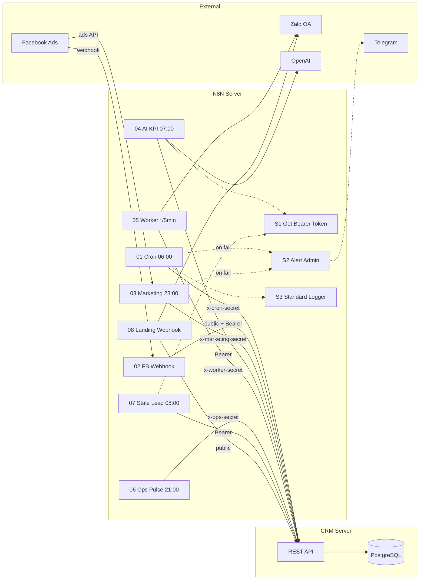
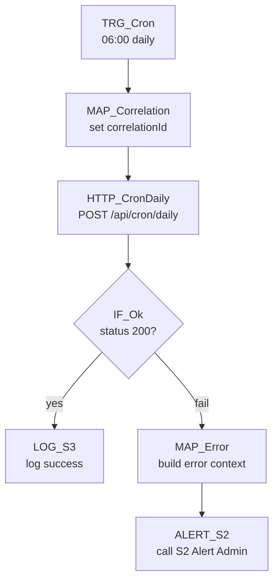
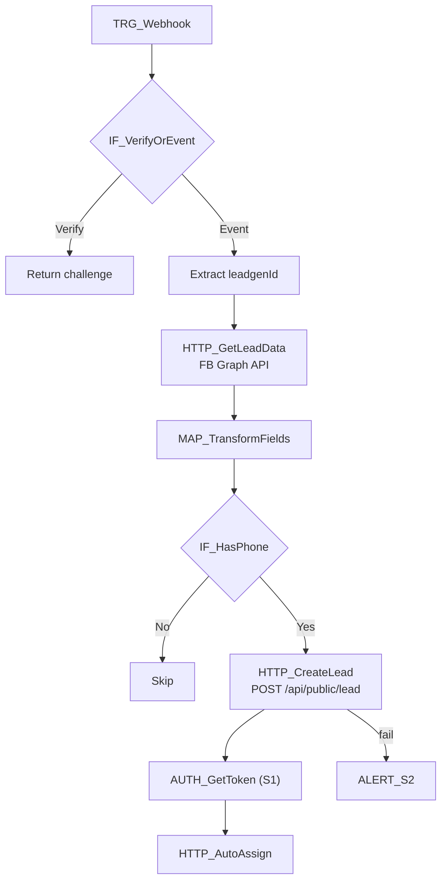
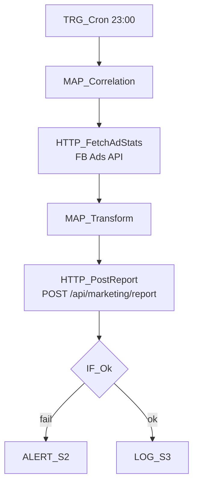
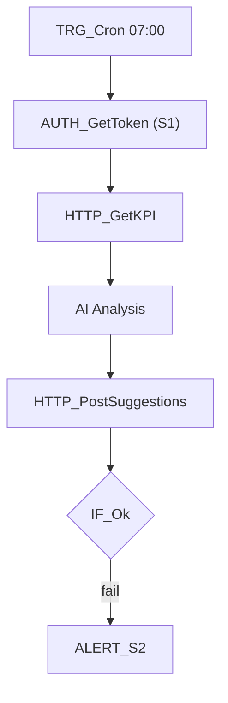
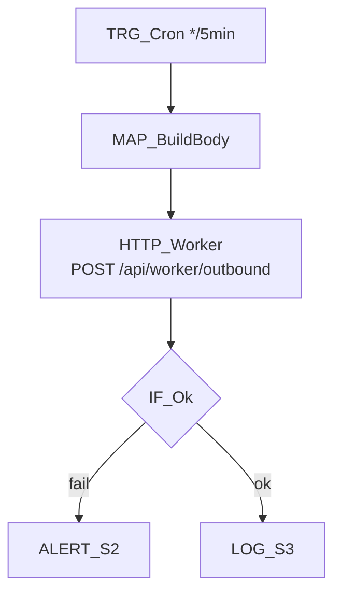
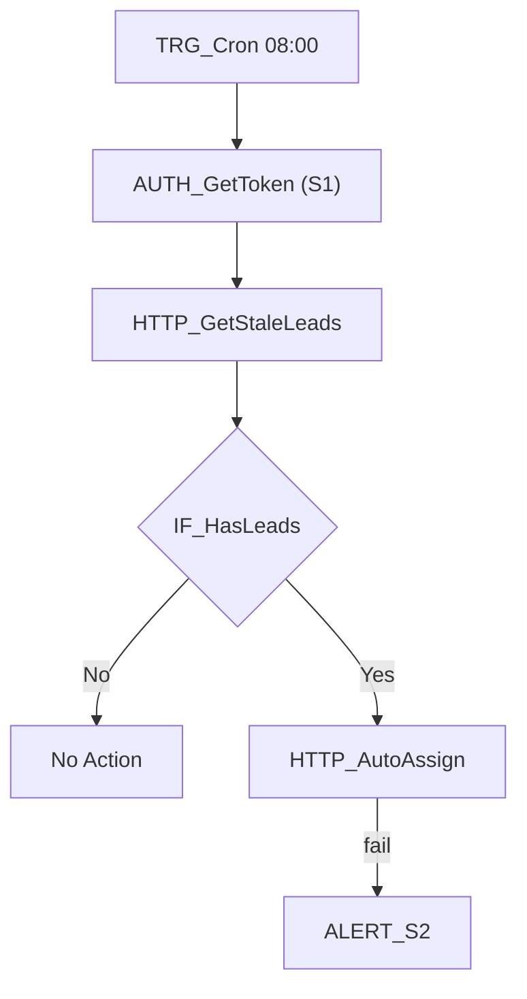

# N8N Production Runbook — thayduydaotaolaixe

## 0. Thông tin hệ thống

| Key | Value |
|-----|-------|
| Domain | `https://n8n.thayduydaotaolaixe.com/` |
| Timezone | `Asia/Ho_Chi_Minh` |
| n8n image tag | `n8nio/n8n:latest` |
| Deploy path | `/opt/n8n` |
| WEBHOOK_URL | `https://n8n.thayduydaotaolaixe.com/` |
| CRM Domain | `https://thayduydaotaolaixe.com` |
| Docker Compose | `/opt/n8n/docker-compose.yml` |
| Docker Network | `thayduy_default` (shared with CRM) |
| n8n Database | PostgreSQL 16 (container `n8n-postgres`) |
| CRM Database | PostgreSQL 16 (container `thayduy-postgres`) |

## 1. Environment Variables (chỉ KEY, không ghi VALUE)

| Key | Mô tả | Bắt buộc |
|-----|--------|----------|
| `CRM_BASE_URL` | URL CRM server | ‚úÖ |
| `CRM_EMAIL` | Email admin để lấy Bearer token | ✅ |
| `CRM_PASSWORD` | Password admin | ‚úÖ |
| `CRON_SECRET` | Secret cho `POST /api/cron/daily` | ‚úÖ |
| `WORKER_SECRET` | Secret cho `POST /api/worker/outbound` | ‚úÖ |
| `OPS_SECRET` | Secret cho `POST /api/ops/pulse` | ‚úÖ |
| `MARKETING_SECRET` | Secret cho `POST /api/marketing/report` | ‚úÖ |
| `SERVICE_TOKEN` | Token service-to-service | Optional |
| `TELEGRAM_BOT_TOKEN` | Token Telegram Bot (alert S2) | Optional |
| `TELEGRAM_CHAT_ID` | Chat ID group admin | Optional |
| `FB_PAGE_TOKEN` | Facebook Page access token | Optional (W02) |
| `ZALO_OA_ACCESS_TOKEN` | Zalo OA access token | Optional (W05/W08) |

> [!CAUTION]
> Tuyệt đối **KHÔNG hardcode** value trong workflow JSON. Luôn dùng `{{ $env.VAR_NAME }}`.
> File `.env` trên server: **không dùng dấu ngoặc kép** bao quanh giá trị (Docker `--env-file` sẽ truyền literal quotes).

## 2. Workflow Catalog (1 dòng / 1 workflow)

| Name | Type | Schedule | Calls (CRM endpoints) | Required Env Keys | Idempotency | Retry/Backoff | Alerts |
|------|------|----------|----------------------|-------------------|-------------|---------------|--------|
| S1 Get Bearer Token | subflow | n/a | `POST /api/auth/login` | CRM_BASE_URL, CRM_EMAIL, CRM_PASSWORD | n/a | 3× 3s exp | — |
| S2 Alert Admin | subflow | n/a | Telegram Bot API | TELEGRAM_BOT_TOKEN, TELEGRAM_CHAT_ID | n/a | 2× 3s | — |
| S3 Standard Logger | subflow | n/a | Console log (structured) | — | correlationId | n/a | — |
| 01 Daily Cron Master | cron | 06:00 | `POST /api/cron/daily` | CRM_BASE_URL, CRON_SECRET | dateKey + correlationId | 3√ó 5s exp | S2 |
| 02 Facebook Lead Capture | webhook | realtime | `POST /api/public/lead`, `POST /api/leads/auto-assign`, FB Graph API | CRM_BASE_URL, CRM_EMAIL, CRM_PASSWORD, FB_PAGE_TOKEN | phone (upsert) | 3√ó 2s exp | S2 |
| 03 Marketing Ads Sync | cron | 23:00 | `POST /api/marketing/report` | CRM_BASE_URL, MARKETING_SECRET | date + source | 3√ó 5s exp | S2 |
| 04 AI KPI Coach | cron | 07:00 | `POST /api/ai/suggestions`, `GET /api/kpi/targets` | CRM_BASE_URL, CRM_EMAIL, CRM_PASSWORD | dateKey | 3√ó 5s exp | S2 |
| 05 Outbound Message Worker | cron | */5 min | `POST /api/worker/outbound` | CRM_BASE_URL, WORKER_SECRET | — | 3× backoff | S2 |
| 06 Ops Pulse Report | cron | 21:00 | `POST /api/ops/pulse` | CRM_BASE_URL, OPS_SECRET | dateKey + role | 3√ó 5s exp | S2 |
| 07 Stale Lead Alert & Auto-Assign | cron | 08:00 | `GET /api/leads/stale`, `POST /api/leads/auto-assign` | CRM_BASE_URL, CRM_EMAIL, CRM_PASSWORD | — | 3× 5s exp | S2 |
| 08 Landing CRM Zalo Notify | webhook | realtime | `POST /api/public/lead` | CRM_BASE_URL, ZALO_OA_ACCESS_TOKEN | phone (upsert) | 3√ó 2s exp | S2 |

### Production IDs (n8n)

| Workflow | n8n ID | Status |
|----------|--------|--------|
| S1 Get Bearer Token | `rM8NCtXchLsIhLxG` | 🟢 Published |
| S2 Alert Admin | `naX5gYVTYw9cz3dA` | 🟢 Published |
| S3 Standard Logger | `e1WhICIEbwErc0ej` | 🟢 Published |
| 01 Daily Cron Master | `3dvziGY3AdYINrob` | 🟢 Published |
| 02 Facebook Lead Capture | `d4VbLHU3Li2ORnD7` | 🟢 Published |
| 03 Marketing Ads Sync | `aT7zN4h6T0ziCOHa` | 🟢 Published |
| 04 AI KPI Coach | `mA40Z49COZ01Pm0d` | 🟢 Published |
| 05 Outbound Message Worker | `49Aw1IvGmLG611PI` | 🟢 Published |
| 06 Ops Pulse Report | `ywxhG2irMLrxZf7V` | 🟢 Published |
| 07 Stale Lead Alert | `s5QxHfy1AayJngqp` | 🟢 Published |
| 08 Landing CRM Zalo Notify | `Bd7LpHje2XQPPLuc` | 🟢 Published |

## 3. Tổng sơ đồ luồng (Mermaid)


```mermaid
flowchart LR
    subgraph N8N["N8N Server"]
        S1["S1 Get Bearer Token"]
        S2["S2 Alert Admin"]
        S3["S3 Standard Logger"]
        W01["01 Cron 06:00"]
        W02["02 FB Webhook"]
        W03["03 Marketing 23:00"]
        W04["04 AI KPI 07:00"]
        W05["05 Worker */5min"]
        W06["06 Ops Pulse 21:00"]
        W07["07 Stale Lead 08:00"]
        W08["08 Landing Webhook"]
    end

    subgraph CRM["CRM Server"]
        API["REST API"]
        DB[("PostgreSQL")]
    end

    subgraph EXT["External"]
        FB["Facebook Ads"]
        ZALO["Zalo OA"]
        AI["OpenAI"]
        TG["Telegram"]
    end

    W01 -->|x-cron-secret| API
    W02 -->|public + Bearer| API
    W03 -->|x-marketing-secret| API
    W04 -->|Bearer| API
    W05 -->|x-worker-secret| API
    W06 -->|x-ops-secret| API
    W07 -->|Bearer| API
    W08 -->|public| API
    API --> DB

    FB -->|webhook| W02
    FB -->|ads API| W03
    W04 --> AI
    W05 --> ZALO
    W08 --> ZALO

    W01 -.->|on fail| S2
    W03 -.->|on fail| S2
    W04 -.-> S1
    W07 -.-> S1
    S2 -.-> TG
    W01 -.-> S3
```

---

## 4. Runbook theo t·ª´ng workflow

---

### 01 Daily Cron Master

#### 4.1 Mục tiêu
Mỗi sáng 06:00 gọi CRM trigger daily jobs: notification, cleanup, stats aggregation.

**KPI**: Chạy 100% hàng ngày, duration < 30s.

#### 4.2 Trigger / Schedule
- **Cron**: `0 6 * * *` (06:00 Asia/Ho_Chi_Minh)

#### 4.3 I/O Contract

**Request**
- Endpoint: `POST /api/cron/daily`
- Headers: `x-cron-secret: {{ $env.CRON_SECRET }}`, `X-Correlation-Id: <uuid>`
- Body: `{ "force": false, "dryRun": false }`

**Response**
```json
{ "ok": true, "ranAt": "2026-02-19T06:00:01Z", "notifications": 15, "messages": 8 }
```

#### 4.4 Node Diagram (Mermaid)


```mermaid
flowchart TD
    TRG_Cron["TRG_Cron<br/>06:00 daily"] --> MAP_Correlation["MAP_Correlation<br/>set correlationId"]
    MAP_Correlation --> HTTP_CronDaily["HTTP_CronDaily<br/>POST /api/cron/daily"]
    HTTP_CronDaily --> IF_Ok{"IF_Ok<br/>status 200?"}
    IF_Ok -->|yes| LOG_S3["LOG_S3<br/>log success"]
    IF_Ok -->|fail| MAP_Error["MAP_Error<br/>build error context"]
    MAP_Error --> ALERT_S2["ALERT_S2<br/>call S2 Alert Admin"]
```

#### 4.5 Node-by-Node Table

| Node | Type | Endpoint | Headers | Body mapping | Output used | Retry | Error branch |
|------|------|----------|---------|-------------|-------------|-------|-------------|
| TRG_Cron | Cron | — | — | — | — | — | — |
| MAP_Correlation | Set | — | — | — | correlationId (uuid) | — | — |
| HTTP_CronDaily | HTTP | `POST /api/cron/daily` | x-cron-secret, X-Correlation-Id | force, dryRun | ok, ranAt, notifications | 3√ó exp backoff | ‚Üí MAP_Error |
| IF_Ok | If | — | — | — | route | — | → MAP_Error |
| LOG_S3 | Execute Workflow | S3 | — | correlationId, status, endpoint | — | — | — |
| MAP_Error | Set | — | — | — | workflowName, endpoint, error | — | — |
| ALERT_S2 | Execute Workflow | S2 | — | workflowName, error, statusCode | sent | — | continueRegularOutput |

#### 4.6 Idempotency / Anti-duplicate
- `correlationId` per execution (uuid)
- CRM skips nếu cùng dateKey đã chạy (trừ `force: true`)
- `dryRun: true` cho smoke-test production (không ghi data)

#### 4.7 Failure Modes (top 10)

| # | Lỗi | Nguyên nhân | Fix |
|---|------|-------------|-----|
| 1 | 403 Forbidden | `CRON_SECRET` sai | So s√°nh n8n env vs CRM env ‚Üí fix ‚Üí restart n8n |
| 2 | 500 Internal | CRM logic error / DB down | `docker logs thayduy-app` ‚Üí fix ‚Üí redeploy |
| 3 | 502/503 | Nginx proxy error / app crashed | `docker ps` ‚Üí restart `thayduy-app` |
| 4 | Timeout 30s | DB lock / heavy query | Tăng timeout node → check slow query |
| 5 | 429 Rate Limit | Quá nhiều request | Tự backoff, check frequency |
| 6 | ECONNREFUSED | Container down / network drop | `docker network inspect thayduy_default` |
| 7 | DNS resolution fail | Docker DNS issue | Restart Docker daemon |
| 8 | Schema mismatch | CRM API contract changed | Check request body vs API spec |
| 9 | Token expired (n·∫øu d√πng S1) | JWT h·∫øt h·∫°n | Re-call S1 tr∆∞·ªõc HTTP |
| 10 | Duplicate execution | Cron trigger twice | Check n8n execution history ‚Üí idempotency key |

#### 4.8 Debug nhanh (3 ph√∫t)
1. **n8n**: Execution ‚Üí click node fail ‚Üí xem response body
2. **CRM**: `docker logs thayduy-app --tail 50 | grep cron`
3. **Reproduce**: `bash scripts/simulate-n8n.sh` (cron section) ho·∫∑c:
```bash
curl -X POST https://thayduydaotaolaixe.com/api/cron/daily \
  -H "Content-Type: application/json" \
  -H "x-cron-secret: $CRON_SECRET" \
  -d '{"force":true,"dryRun":true}'
```

#### 4.9 Rollback
1. Disable workflow `3dvziGY3AdYINrob` trong n8n
2. Import JSON `n8n/workflows/01-daily-cron-master.json` (version tr∆∞·ªõc t·ª´ git)
3. Enable ‚Üí run `dryRun: true` ‚Üí PASS

---

### 02 Facebook Lead Capture

#### 4.1 Mục tiêu
Nhận webhook từ Facebook Leadgen → lấy lead data từ Graph API → tạo lead trong CRM → auto-assign.

#### 4.2 Trigger / Schedule
- **Webhook**: `POST /webhook/facebook-lead` (n8n webhook URL)
- **Verification**: Facebook sends `GET` with `hub.challenge` ‚Üí tr·∫£ l·∫°i challenge

#### 4.3 I/O Contract

**Request (Facebook webhook payload)**
```json
{
  "object": "page",
  "entry": [{ "changes": [{ "field": "leadgen", "value": { "leadgen_id": "123456789" } }] }]
}
```

**CRM Request** (`POST /api/public/lead`)
- Headers: `Content-Type: application/json`, `X-Correlation-Id: <uuid>`
- Body: `{ "fullName": "...", "phone": "0901234567", "province": "...", "licenseType": "B2", "source": "facebook" }`

**Response**: `{ "ok": true, "leadId": "clxyz..." }`

#### 4.4 Node Diagram


```mermaid
flowchart TD
    TRG["TRG_Webhook"] --> IF1{"IF_VerifyOrEvent"}
    IF1 -->|Verify| RET["Return challenge"]
    IF1 -->|Event| EXT["Extract leadgenId"]
    EXT --> FB["HTTP_GetLeadData<br/>FB Graph API"]
    FB --> MAP["MAP_TransformFields"]
    MAP --> IF2{"IF_HasPhone"}
    IF2 -->|No| SKIP["Skip"]
    IF2 -->|Yes| CRM["HTTP_CreateLead<br/>POST /api/public/lead"]
    CRM --> AUTH["AUTH_GetToken (S1)"]
    AUTH --> ASSIGN["HTTP_AutoAssign"]
    CRM -->|fail| ALERT["ALERT_S2"]
```

#### 4.5 Node-by-Node Table

| Node | Type | Endpoint | Headers | Body mapping | Retry | Error branch |
|------|------|----------|---------|-------------|-------|-------------|
| TRG_Webhook | Webhook | `/webhook/facebook-lead` | — | — | — | — |
| HTTP_GetLeadData | HTTP | `GET graph.facebook.com/v18.0/{leadgen_id}` | access_token | — | 3× 2s | → ALERT_S2 |
| HTTP_CreateLead | HTTP | `POST /api/public/lead` | X-Correlation-Id | fullName, phone, source | 3√ó 2s | ‚Üí ALERT_S2 |
| AUTH_GetToken | Execute WF | S1 (`rM8NCtXchLsIhLxG`) | — | — | — | — |
| HTTP_AutoAssign | HTTP | `POST /api/leads/auto-assign` | Authorization: Bearer | strategy, leadIds | 3√ó 2s | continueRegularOutput |
| ALERT_S2 | Execute WF | S2 (`naX5gYVTYw9cz3dA`) | — | workflowName, error | — | — |

#### 4.6 Idempotency
- **Key**: `phone` — CRM upserts by phone (trùng → update, không tạo mới)
- `leadgenId` từ Facebook luôn unique

#### 4.7 Failure Modes

| # | L·ªói | Fix |
|---|------|-----|
| 1 | FB Graph 401 | `FB_PAGE_TOKEN` hết hạn (60 ngày) → refresh |
| 2 | CRM 409 Conflict | Lead tr√πng phone ‚Üí expected (upsert) |
| 3 | Webhook không nhận | Check WEBHOOK_URL + Nginx proxy |
| 4 | Auto-assign 404 | Không có telesale active → thêm user |
| 5 | Schema mismatch | Facebook thay đổi fields → update MAP node |

#### 4.8 Debug nhanh
```bash
# Test t·∫°o lead
curl -X POST https://thayduydaotaolaixe.com/api/public/lead \
  -H "Content-Type: application/json" \
  -d '{"fullName":"Test","phone":"0900000001","source":"test","licenseType":"B2"}'
```

#### 4.9 Rollback
Disable → Import `02-facebook-lead-capture.json` cũ → Enable → test webhook

---

### 03 Marketing Ads Sync

#### 4.1 Mục tiêu
Sync chi phí quảng cáo Facebook Ads vào CRM mỗi tối 23:00.

#### 4.2 Trigger / Schedule
- **Cron**: `0 23 * * *` (23:00 VN)

#### 4.3 I/O Contract

**Request**
- Endpoint: `POST /api/marketing/report`
- Headers: `x-marketing-secret: {{ $env.MARKETING_SECRET }}`, `X-Correlation-Id: <uuid>`
- Body:
```json
{ "date": "2026-02-19", "source": "meta_ads", "spendVnd": 1500000, "messages": 42, "branchCode": "Q1", "meta": {} }
```

**Response**: `{ "ok": true }`

#### 4.4 Node Diagram


```mermaid
flowchart TD
    TRG["TRG_Cron 23:00"] --> MAP["MAP_Correlation"]
    MAP --> FB["HTTP_FetchAdStats<br/>FB Ads API"]
    FB --> TRANSFORM["MAP_Transform"]
    TRANSFORM --> HTTP["HTTP_PostReport<br/>POST /api/marketing/report"]
    HTTP --> IF{"IF_Ok"}
    IF -->|fail| ALERT["ALERT_S2"]
    IF -->|ok| LOG["LOG_S3"]
```

#### 4.5 Failure Modes

| # | L·ªói | Fix |
|---|------|-----|
| 1 | 403 | `MARKETING_SECRET` sai ‚Üí check n8n env |
| 2 | FB Ads 401 | Token h·∫øt h·∫°n ‚Üí refresh Facebook App |
| 3 | 500 CRM | `docker logs thayduy-app | grep marketing` |

#### 4.8 Debug nhanh
```bash
curl -X POST https://thayduydaotaolaixe.com/api/marketing/report \
  -H "Content-Type: application/json" \
  -H "x-marketing-secret: $MARKETING_SECRET" \
  -d '{"date":"2026-02-19","source":"meta_ads","spendVnd":0,"messages":0,"branchCode":"HCM1"}'
```

#### 4.9 Rollback
Disable → Import `03-marketing-ads-sync.json` cũ → Enable → test

---

### 04 AI KPI Coach

#### 4.1 Mục tiêu
Phân tích KPI hàng ngày bằng AI → tạo gợi ý cho từng role/chi nhánh.

#### 4.2 Trigger / Schedule
- **Cron**: `0 7 * * *` (07:00 VN — sau Daily Cron 06:00)

#### 4.3 I/O Contract

**Step 1**: `GET /api/kpi/targets` ‚Üí Headers: `Authorization: Bearer {{ bearerToken }}`
**Step 2**: `POST /api/ai/suggestions` ‚Üí Body:
```json
{ "dateKey": "2026-02-19", "role": "telesales", "branchId": "clxyz...", "title": "...", "content": "...", "scoreColor": "GREEN" }
```

#### 4.4 Node Diagram


```mermaid
flowchart TD
    TRG["TRG_Cron 07:00"] --> AUTH["AUTH_GetToken (S1)"]
    AUTH --> KPI["HTTP_GetKPI"]
    KPI --> AI["AI Analysis"]
    AI --> HTTP["HTTP_PostSuggestions"]
    HTTP --> IF{"IF_Ok"}
    IF -->|fail| ALERT["ALERT_S2"]
```

#### 4.7 Failure Modes

| # | L·ªói | Fix |
|---|------|-----|
| 1 | S1 login fail | Check CRM_EMAIL/CRM_PASSWORD |
| 2 | KPI 404 | Chưa có KPI targets → tạo targets |
| 3 | AI timeout | OpenAI chậm → tăng timeout |
| 4 | Suggestion 422 | Payload schema thay đổi |

---

### 05 Outbound Message Worker

#### 4.1 Mục tiêu
Poll CRM mỗi 5 phút để gửi tin nhắn pending (Zalo, SMS).

#### 4.2 Trigger / Schedule
- **Cron**: `*/5 * * * *`

#### 4.3 I/O Contract

**Request**
- Endpoint: `POST /api/worker/outbound`
- Headers: `x-worker-secret: {{ $env.WORKER_SECRET }}`
- Body: `{ "batchSize": 50, "concurrency": 5, "dryRun": false }`

**Response**: `{ "processed": 10, "sent": 8, "failed": 1, "skipped": 1 }`

#### 4.4 Node Diagram


```mermaid
flowchart TD
    TRG["TRG_Cron */5min"] --> MAP["MAP_BuildBody"]
    MAP --> HTTP["HTTP_Worker<br/>POST /api/worker/outbound"]
    HTTP --> IF{"IF_Ok"}
    IF -->|fail| ALERT["ALERT_S2"]
    IF -->|ok| LOG["LOG_S3"]
```

#### 4.7 Failure Modes

| # | L·ªói | Fix |
|---|------|-----|
| 1 | 403 | `WORKER_SECRET` sai |
| 2 | Zalo 429 | Rate limit ‚Üí gi·∫£m concurrency |
| 3 | DB deadlock | Gi·∫£m batchSize |

#### 4.8 Debug nhanh
```bash
curl -X POST https://thayduydaotaolaixe.com/api/worker/outbound \
  -H "Content-Type: application/json" \
  -H "x-worker-secret: $WORKER_SECRET" \
  -d '{"batchSize":10,"concurrency":2,"dryRun":true}'
```

---

### 06 Ops Pulse Report

#### 4.1 Mục tiêu
Thu thập metrics hiệu suất vận hành mỗi tối 21:00.

#### 4.2 Trigger / Schedule
- **Cron**: `0 21 * * *`

#### 4.3 I/O Contract

**Request**
- Endpoint: `POST /api/ops/pulse`
- Headers: `x-ops-secret: {{ $env.OPS_SECRET }}`
- Body:
```json
{ "role": "PAGE", "branchId": "clxyz...", "dateKey": "2026-02-19", "metrics": { "dataToday": 9, "calledToday": 25 } }
```

#### 4.7 Failure Modes

| # | L·ªói | Fix |
|---|------|-----|
| 1 | 403 | `OPS_SECRET` sai |
| 2 | 422 | Missing required fields |
| 3 | 409 | Duplicate dateKey (CRM auto-handles) |

#### 4.8 Debug nhanh
```bash
curl -X POST https://thayduydaotaolaixe.com/api/ops/pulse \
  -H "Content-Type: application/json" \
  -H "x-ops-secret: $OPS_SECRET" \
  -d '{"role":"PAGE","branchId":"test","dateKey":"2026-02-19","metrics":{"dataToday":1}}'
```

---

### 07 Stale Lead Alert & Auto-Assign

#### 4.1 Mục tiêu
Tìm lead >48h không liên lạc → alert → auto-assign lại.

#### 4.2 Trigger / Schedule
- **Cron**: `0 8 * * *` (08:00 VN)

#### 4.3 I/O Contract

**Step 1**: `GET /api/leads/stale?page=1&pageSize=50` ‚Üí `Authorization: Bearer {{ token }}`
**Step 2**: `POST /api/leads/auto-assign` ‚Üí `{ "strategy": "round_robin", "leadIds": [...] }`

#### 4.4 Node Diagram


```mermaid
flowchart TD
    TRG["TRG_Cron 08:00"] --> AUTH["AUTH_GetToken (S1)"]
    AUTH --> HTTP1["HTTP_GetStaleLeads"]
    HTTP1 --> IF1{"IF_HasLeads"}
    IF1 -->|No| DONE["No Action"]
    IF1 -->|Yes| ASSIGN["HTTP_AutoAssign"]
    ASSIGN -->|fail| ALERT["ALERT_S2"]
```

---

### 08 Landing CRM Zalo Notify

#### 4.1 Mục tiêu
Nhận lead từ landing page → tạo trong CRM → gửi Zalo xác nhận.

#### 4.2 Trigger / Schedule
- **Webhook**: `POST /webhook/landing-lead`

#### 4.3 I/O Contract

**Request**
```json
{ "fullName": "Nguyễn Văn B", "phone": "0987654321", "province": "HCM", "licenseType": "B2" }
```

#### 4.6 Idempotency
- **Key**: `phone` — CRM upserts by phone

---

## 5. Test & Reproduce

### Local/Staging
```bash
BASE_URL=http://localhost:3000 \
CRON_SECRET=test-secret \
WORKER_SECRET=test-secret \
OPS_SECRET=test-secret \
MARKETING_SECRET=test-secret \
CRM_EMAIL=admin@thayduy.local \
CRM_PASSWORD=Admin@123456 \
bash scripts/simulate-n8n.sh
```

### Production smoke-test (dryRun)
```bash
BASE_URL=https://thayduydaotaolaixe.com \
DRY_RUN=1 \
CRON_SECRET=$CRON_SECRET \
WORKER_SECRET=$WORKER_SECRET \
OPS_SECRET=$OPS_SECRET \
MARKETING_SECRET=$MARKETING_SECRET \
CRM_EMAIL=$CRM_EMAIL \
CRM_PASSWORD=$CRM_PASSWORD \
bash scripts/simulate-n8n.sh
```

---

## 6. Troubleshooting Matrix

| Symptom | Where to look | Likely cause | Fix | Verify |
|---------|--------------|-------------|-----|--------|
| `cron/daily 403` | n8n env `CRON_SECRET` | Secret mismatch | So sánh n8n env vs CRM env → set đúng → restart | rerun node → 200 |
| `marketing/report 403` | n8n env `MARKETING_SECRET` | Secret sai | Set đúng → restart n8n | rerun → 200 |
| `ops/pulse 403` | n8n env `OPS_SECRET` | Secret sai | Set đúng → restart | rerun → 200 |
| `worker/outbound 403` | n8n env `WORKER_SECRET` | Secret sai | Set đúng → restart | rerun → 200 |
| `auth/login 401` | n8n env `CRM_EMAIL/PASSWORD` | Credentials sai | Fix credentials ‚Üí restart | curl login ‚Üí token |
| `auth/login 500` | CRM server logs | DB down / Prisma timeout | `docker logs thayduy-app` ‚Üí check postgres ‚Üí restart app | login test PASS |
| Webhook không nhận | WEBHOOK_URL, Nginx | Sai base URL / SSL expired | Check `WEBHOOK_URL=https://n8n...` + Nginx config | test webhook |
| FB Graph 401 | Facebook App Dashboard | Page token hết hạn (60 ngày) | Refresh long-lived token | FB API call OK |
| TG alert không gửi | TELEGRAM_BOT_TOKEN/CHAT_ID | Token sai / bot chưa join group | Check + thêm bot vào group | curl sendMessage |
| Workflow không trigger | n8n Settings → Timezone | `GENERIC_TIMEZONE` sai | Set `Asia/Ho_Chi_Minh` | chờ next trigger |
| 429 spam | CRM/External API | Rate limiting | Giảm frequency + tăng backoff | monitor OK |
| `ECONNREFUSED` | Docker network | Container isolation | `docker network inspect thayduy_default` | ping |
| Duplicate leads | CRM database | Webhook retry trùng | Expected — CRM upsert by phone | check DB |
| `Connection timeout` (Prisma) | CRM `.env` | `DATABASE_URL` có quotes `"..."` | Xóa quotes → restart app | login OK |
| N8N execution history trống | n8n Settings | Retention too short | Tăng `EXECUTIONS_DATA_MAX_AGE` | check settings |

---

## 7. Change log

| Date | Version | Changes |
|------|---------|---------|
| 2026-02-19 | v1.0.0 | Initial import: 3 sub + 8 main workflows. Env vars set. All published. |

---

## Phụ lục: Docker Commands

```bash
# SSH vào server
ssh root@76.13.190.139

# N8N logs
docker logs n8n --tail 100 -f

# Restart n8n
cd /opt/n8n && docker compose restart n8n

# Xem env vars (n8n)
docker exec n8n env | grep CRM

# CRM logs
docker logs thayduy-app --tail 50 -f

# Check network
docker network inspect thayduy_default

# PostgreSQL connections
docker exec thayduy-postgres psql -U thayduy -d thayduy_crm -c "SELECT count(*) FROM pg_stat_activity;"
```
